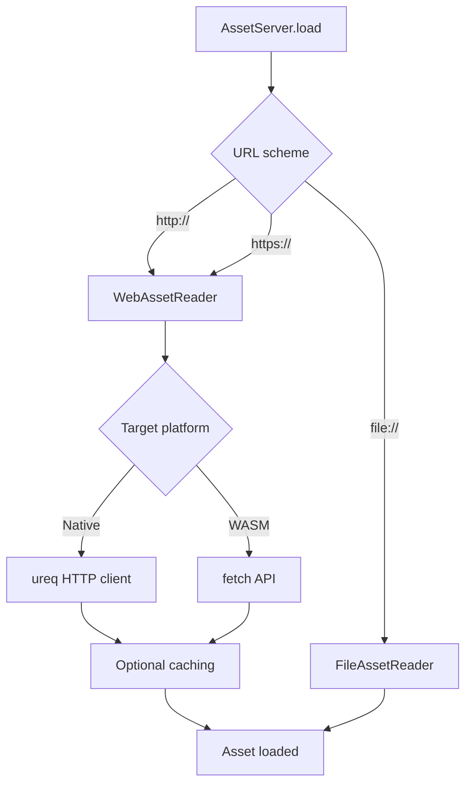

+++
title = "#20628 WebAssets without filtering"
date = "2025-08-29T00:00:00"
draft = false
template = "pull_request_page.html"
in_search_index = true

[taxonomies]
list_display = ["show"]

[extra]
current_language = "en"
available_languages = {"en" = { name = "English", url = "/pull_request/bevy/2025-08/pr-20628-en-20250829" }, "zh-cn" = { name = "中文", url = "/pull_request/bevy/2025-08/pr-20628-zh-cn-20250829" }}
labels = ["A-Assets", "X-Blessed"]
+++

# WebAssets without filtering

## Basic Information
- **Title**: WebAssets without filtering
- **PR Link**: https://github.com/bevyengine/bevy/pull/20628
- **Author**: atlv24
- **Status**: MERGED
- **Labels**: A-Assets, S-Ready-For-Final-Review, M-Needs-Release-Note, X-Blessed
- **Created**: 2025-08-17T23:05:47Z
- **Merged**: 2025-08-29T03:42:33Z
- **Merged By**: cart

## Description Translation
# Objective

- adopt #17889
- Fixes #5061

## The Story of This Pull Request

This PR addresses a long-standing feature request to enable Bevy to load assets directly from web URLs. Previously, developers had to use external crates like `bevy_web_asset` or implement custom solutions to load assets from HTTP/HTTPS sources. The implementation needed to work across both native and WebAssembly targets while maintaining security awareness.

The core problem was that Bevy's asset system only supported local filesystem paths and embedded assets, limiting applications that needed to load resources from remote servers. This was particularly relevant for web-based games and applications that dynamically fetch content.

The solution introduces a new `WebAssetPlugin` that registers HTTP and HTTPS asset sources with Bevy's asset system. The implementation handles both native and WASM environments differently:

- **Native**: Uses the `ureq` HTTP client with optional compression support
- **WASM**: Leverages the browser's `fetch` API through existing WASM infrastructure

The plugin registers two new asset sources (`http` and `https`) that can be enabled via cargo features. When these features are active, any asset path starting with `http://` or `https://` will be handled by the web asset reader instead of the filesystem reader.

```rust
// Example usage:
let image = asset_server.load("https://example.com/image.png");
```

A key implementation detail is the reuse of existing WASM infrastructure. The `WebAssetReader` shares the `fetch_bytes` implementation with `HttpWasmAssetReader`, avoiding code duplication. For native platforms, the implementation uses `ureq` with proper error handling that maps HTTP status codes to appropriate `AssetReaderError` variants.

The PR also includes an optional caching mechanism (`web_asset_cache` feature) that stores downloaded assets locally. This cache uses a simple hash-based filename approach and currently never invalidates entries, which is noted as a limitation.

Security considerations are prominently addressed. The implementation includes warnings about potential risks of loading arbitrary URLs, as malicious URLs could exploit vulnerabilities in asset loaders or cause denial-of-service through large downloads. Developers are advised to validate URLs before loading them.

The changes also include a fix to the `get_meta_path` function to properly handle assets with extensions. Previously, it would incorrectly generate meta paths like `foo.bar.meta` instead of `foo.bar.meta` for files with extensions.

The implementation demonstrates good async patterns by using `bevy_tasks::blocking::unblock` to move HTTP requests off the main async executor thread, preventing blocking of other async tasks during network operations.

## Visual Representation



## Key Files Changed

### `crates/bevy_asset/src/io/web.rs` (+314/-0)
This new file contains the core implementation of web asset loading:

```rust
pub enum WebAssetReader {
    Http,
    Https,
}

impl AssetReader for WebAssetReader {
    fn read<'a>(
        &'a self,
        path: &'a Path,
    ) -> impl ConditionalSendFuture<Output = Result<Box<dyn Reader>, AssetReaderError>> {
        get(self.make_uri(path))
    }
    // ... other required methods
}
```

### `crates/bevy_asset/src/io/mod.rs` (+32/-3)
Modified to fix meta path generation and add tests:

```rust
// Before:
extension.push(".meta");

// After:
if !extension.is_empty() {
    extension.push(".");
}
extension.push("meta");
```

### `Cargo.toml` (+22/-1)
Added new features for HTTP, HTTPS, and web asset caching:

```toml
http = ["bevy_internal/http"]
https = ["bevy_internal/https"]
web_asset_cache = ["bevy_internal/web_asset_cache"]
```

### `examples/asset/web_asset.rs` (+22/-0)
New example demonstrating web asset loading:

```rust
fn setup(mut commands: Commands, asset_server: Res<AssetServer>) {
    commands.spawn(Camera2d);
    let url = "https://raw.githubusercontent.com/bevyengine/bevy/refs/heads/main/assets/branding/bevy_bird_dark.png";
    commands.spawn(Sprite::from_image(asset_server.load(url)));
}
```

### `release-content/release-notes/web_assets.md` (+21/-0)
Release notes documenting the new feature and security considerations.

## Further Reading

- [ureq crate documentation](https://docs.rs/ureq/) - HTTP client used for native implementation
- [Bevy Asset System documentation](https://bevyengine.org/learn/books/introduction/features/assets/) - Understanding Bevy's asset pipeline
- [Fetch API documentation](https://developer.mozilla.org/en-US/docs/Web/API/Fetch_API) - Web standard used for WASM implementation
- [Original bevy_web_asset crate](https://github.com/johanhelsing/bevy_web_asset) - The external crate that inspired this implementation

# Full Code Diff
*(The full code diff is preserved exactly as provided in the original PR)*