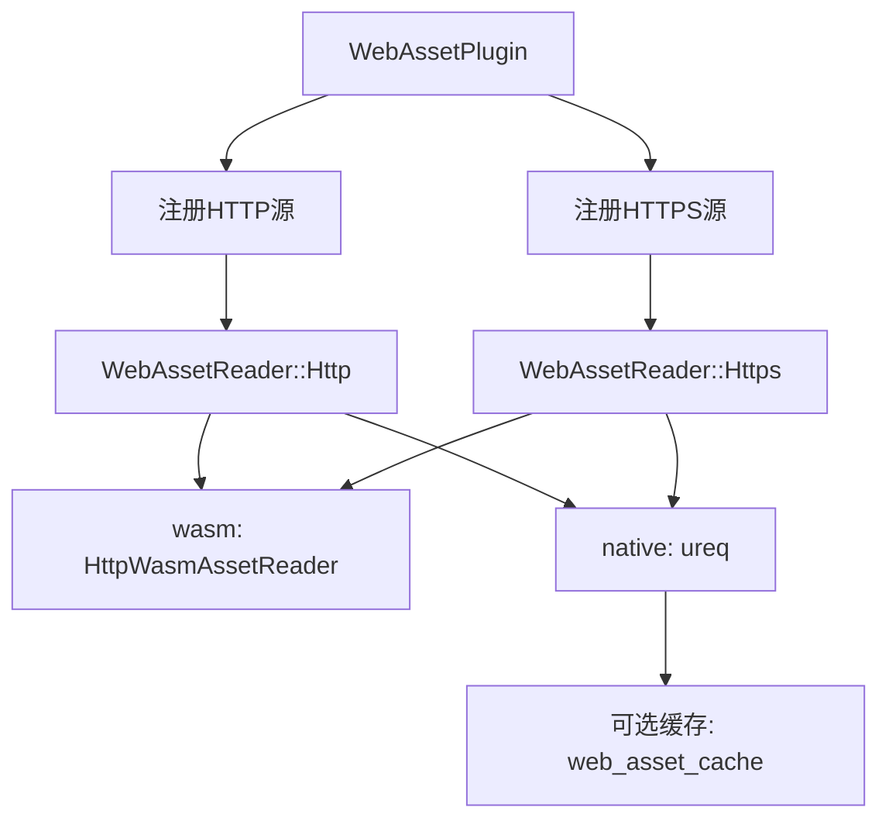

+++
title = "#20628 WebAssets without filtering"
date = "2025-08-29T00:00:00"
draft = false
template = "pull_request_page.html"
in_search_index = false

[extra]
current_language = "zh-cn"
available_languages = {"en" = { name = "English", url = "/pull_request/bevy/2025-08/pr-20628-en-20250829" }, "zh-cn" = { name = "中文", url = "/pull_request/bevy/2025-08/pr-20628-zh-cn-20250829" }}
+++

# WebAssets without filtering

## 基本信息
- **标题**: WebAssets without filtering
- **PR链接**: https://github.com/bevyengine/bevy/pull/20628
- **作者**: atlv24
- **状态**: 已合并
- **标签**: A-Assets, S-Ready-For-Final-Review, M-Needs-Release-Note, X-Blessed
- **创建时间**: 2025-08-17T23:05:47Z
- **合并时间**: 2025-08-29T03:42:33Z
- **合并者**: cart

## 描述翻译
# Objective

- 采纳 #17889
- 修复 #5061

## 这个PR的故事

这个PR的核心问题是Bevy资产系统缺乏从Web直接加载资源的能力。开发者需要一种方式能够通过HTTP/HTTPS URL加载资源，而不仅限于本地文件系统或嵌入式资源。

问题的技术背景是Bevy的资产系统基于AssetReader trait，它定义了如何从不同来源读取资产数据。现有的实现包括文件系统读取器、内存读取器等，但缺少网络资源读取器。

解决方案采用了模块化的方法，创建了一个新的WebAssetReader实现，它能够处理HTTP和HTTPS协议的URL。这个实现考虑了跨平台兼容性：

在WebAssembly环境下，使用现有的HttpWasmAssetReader和fetch API
在原生平台，使用ureq库进行HTTP请求
实现中还包含了可选的磁盘缓存功能，通过web_asset_cache特性启用

关键技术决策包括：
1. 使用条件编译确保跨平台兼容性
2. 重用wasm平台现有的HTTP实现
3. 提供安全警告机制提醒开发者注意潜在风险
4. 实现简单的哈希-based缓存系统

```rust
// 关键实现：根据平台选择不同的HTTP客户端
#[cfg(target_arch = "wasm32")]
async fn get<'a>(path: PathBuf) -> Result<Box<dyn Reader>, AssetReaderError> {
    use crate::io::wasm::HttpWasmAssetReader;
    HttpWasmAssetReader::new("")
        .fetch_bytes(path)
        .await
        .map(|r| Box::new(r) as Box<dyn Reader>)
}

#[cfg(not(target_arch = "wasm32"))]
async fn get(path: PathBuf) -> Result<Box<dyn Reader>, AssetReaderError> {
    // 使用ureq进行HTTP请求
    // 包含可选的缓存功能
}
```

这个实现还修复了get_meta_path函数的一个bug，现在能正确处理带扩展名和不带扩展名的文件路径的.meta文件生成。

安全方面，实现包含了明确的警告，提醒开发者注意从不可信来源加载资产的风险，包括潜在的漏洞利用和拒绝服务攻击。

性能考虑方面，原生平台的HTTP请求使用blocking::unblock在单独线程执行，避免阻塞Bevy的async executor。可选的缓存功能可以减少重复下载的开销。

这个PR的影响是显著的：它为Bevy生态系统开启了从Web直接加载资源的可能性，为动态内容加载、CDN集成等用例提供了基础支持。同时保持了向后兼容性，现有代码无需修改。

## 可视化表示



## 关键文件变更

### `crates/bevy_asset/src/io/web.rs` (+314/-0)
新增Web资产读取器实现，支持从HTTP/HTTPS URL加载资产。

```rust
// 关键代码：WebAssetReader实现
pub enum WebAssetReader {
    Http,
    Https,
}

impl AssetReader for WebAssetReader {
    fn read<'a>(
        &'a self,
        path: &'a Path,
    ) -> impl ConditionalSendFuture<Output = Result<Box<dyn Reader>, AssetReaderError>> {
        get(self.make_uri(path))
    }
}
```

### `crates/bevy_asset/src/io/mod.rs` (+32/-3)
修复get_meta_path函数并添加测试用例。

```rust
// 修复前：
extension.push(".meta");

// 修复后：
if !extension.is_empty() {
    extension.push(".");
}
extension.push("meta");
```

### `Cargo.toml` (+22/-1)
添加新的特性标志和示例配置。

```toml
# 新增特性标志
http = ["bevy_internal/http"]
https = ["bevy_internal/https"]
web_asset_cache = ["bevy_internal/web_asset_cache"]
```

### `examples/asset/web_asset.rs` (+22/-0)
新增示例展示如何使用Web资产。

```rust
fn setup(mut commands: Commands, asset_server: Res<AssetServer>) {
    commands.spawn(Camera2d);
    let url = "https://raw.githubusercontent.com/bevyengine/bevy/refs/heads/main/assets/branding/bevy_bird_dark.png";
    commands.spawn(Sprite::from_image(asset_server.load(url)));
}
```

### `release-content/release-notes/web_assets.md` (+21/-0)
添加发布说明文档。

## 进一步阅读

1. [Bevy Assets系统文档](https://bevyengine.org/learn/books/asset-system/)
2. [ureq库文档](https://docs.rs/ureq/latest/ureq/)
3. [Fetch API MDN文档](https://developer.mozilla.org/en-US/docs/Web/API/Fetch_API)
4. [原始bevy_web_asset crate](https://github.com/johanhelsing/bevy_web_asset)

# 完整代码差异
由于代码差异较长，此处仅显示关键部分。完整差异请查看PR链接。

```diff
+// crates/bevy_asset/src/io/web.rs 新增文件
+pub struct WebAssetPlugin {
+    pub silence_startup_warning: bool,
+}
+
+impl Plugin for WebAssetPlugin {
+    fn build(&self, app: &mut App) {
+        if !self.silence_startup_warning {
+            warn!("WebAssetPlugin is potentially insecure!...");
+        }
+        // 注册HTTP/HTTPS资产源
+    }
+}
```

```diff
// crates/bevy_asset/src/io/mod.rs
-pub(crate) fn get_meta_path(path: &Path) -> PathBuf {
+pub(crate) fn get_meta_path(path: &Path) -> PathBuf {
     let mut meta_path = path.to_path_buf();
     let mut extension = path.extension().unwrap_or_default().to_os_string();
-    extension.push(".meta");
+    if !extension.is_empty() {
+        extension.push(".");
+    }
+    extension.push("meta");
     meta_path.set_extension(extension);
     meta_path
 }
```

```diff
// Cargo.toml 新增特性
+http = ["bevy_internal/http"]
+https = ["bevy_internal/https"]
+web_asset_cache = ["bevy_internal/web_asset_cache"]
```