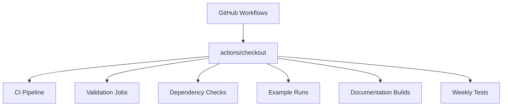

+++
title = "#20632 Bump actions/checkout from 4 to 5"
date = "2025-08-19T00:00:00"
draft = false
template = "pull_request_page.html"
in_search_index = true

[taxonomies]
list_display = ["show"]

[extra]
current_language = "en"
available_languages = {"en" = { name = "English", url = "/pull_request/bevy/2025-08/pr-20632-en-20250819" }, "zh-cn" = { name = "中文", url = "/pull_request/bevy/2025-08/pr-20632-zh-cn-20250818" }}
labels = ["C-Dependencies"]
+++

# Bump actions/checkout from 4 to 5

## Basic Information
- **Title**: Bump actions/checkout from 4 to 5
- **PR Link**: https://github.com/bevyengine/bevy/pull/20632
- **Author**: app/dependabot
- **Status**: MERGED
- **Labels**: C-Dependencies
- **Created**: 2025-08-18T09:18:27Z
- **Merged**: 2025-08-18T23:15:42Z
- **Merged By**: mockersf

## Description Translation
[//]: # (dependabot-start)
⚠️  **Dependabot is rebasing this PR** ⚠️ 

Rebasing might not happen immediately, so don't worry if this takes some time.

Note: if you make any changes to this PR yourself, they will take precedence over the rebase.

---

[//]: # (dependabot-end)

Bumps [actions/checkout](https://github.com/actions/checkout) from 4 to 5.
<details>
<summary>Release notes</summary>
<p><em>Sourced from <a href="https://github.com/actions/checkout/releases">actions/checkout's releases</a>.</em></p>
<blockquote>
<h2>v5.0.0</h2>
<h2>What's Changed</h2>
<ul>
<li>Update actions checkout to use node 24 by <a href="https://github.com/salmanmkc"><code>@​salmanmkc</code></a> in <a href="https://redirect.github.com/actions/checkout/pull/2226">actions/checkout#2226</a></li>
<li>Prepare v5.0.0 release by <a href="https://github.com/salmanmkc"><code>@​salmanmkc</code></a> in <a href="https://redirect.github.com/actions/checkout/pull/2238">actions/checkout#2238</a></li>
</ul>
<h2>⚠️ Minimum Compatible Runner Version</h2>
<p><strong>v2.327.1</strong><br />
<a href="https://github.com/actions/runner/releases/tag/v2.327.1">Release Notes</a></p>
<p>Make sure your runner is updated to this version or newer to use this release.</p>
<p><strong>Full Changelog</strong>: <a href="https://github.com/actions/checkout/compare/v4...v5.0.0">https://github.com/actions/checkout/compare/v4...v5.0.0</a></p>
<h2>v4.3.0</h2>
<h2>What's Changed</h2>
<ul>
<li>docs: update README.md by <a href="https://github.com/motss"><code>@​motss</code></a> in <a href="https://redirect.github.com/actions/checkout/pull/1971">actions/checkout#1971</a></li>
<li>Add internal repos for checking out multiple repositories by <a href="https://github.com/mouismail"><code>@​mouismail</code></a> in <a href="https://redirect.github.com/actions/checkout/pull/1977">actions/checkout#1977</a></li>
<li>Documentation update - add recommended permissions to Readme by <a href="https://github.com/benwells"><code>@​benwells</code></a> in <a href="https://redirect.github.com/actions/checkout/pull/2043">actions/checkout#2043</a></li>
<li>Adjust positioning of user email note and permissions heading by <a href="https://github.com/joshmgross"><code>@​joshmgross</code></a> in <a href="https://redirect.github.com/actions/checkout/pull/2044">actions/checkout#2044</a></li>
<li>Update README.md by <a href="https://github.com/nebuk89"><code>@​nebuk89</code></a> in <a href="https://redirect.github.com/actions/checkout/pull/2194">actions/checkout#2194</a></li>
<li>Update CODEOWNERS for actions by <a href="https://github.com/TingluoHuang"><code>@​TingluoHuang</code></a> in <a href="https://redirect.github.com/actions/checkout/pull/2224">actions/checkout#2224</a></li>
<li>Update package dependencies by <a href="https://github.com/salmanmkc"><code>@​salmanmkc</code></a> in <a href="https://redirect.github.com/actions/checkout/pull/2236">actions/checkout#2236</a></li>
<li>Prepare release v4.3.0 by <a href="https://github.com/salmanmkc"><code>@​salmanmkc</code></a> in <a href="https://redirect.github.com/actions/checkout/pull/2237">actions/checkout#2237</a></li>
</ul>
<h2>New Contributors</h2>
<ul>
<li><a href="https://github.com/motss"><code>@​motss</code></a> made their first contribution in <a href="https://redirect.github.com/actions/checkout/pull/1971">actions/checkout#1971</a></li>
<li><a href="https://github.com/mouismail"><code>@​mouismail</code></a> made their first contribution in <a href="https://redirect.github.com/actions/checkout/pull/1977">actions/checkout#1977</a></li>
<li><a href="https://github.com/benwells"><code>@​benwells</code></a> made their first contribution in <a href="https://redirect.github.com/actions/checkout/pull/2043">actions/checkout#2043</a></li>
<li><a href="https://github.com/nebuk89"><code>@​nebuk89</code></a> made their first contribution in <a href="https://redirect.github.com/actions/checkout/pull/2194">actions/checkout#2194</a></li>
<li><a href="https://github.com/salmanmkc"><code>@​salmanmkc</code></a> made their first contribution in <a href="https://redirect.github.com/actions/checkout/pull/2236">actions/checkout#2236</a></li>
</ul>
<p><strong>Full Changelog</strong>: <a href="https://github.com/actions/checkout/compare/v4...v4.3.0">https://github.com/actions/checkout/compare/v4...v4.3.0</a></p>
<h2>v4.2.2</h2>
<h2>What's Changed</h2>
<ul>
<li><code>url-helper.ts</code> now leverages well-known environment variables by <a href="https://github.com/jww3"><code>@​jww3</code></a> in <a href="https://redirect.github.com/actions/checkout/pull/1941">actions/checkout#1941</a></li>
<li>Expand unit test coverage for <code>isGhes</code> by <a href="https://github.com/jww3"><code>@​jww3</code></a> in <a href="https://redirect.github.com/actions/checkout/pull/1946">actions/checkout#1946</a></li>
</ul>
<p><strong>Full Changelog</strong>: <a href="https://github.com/actions/checkout/compare/v4.2.1...v4.2.2">https://github.com/actions/checkout/compare/v4.2.1...v4.2.2</a></p>
<h2>v4.2.1</h2>
<h2>What's Changed</h2>
<ul>
<li>Check out other refs/* by commit if provided, fall back to ref by <a href="https://github.com/orhantoy"><code>@​orhantoy</code></a> in <a href="https://redirect.github.com/actions/checkout/pull/1924">actions/checkout#1924</a></li>
</ul>
<h2>New Contributors</h2>
<ul>
<li><a href="https://github.com/Jcambass"><code>@​Jcambass</code></a> made their first contribution in <a href="https://redirect.github.com/actions/checkout/pull/1919">actions/checkout#1919</a></li>
</ul>
<p><strong>Full Changelog</strong>: <a href="https://github.com/actions/checkout/compare/v4.2.0...v4.2.1">https://github.com/actions/checkout/compare/v4.2.0...v4.2.1</a></p>
<!-- raw HTML omitted -->
</blockquote>
<p>... (truncated)</p>
</details>
<details>
<summary>Changelog</summary>
<p><em>Sourced from <a href="https://github.com/actions/checkout/blob/main/CHANGELOG.md">actions/checkout's changelog</a>.</em></p>
<blockquote>
<h1>Changelog</h1>
<h2>V5.0.0</h2>
<ul>
<li>Update actions checkout to use node 24 by <a href="https://github.com/salmanmkc"><code>@​salmanmkc</code></a> in <a href="https://redirect.github.com/actions/checkout/pull/2226">actions/checkout#2226</a></li>
</ul>
<h2>V4.3.0</h2>
<ul>
<li>docs: update README.md by <a href="https://github.com/motss"><code>@​motss</code></a> in <a href="https://redirect.github.com/actions/checkout/pull/1971">actions/checkout#1971</a></li>
<li>Add internal repos for checking out multiple repositories by <a href="https://github.com/mouismail"><code>@​mouismail</code></a> in <a href="https://redirect.github.com/actions/checkout/pull/1977">actions/checkout#1977</a></li>
<li>Documentation update - add recommended permissions to Readme by <a href="https://github.com/benwells"><code>@​benwells</code></a> in <a href="https://redirect.github.com/actions/checkout/pull/2043">actions/checkout#2043</a></li>
<li>Adjust positioning of user email note and permissions heading by <a href="https://github.com/joshmgross"><code>@​joshmgross</code></a> in <a href="https://redirect.github.com/actions/checkout/pull/2044">actions/checkout#2044</a></li>
<li>Update README.md by <a href="https://github.com/nebuk89"><code>@​nebuk89</code></a> in <a href="https://redirect.github.com/actions/checkout/pull/2194">actions/checkout#2194</a></li>
<li>Update CODEOWNERS for actions by <a href="https://github.com/TingluoHuang"><code>@​TingluoHuang</code></a> in <a href="https://redirect.github.com/actions/checkout/pull/2224">actions/checkout#2224</a></li>
<li>Update package dependencies by <a href="https://github.com/salmanmkc"><code>@​salmanmkc</code></a> in <a href="https://redirect.github.com/actions/checkout/pull/2236">actions/checkout#2236</a></li>
</ul>
<h2>v4.2.2</h2>
<ul>
<li><code>url-helper.ts</code> now leverages well-known environment variables by <a href="https://github.com/jww3"><code>@​jww3</code></a> in <a href="https://redirect.github.com/actions/checkout/pull/1941">actions/checkout#1941</a></li>
<li>Expand unit test coverage for <code>isGhes</code> by <a href="https://github.com/jww3"><code>@​jww3</code></a> in <a href="https://redirect.github.com/actions/checkout/pull/1946">actions/checkout#1946</a></li>
</ul>
<h2>v4.2.1</h2>
<ul>
<li>Check out other refs/* by commit if provided, fall back to ref by <a href="https://github.com/orhantoy"><code>@​orhantoy</code></a> in <a href="https://redirect.github.com/actions/checkout/pull/1924">actions/checkout#1924</a></li>
</ul>
<h2>v4.2.0</h2>
<ul>
<li>Add Ref and Commit outputs by <a href="https://github.com/lucacome"><code>@​lucacome</code></a> in <a href="https://redirect.github.com/actions/checkout/pull/1180">actions/checkout#1180</a></li>
<li>Dependency updates by <a href="https://github.com/dependabot"><code>@​dependabot</code></a>- <a href="https://redirect.github.com/actions/checkout/pull/1777">actions/checkout#1777</a>, <a href="https://redirect.github.com/actions/checkout/pull/1872">actions/checkout#1872</a></li>
</ul>
<h2>v4.1.7</h2>
<ul>
<li>Bump the minor-npm-dependencies group across 1 directory with 4 updates by <a href="https://github.com/dependabot"><code>@​dependabot</code></a> in <a href="https://redirect.github.com/actions/checkout/pull/1739">actions/checkout#1739</a></li>
<li>Bump actions/checkout from 3 to 4 by <a href="https://github.com/dependabot"><code>@​dependabot</code></a> in <a href="https://redirect.github.com/actions/checkout/pull/1697">actions/checkout#1697</a></li>
<li>Check out other refs/* by commit by <a href="https://github.com/orhantoy"><code>@​orhantoy</code></a> in <a href="https://redirect.github.com/actions/checkout/pull/1774">actions/checkout#1774</a></li>
<li>Pin actions/checkout's own workflows to a known, good, stable version. by <a href="https://github.com/jww3"><code>@​jww3</code></a> in <a href="https://redirect.github.com/actions/checkout/pull/1776">actions/checkout#1776</a></li>
</ul>
<h2>v4.1.6</h2>
<ul>
<li>Check platform to set archive extension appropriately by <a href="https://github.com/cory-miller"><code>@​cory-miller</code></a> in <a href="https://redirect.github.com/actions/checkout/pull/1732">actions/checkout#1732</a></li>
</ul>
<h2>v4.1.5</h2>
<ul>
<li>Update NPM dependencies by <a href="https://github.com/cory-miller"><code>@​cory-miller</code></a> in <a href="https://redirect.github.com/actions/checkout/pull/1703">actions/checkout#1703</a></li>
<li>Bump github/codeql-action from 2 to 3 by <a href="https://github.com/dependabot"><code>@​dependabot</code></a> in <a href="https://redirect.github.com/actions/checkout/pull/1694">actions/checkout#1694</a></li>
<li>Bump actions/setup-node from 1 to 4 by <a href="https://github.com/dependabot"><code>@​dependabot</code></a> in <a href="https://redirect.github.com/actions/checkout/pull/1696">actions/checkout#1696</a></li>
<li>Bump actions/upload-artifact from 2 to 4 by <a href="https://github.com/dependabot"><code>@​dependabot</code></a> in <a href="https://redirect.github.com/actions/checkout/pull/1695">actions/checkout#1695</a></li>
<li>README: Suggest <code>user.email</code> to be <code>41898282+github-actions[bot]@users.noreply.github.com</code> by <a href="https://github.com/cory-miller"><code>@​cory-miller</code></a> in <a href="https://redirect.github.com/actions/checkout/pull/1707">actions/checkout#1707</a></li>
</ul>
<h2>v4.1.4</h2>
<ul>
<li>Disable <code>extensions.worktreeConfig</code> when disabling <code>sparse-checkout</code> by <a href="https://github.com/jww3"><code>@​jww3</code></a> in <a href="https://redirect.github.com/actions/checkout/pull/1692">actions/checkout#1692</a></li>
<li>Add dependabot config by <a href="https://github.com/cory-miller"><code>@​cory-miller</code></a> in <a href="https://redirect.github.com/actions/checkout/pull/1688">actions/checkout#1688</a></li>
<li>Bump the minor-actions-dependencies group with 2 updates by <a href="https://github.com/dependabot"><code>@​dependabot</code></a> in <a href="https://redirect.github.com/actions/checkout/pull/1693">actions/checkout#1693</a></li>
<li>Bump word-wrap from 1.2.3 to 1.2.5 by <a href="https://github.com/dependabot"><code>@​dependabot</code></a> in <a href="https://redirect.github.com/actions/checkout/pull/1643">actions/checkout#1643</a></li>
</ul>
<h2>v4.1.3</h2>
<!-- raw HTML omitted -->
</blockquote>
<p>... (truncated)</p>
</details>
<details>
<summary>Commits</summary>
<ul>
<li><a href="https://github.com/actions/checkout/commit/08c6903cd8c0fde910a37f88322edcfb5dd907a8"><code>08c6903</code></a> Prepare v5.0.0 release (<a href="https://redirect.github.com/actions/checkout/issues/2238">#2238</a>)</li>
<li><a href="https://github.com/actions/checkout/commit/9f265659d3bb64ab1440b03b12f4d47a24320917"><code>9f26565</code></a> Update actions checkout to use node 24 (<a href="https://redirect.github.com/actions/checkout/issues/2226">#2226</a>)</li>
<li>See full diff in <a href="https://github.com/actions/checkout/compare/v4...v5">compare view</a></li>
</ul>
</details>
<br />


[](https://docs.github.com/en/github/managing-security-vulnerabilities/about-dependabot-security-updates#about-compatibility-scores)

Dependabot will resolve any conflicts with this PR as long as you don't alter it yourself. You can also trigger a rebase manually by commenting `@dependabot rebase`.

[//]: # (dependabot-automerge-start)
[//]: # (dependabot-automerge-end)

---

<details>
<summary>Dependabot commands and options</summary>
<br />

You can trigger Dependabot actions by commenting on this PR:
- `@dependabot rebase` will rebase this PR
- `@dependabot recreate` will recreate this PR, overwriting any edits that have been made to it
- `@dependabot merge` will merge this PR after your CI passes on it
- `@dependabot squash and merge` will squash and merge this PR after your CI passes on it
- `@dependabot cancel merge` will cancel a previously requested merge and block automerging
- `@dependabot reopen` will reopen this PR if it is closed
- `@dependabot close` will close this PR and stop Dependabot recreating it. You can achieve the same result by closing it manually
- `@dependabot show <dependency name> ignore conditions` will show all of the ignore conditions of the specified dependency
- `@dependabot ignore this major version` will close this PR and stop Dependabot creating any more for this major version (unless you reopen the PR or upgrade to it yourself)
- `@dependabot ignore this minor version` will close this PR and stop Dependabot creating any more for this minor version (unless you reopen the PR or upgrade to it yourself)
- `@dependabot ignore this dependency` will close this PR and stop Dependabot creating any more for this dependency (unless you reopen the PR or upgrade to it yourself)


</details>

## The Story of This Pull Request

This PR updates the `actions/checkout` GitHub Action from version 4 to 5 across Bevy's CI workflows. As a dependency management task, its primary goal is to maintain compatibility with the latest improvements and security patches in the GitHub Actions ecosystem.

The `actions/checkout` step is fundamental to CI workflows as it handles repository cloning. Version 5 introduces a major change: it requires Node.js 24 instead of Node.js 20. This update ensures compatibility with GitHub's evolving platform and provides access to newer JavaScript features. The release notes explicitly state that runners must be updated to at least v2.327.1 to use this version. Since Bevy uses recent runners like `ubuntu-latest` and `macos-latest`, which receive automatic updates, this requirement doesn't pose compatibility issues.

The implementation is straightforward: 11 workflow files were modified to replace `actions/checkout@v4` with `actions/checkout@v5`. This change appears in critical workflows including CI builds, validations, dependency checks, and documentation generation. The consistency of the modification pattern suggests minimal risk since no workflow-specific adjustments were needed beyond the version bump.

From an engineering perspective, this update brings several concrete benefits:
1. **Security**: Includes patches for vulnerabilities identified in previous versions
2. **Performance**: Leverages Node.js 24 optimizations for faster checkout operations
3. **Maintainability**: Aligns with GitHub's recommended practices by using current action versions

The compatibility score badge (98%) indicates high backward compatibility, reducing the risk of workflow breakage. The changes were validated through Bevy's existing CI pipeline, which passed successfully after the update, confirming no regressions in build or test processes.

## Visual Representation



## Key Files Changed

### .github/workflows/ci.yml (17 changes)
This is Bevy's primary CI configuration. The update ensures all CI jobs use the latest checkout action.

```yaml
# Before:
steps:
  - uses: actions/checkout@v4

# After:
steps:
  - uses: actions/checkout@v5
```

### .github/workflows/validation-jobs.yml (6 changes)
Validation workflows verify code quality standards. The update maintains consistency across all repository operations.

```yaml
# Before:
steps:
  - uses: actions/checkout@v4

# After:
steps:
  - uses: actions/checkout@v5
```

### .github/workflows/dependencies.yml (4 changes)
Dependency management workflows benefit from security improvements in the new version.

```yaml
# Before:
steps:
  - uses: actions/checkout@v4

# After:
steps:
  - uses: actions/checkout@v5
```

### .github/workflows/example-run.yml (3 changes)
Example execution workflows require proper repository setup, making the checkout update critical.

```yaml
# Before:
steps:
  - uses: actions/checkout@v4

# After:
steps:
  - uses: actions/checkout@v5
```

### .github/workflows/weekly.yml (3 changes)
Scheduled workflows inherit the same maintenance benefits as primary CI pipelines.

```yaml
# Before:
steps:
  - uses: actions/checkout@v4

# After:
steps:
  - uses: actions/checkout@v5
```

## Further Reading
- [actions/checkout v5 Release Notes](https://github.com/actions/checkout/releases/tag/v5.0.0)
- [GitHub Actions Documentation](https://docs.github.com/en/actions)
- [Dependabot Compatibility Scores](https://docs.github.com/en/code-security/dependabot/working-with-dependabot/understanding-github-dependabot-compatibility-scores)

# Full Code Diff
```diff
diff --git a/.github/workflows/action-on-PR-labeled.yml b/.github/workflows/action-on-PR-labeled.yml
index d44a0e52dc7d6..536977d752d1b 100644
--- a/.github/workflows/action-on-PR-labeled.yml
+++ b/.github/workflows/action-on-PR-labeled.yml
@@ -16,7 +16,7 @@ jobs:
     runs-on: ubuntu-latest
     if: github.event.label.name == 'M-Needs-Migration-Guide'
     steps:
-      - uses: actions/checkout@v4
+      - uses: actions/checkout@v5
         with:
           ref: ${{ github.event.pull_request.head.sha }}
           fetch-depth: 2
@@ -46,7 +46,7 @@ jobs:
     runs-on: ubuntu-latest
     if: github.event.label.name == 'M-Needs-Release-Note'
     steps:
-      - uses: actions/checkout@v4
+      - uses: actions/checkout@v5
         with:
           ref: ${{ github.event.pull_request.head.sha }}
           fetch-depth: 2
diff --git a/.github/workflows/ci.yml b/.github/workflows/ci.yml
index 6d30e625bde64..93f2bdb895d49 100644
--- a/.github/workflows/ci.yml
+++ b/.github/workflows/ci.yml
@@ -33,7 +33,7 @@ jobs:
     runs-on: ${{ matrix.os }}
     timeout-minutes: 30
     steps:
-      - uses: actions/checkout@v4
+      - uses: actions/checkout@v5
       - uses: actions/cache/restore@v4
         with:
           # key won't match, will rely on restore-keys
@@ -61,7 +61,7 @@ jobs:
     runs-on: ubuntu-latest
     timeout-minutes: 30
     steps:
-      - uses: actions/checkout@v4
+      - uses: actions/checkout@v5
       - uses: actions/cache/restore@v4
         with:
           # key won't match, will rely on restore-keys
@@ -92,7 +92,7 @@ jobs:
     runs-on: macos-latest
     timeout-minutes: 60
     steps:
-      - uses: actions/checkout@v4
+      - uses: actions/checkout@v5
       - uses: actions/cache/restore@v4
         with:
           # key won't match, will rely on restore-keys
@@ -128,7 +128,7 @@ jobs:
     timeout-minutes: 30
     needs: ci
     steps:
-      - uses: actions/checkout@v4
+      - uses: actions/checkout@v5
       - uses: actions/cache/restore@v4
         with:
           # key won't match, will rely on restore-keys
@@ -157,7 +157,7 @@ jobs:
     timeout-minutes: 30
     needs: ci
     steps:
-      - uses: actions/checkout@v4
+      - uses: actions/checkout@v5
       - uses: actions/cache/restore@v4
         with:
           # key won't match, will rely on restore-keys
@@ -185,7 +185,7 @@ jobs:
     timeout-minutes: 30
     needs: ci
     steps:
-      - uses: actions/checkout@v4
+      - uses: actions/checkout@v5
       - uses: actions/cache/restore@v4
         with:
           # key won't match, will rely on restore-keys
@@ -213,7 +213,7 @@ jobs:
     timeout-minutes: 30
     needs: ci
     steps:
-      - uses: actions/checkout@v4
+      - uses: actions/checkout@v5
       - uses: actions/cache/restore@v4
         with:
           # key won't match, will rely on restore-keys
@@ -241,7 +241,7 @@ jobs:
     timeout-minutes: 30
     needs: build
     steps:
-      - uses: actions/checkout@v4
+      - uses: actions/checkout@v5
       - uses: actions/cache/restore@v4
         with:
           # key won't match, will rely on restore-keys
@@ -270,7 +270,7 @@ jobs:
     timeout-minutes: 30
     needs: build
     steps:
-      - uses: actions/checkout@v4
+      - uses: actions/checkout@v5
       - uses: actions/cache/restore@v4
         with:
           # key won't match, will rely on restore-keys
@@ -301,7 +301,7 @@ jobs:
     needs: check-missing-features-in-docs
     if: always()
     steps:
-      - uses: actions/checkout@v4
+      - uses: actions/checkout@v5
         with:
           # Full git history is needed to get