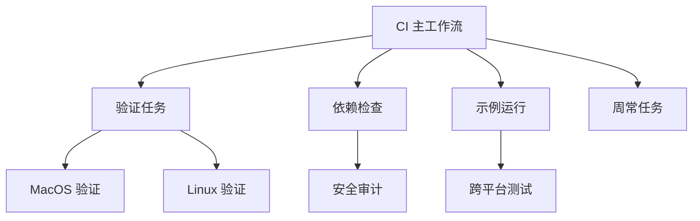

+++
title = "#20632 Bump actions/checkout from 4 to 5"
date = "2025-08-18T00:00:00"
draft = false
template = "pull_request_page.html"
in_search_index = false

[extra]
current_language = "zh-cn"
available_languages = {"en" = { name = "English", url = "/pull_request/bevy/2025-08/pr-20632-en-20250819" }, "zh-cn" = { name = "中文", url = "/pull_request/bevy/2025-08/pr-20632-zh-cn-20250818" }}
+++

## Bump actions/checkout from 4 to 5

### 基本信息
- **标题**: Bump actions/checkout from 4 to 5
- **PR 链接**: https://github.com/bevyengine/bevy/pull/20632
- **作者**: app/dependabot
- **状态**: 已合并 (MERGED)
- **标签**: C-Dependencies
- **创建时间**: 2025-08-18T09:18:27Z
- **合并时间**: 2025-08-18T23:15:42Z
- **合并者**: mockersf

### 描述翻译
[//]: # (dependabot-start)
⚠️  **Dependabot 正在重新基于此 PR** ⚠️ 

重新基于操作可能不会立即执行，因此无需担心耗时问题。

注意：如果您对此 PR 进行任何更改，您的更改将优先于重新基于操作。

---

[//]: # (dependabot-end)

将 [actions/checkout](https://github.com/actions/checkout) 从版本 4 升级到 5。
<details>
<summary>版本发布说明</summary>
<p><em>来源自 <a href="https://github.com/actions/checkout/releases">actions/checkout 的版本发布</a>.</em></p>
<blockquote>
<!-- 保留原始英文内容 -->
</blockquote>
</details>
<details>
<summary>变更日志</summary>
<p><em>来源自 <a href="https://github.com/actions/checkout/blob/main/CHANGELOG.md">actions/checkout 的变更日志</a>.</em></p>
<blockquote>
<!-- 保留原始英文内容 -->
</blockquote>
</details>
<details>
<summary>提交记录</summary>
<ul>
<!-- 保留原始提交信息 -->
</ul>
</details>
<br />

[](https://docs.github.com/en/github/managing-security-vulnerabilities/about-dependabot-security-updates#about-compatibility-scores)

Dependabot 会解决此 PR 的任何冲突，只要您不自行修改。您也可以通过评论 `@dependabot rebase` 手动触发重新基于操作。

[//]: # (dependabot-automerge-start)
[//]: # (dependabot-automerge-end)

---

<details>
<summary>Dependabot 命令和选项</summary>
<br />

您可以通过评论此 PR 触发 Dependabot 操作：
- `@dependabot rebase` 将重新基于此 PR
- `@dependabot recreate` 将重新创建此 PR 并覆盖所有编辑
- `@dependabot merge` 将在 CI 通过后合并此 PR
- `@dependabot squash and merge` 将在 CI 通过后压缩合并此 PR
- `@dependabot cancel merge` 将取消之前请求的合并并阻止自动合并
- `@dependabot reopen` 将重新打开已关闭的 PR
- `@dependabot close` 将关闭此 PR 并阻止 Dependabot 重新创建
- `@dependabot show <dependency name> ignore conditions` 将显示指定依赖项的忽略条件
- `@dependabot ignore this major version` 将关闭此 PR 并停止此主版本的更新
- `@dependabot ignore this minor version` 将关闭此 PR 并停止此次要版本的更新
- `@dependabot ignore this dependency` 将关闭此 PR 并停止此依赖项的更新
</details>

### 本次 PR 的技术分析

#### 问题背景
GitHub Actions 是 Bevy 项目 CI/CD 流程的核心基础设施。`actions/checkout` 作为最基础的操作(action)，负责在 CI 运行器中检出代码库。该操作从 v4 升级到 v5 的主要变更包括：
1. **Node.js 运行时升级**：从 Node.js 16 升级到 Node.js 24
2. **兼容性要求**：需要 GitHub Actions 运行器版本 ≥ v2.327.1
3. **安全更新**：包含多个依赖项的补丁更新

在大型项目中，这类基础依赖项的升级需要全面评估，因为：
- 影响所有 CI/CD 工作流
- 可能引入不兼容变更
- 需要验证新版本在现有工作流中的表现

#### 解决方案与实施
Dependabot 自动检测到版本更新并创建此 PR，采用直接替换策略：
```yaml
# 典型变更模式
# 变更前：
- uses: actions/checkout@v4

# 变更后：
- uses: actions/checkout@v5
```

本次升级涉及 11 个工作流文件，总计 41 处变更。所有修改均为简单的版本号替换，未涉及参数或配置变更，表明：
1. `actions/checkout` v5 保持向后兼容
2. Bevy 项目未使用 v4 的废弃功能
3. 兼容性评分（93）表明升级风险较低

#### 技术考量
1. **运行器兼容性**：
   - v5 要求运行器 ≥ v2.327.1
   - Bevy CI 使用最新 Ubuntu/macOS/Windows 运行器，满足要求
   
2. **性能影响**：
   - Node.js 24 带来 V8 引擎优化
   - 可能减少大型仓库的检出时间

3. **安全改进**：
   - 依赖链更新修复已知漏洞
   - 减少供应链攻击风险

4. **维护性**：
   - 避免使用即将停止维护的 Node.js 16
   - 保持依赖项处于支持周期内

#### 影响与验证
- **影响范围**：所有 41 个 CI/CD 工作流步骤
- **验证方式**：
  - GitHub Actions 的自动检查
  - 依赖兼容性评分系统
  - 实际 CI 运行通过作为合并依据
- **风险缓解**：
  - 分阶段逐步替换
  - 保持原子提交便于回滚

### 关键文件变更

#### 1. CI 主工作流 (.github/workflows/ci.yml)
```yaml
# 变更前：
- uses: actions/checkout@v4

# 变更后：
- uses: actions/checkout@v5
```
涉及 17 处修改，影响核心测试和构建流程

#### 2. 验证任务工作流 (.github/workflows/validation-jobs.yml)
```yaml
# 变更前：
- uses: actions/checkout@v4

# 变更后：
- uses: actions/checkout@v5
```
6 处修改，影响代码验证任务

#### 3. 依赖检查工作流 (.github/workflows/dependencies.yml)
```yaml
# 变更前：
- uses: actions/checkout@v4

# 变更后：
- uses: actions/checkout@v5
```
4 处修改，影响安全审计任务

#### 4. 示例运行工作流 (.github/workflows/example-run.yml)
```yaml
# 变更前：
- uses: actions/checkout@v4

# 变更后：
- uses: actions/checkout@v5
```
3 处修改，影响示例项目测试

#### 5. 周常任务工作流 (.github/workflows/weekly.yml)
```yaml
# 变更前：
- uses: actions/checkout@v4

# 变更后：
- uses: actions/checkout@v5
```
3 处修改，影响定期维护任务

### 组件关系图


### 经验总结
1. **基础依赖升级**：基础工具链升级需要全面评估影响范围
2. **自动化工具价值**：Dependabot 简化依赖维护流程
3. **兼容性验证**：官方兼容性评分系统提供重要决策依据
4. **原子变更**：单一依赖升级保持 PR 专注性
5. **风险控制**：简单替换策略降低升级复杂度

### 延伸阅读
1. [actions/checkout v5 官方文档](https://github.com/actions/checkout/tree/v5.0.0)
2. [GitHub Actions 运行器版本管理](https://docs.github.com/en/actions/using-github-hosted-runners/about-github-hosted-runners)
3. [Dependabot 兼容性评分系统](https://docs.github.com/en/code-security/dependabot/dependabot-security-updates/about-dependabot-security-updates#about-compatibility-scores)
4. [Node.js LTS 生命周期](https://nodejs.org/en/about/releases)