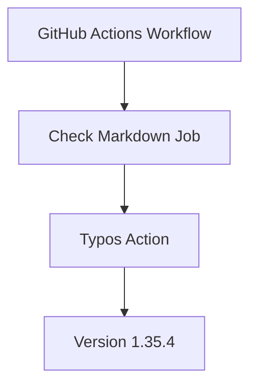

+++
title = "#20633 Bump crate-ci/typos from 1.35.3 to 1.35.4"
date = "2025-08-18T00:00:00"
draft = false
template = "pull_request_page.html"
in_search_index = true

[taxonomies]
list_display = ["show"]

[extra]
current_language = "en"
available_languages = {"en" = { name = "English", url = "/pull_request/bevy/2025-08/pr-20633-en-20250818" }, "zh-cn" = { name = "中文", url = "/pull_request/bevy/2025-08/pr-20633-zh-cn-20250818" }}
labels = ["C-Dependencies"]
+++

## Bump crate-ci/typos from 1.35.3 to 1.35.4

## Basic Information
- **Title**: Bump crate-ci/typos from 1.35.3 to 1.35.4
- **PR Link**: https://github.com/bevyengine/bevy/pull/20633
- **Author**: app/dependabot
- **Status**: MERGED
- **Labels**: C-Dependencies
- **Created**: 2025-08-18T09:28:04Z
- **Merged**: 2025-08-18T22:23:41Z
- **Merged By**: mockersf

## Description Translation
Bumps [crate-ci/typos](https://github.com/crate-ci/typos) from 1.35.3 to 1.35.4.
<details>
<summary>Release notes</summary>
<p><em>Sourced from <a href="https://github.com/crate-ci/typos/releases">crate-ci/typos's releases</a>.</em></p>
<blockquote>
<h2>v1.35.4</h2>
<h2>[1.35.4] - 2025-08-12</h2>
<h3>Fixes</h3>
<ul>
<li>Fix typo in correction to <code>exctracting</code></li>
</ul>
</blockquote>
</details>
<details>
<summary>Changelog</summary>
<p><em>Sourced from <a href="https://github.com/crate-ci/typos/blob/master/CHANGELOG.md">crate-ci/typos's changelog</a>.</em></p>
<blockquote>
<h2>[1.35.4] - 2025-08-12</h2>
<h3>Fixes</h3>
<ul>
<li>Fix typo in correction to <code>exctracting</code></li>
</ul>
</blockquote>
</details>
<details>
<summary>Commits</summary>
<ul>
<li><a href="https://github.com/crate-ci/typos/commit/a67079b4ae32e18c3f53d75368c52ce53b5fb56b"><code>a67079b</code></a> chore: Release</li>
<li><a href="https://github.com/crate-ci/typos/commit/83518a5ce26af538e4fca730663d7545dd957049"><code>83518a5</code></a> docs: Update changelog</li>
<li><a href="https://github.com/crate-ci/typos/commit/1f86d7c688049bd91c2cb7503181b3aa3ed5cad4"><code>1f86d7c</code></a> chore: Release</li>
<li><a href="https://github.com/crate-ci/typos/commit/5191d1f297887a5fe3fc753a33a6b43717309d81"><code>5191d1f</code></a> Merge pull request <a href="https://redirect.github.com/crate-ci/typos/issues/1355">#1355</a> from epage/exctracting</li>
<li><a href="https://github.com/crate-ci/typos/commit/bb6d8c3931203f8e8e26abb40e019d1eedf4e81e"><code>bb6d8c3</code></a> fix(dict): Don't correct to exctracting</li>
<li>See full diff in <a href="https://github.com/crate-ci/typos/compare/v1.35.3...v1.35.4">compare view</a></li>
</ul>
</details>
<br />


[](https://docs.github.com/en/github/managing-security-vulnerabilities/about-dependabot-security-updates#about-compatibility-scores)

Dependabot will resolve any conflicts with this PR as long as you don't alter it yourself. You can also trigger a rebase manually by commenting `@dependabot rebase`.

[//]: # (dependabot-automerge-start)
[//]: # (dependabot-automerge-end)

---

<details>
<summary>Dependabot commands and options</summary>
<br />

You can trigger Dependabot actions by commenting on this PR:
- `@dependabot rebase` will rebase this PR
- `@dependabot recreate` will recreate this PR, overwriting any edits that have been made to it
- `@dependabot merge` will merge this PR after your CI passes on it
- `@dependabot squash and merge` will squash and merge this PR after your CI passes on it
- `@dependabot cancel merge` will cancel a previously requested merge and block automerging
- `@dependabot reopen` will reopen this PR if it is closed
- `@dependabot close` will close this PR and stop Dependabot recreating it. You can achieve the same result by closing it manually
- `@dependabot show <dependency name> ignore conditions` will show all of the ignore conditions of the specified dependency
- `@dependabot ignore this major version` will close this PR and stop Dependabot creating any more for this major version (unless you reopen the PR or upgrade to it yourself)
- `@dependabot ignore this minor version` will close this PR and stop Dependabot creating any more for this minor version (unless you reopen the PR or upgrade to it yourself)
- `@dependabot ignore this dependency` will close this PR and stop Dependabot creating any more for this dependency (unless you reopen the PR or upgrade to it yourself)


</details>

## The Story of This Pull Request

This pull request updates the `crate-ci/typos` GitHub Action from version 1.35.3 to 1.35.4 in Bevy's CI pipeline. The primary motivation for this change is to incorporate a critical fix in the typos tool that addresses an issue in its dictionary. Specifically, the previous version contained an incorrect correction suggestion for the misspelling "exctracting" - instead of suggesting the proper correction "extracting", it was suggesting another invalid spelling. This could potentially introduce new typos if developers automatically applied the incorrect suggestion.

The dependency update process was automated through Dependabot, GitHub's dependency management service. Dependabot detected the new patch release (1.35.4) of the `typos` action and automatically generated this PR to update the version reference in Bevy's CI configuration file. The compatibility score badge shows that the update has no compatibility issues, indicating a safe upgrade path.

For Bevy, maintaining an accurate spell-checking tool is important for documentation quality and code readability. The `typos` action runs as part of the CI pipeline's "Check Markdown" job, scanning all documentation files for spelling errors. By updating to the fixed version, Bevy ensures that:
1. The tool won't suggest incorrect corrections
2. New documentation contributions will be checked more accurately
3. False positives in the spell-checking process are reduced

The implementation is straightforward - a single-line change in the CI configuration file that updates the version tag for the `crate-ci/typos` action. The simplicity of this change reflects the nature of dependency maintenance where updates are often atomic version bumps. The CI pipeline's structure remains unchanged, with the typos check continuing to run at the same point in the workflow.

After passing CI checks, this PR was merged within 13 hours of creation, demonstrating Bevy's efficient maintenance of dependencies. The quick merge cycle helps keep the project's tooling current while minimizing the window where incorrect spell-check suggestions could affect contributions.

## Visual Representation



## Key Files Changed

### `.github/workflows/ci.yml`
This file defines Bevy's GitHub Actions CI pipeline configuration. The change updates the version of the `typos` action used in the documentation checking stage.

**Before:**
```yaml
      - name: Check for typos
        uses: crate-ci/typos@v1.35.3
```

**After:**
```yaml
      - name: Check for typos
        uses: crate-ci/typos@v1.35.4
```

The update from `v1.35.3` to `v1.35.4` ensures the CI pipeline uses the latest bug-fixed version of the spell-checking tool. This change directly addresses the specific dictionary correction issue described in the release notes.

## Further Reading
- [Typos GitHub Repository](https://github.com/crate-ci/typos): Source code and documentation for the spell-checking tool
- [GitHub Actions Documentation](https://docs.github.com/en/actions): Official guide for configuring CI/CD workflows
- [Dependabot Documentation](https://docs.github.com/en/code-security/dependabot): Managing automated dependency updates
- [Semantic Versioning](https://semver.org/): Understanding patch version updates