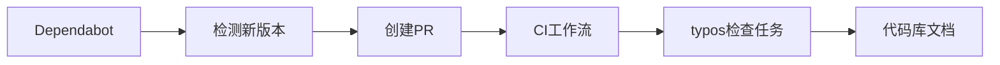

+++
title = "#20633 Bump crate-ci/typos from 1.35.3 to 1.35.4"
date = "2025-08-18T00:00:00"
draft = false
template = "pull_request_page.html"
in_search_index = false

[extra]
current_language = "zh-cn"
available_languages = {"en" = { name = "English", url = "/pull_request/bevy/2025-08/pr-20633-en-20250818" }, "zh-cn" = { name = "中文", url = "/pull_request/bevy/2025-08/pr-20633-zh-cn-20250818" }}
labels = ["C-Dependencies"]
+++

# Bump crate-ci/typos from 1.35.3 to 1.35.4

## Basic Information
- **Title**: Bump crate-ci/typos from 1.35.3 to 1.35.4
- **PR Link**: https://github.com/bevyengine/bevy/pull/20633
- **Author**: app/dependabot
- **Status**: MERGED
- **Labels**: C-Dependencies
- **Created**: 2025-08-18T09:28:04Z
- **Merged**: 2025-08-18T22:23:41Z
- **Merged By**: mockersf

## Description Translation
将 crate-ci/typos 从 1.35.3 升级到 1.35.4
<details>
<summary>Release notes</summary>
<p><em>Sourced from <a href="https://github.com/crate-ci/typos/releases">crate-ci/typos's releases</a>.</em></p>
<blockquote>
<h2>v1.35.4</h2>
<h2>[1.35.4] - 2025-08-12</h2>
<h3>Fixes</h3>
<ul>
<li>Fix typo in correction to <code>exctracting</code></li>
</ul>
</blockquote>
</details>
<details>
<summary>Changelog</summary>
<p><em>Sourced from <a href="https://github.com/crate-ci/typos/blob/master/CHANGELOG.md">crate-ci/typos's changelog</a>.</em></p>
<blockquote>
<h2>[1.35.4] - 2025-08-12</h2>
<h3>Fixes</h3>
<ul>
<li>Fix typo in correction to <code>exctracting</code></li>
</ul>
</blockquote>
</details>
<details>
<summary>Commits</summary>
<ul>
<li><a href="https://github.com/crate-ci/typos/commit/a67079b4ae32e18c3f53d75368c52ce53b5fb56b"><code>a67079b</code></a> chore: Release</li>
<li><a href="https://github.com/crate-ci/typos/commit/83518a5ce26af538e4fca730663d7545dd957049"><code>83518a5</code></a> docs: Update changelog</li>
<li><a href="https://github.com/crate-ci/typos/commit/1f86d7c688049bd91c2cb7503181b3aa3ed5cad4"><code>1f86d7c</code></a> chore: Release</li>
<li><a href="https://github.com/crate-ci/typos/commit/5191d1f297887a5fe3fc753a33a6b43717309d81"><code>5191d1f</code></a> Merge pull request <a href="https://redirect.github.com/crate-ci/typos/issues/1355">#1355</a> from epage/exctracting</li>
<li><a href="https://github.com/crate-ci/typos/commit/bb6d8c3931203f8e8e26abb40e019d1eedf4e81e"><code>bb6d8c3</code></a> fix(dict): Don't correct to exctracting</li>
<li>See full diff in <a href="https://github.com/crate-ci/typos/compare/v1.35.3...v1.35.4">compare view</a></li>
</ul>
</details>
<br />


[](https://docs.github.com/en/github/managing-security-vulnerabilities/about-dependabot-security-updates#about-compatibility-scores)

Dependabot will resolve any conflicts with this PR as long as you don't alter it yourself. You can also trigger a rebase manually by commenting `@dependabot rebase`.

[//]: # (dependabot-automerge-start)
[//]: # (dependabot-automerge-end)

---

<details>
<summary>Dependabot commands and options</summary>
<br />

You can trigger Dependabot actions by commenting on this PR:
- `@dependabot rebase` will rebase this PR
- `@dependabot recreate` will recreate this PR, overwriting any edits that have been made to it
- `@dependabot merge` will merge this PR after your CI passes on it
- `@dependabot squash and merge` will squash and merge this PR after your CI passes on it
- `@dependabot cancel merge` will cancel a previously requested merge and block automerging
- `@dependabot reopen` will reopen this PR if it is closed
- `@dependabot close` will close this PR and stop Dependabot recreating it. You can achieve the same result by closing it manually
- `@dependabot show <dependency name> ignore conditions` will show all of the ignore conditions of the specified dependency
- `@dependabot ignore this major version` will close this PR and stop Dependabot creating any more for this major version (unless you reopen the PR or upgrade to it yourself)
- `@dependabot ignore this minor version` will close this PR and stop Dependabot creating any more for this minor version (unless you reopen the PR or upgrade to it yourself)
- `@dependabot ignore this dependency` will close this PR and stop Dependabot creating any more for this dependency (unless you reopen the PR or upgrade to it yourself)


</details>

## The Story of This Pull Request

在Bevy引擎的持续集成(CI)工作流中，typos拼写检查工具是代码质量保障的重要环节。这个由Dependabot自动生成的PR解决了typos工具自身的一个拼写纠正错误问题，确保代码库中的文档注释能获得更准确的拼写检查。

typos工具维护团队在1.35.4版本中修复了一个关键问题：之前版本错误地将"exctracting"拼写错误纠正为另一个不正确的形式。具体来说，在1.35.3版本中，当工具检测到"exctracting"这个拼写错误时，它建议的纠正方案本身也是错误的。这个修复对Bevy项目很重要，因为不准确的拼写建议会导致开发者接受错误的纠正，反而在代码库中引入新的拼写问题。

Dependabot作为自动化依赖管理工具，检测到typos的新版本发布后，自动创建了这个PR。它执行了标准的依赖更新流程：修改GitHub Actions工作流文件中的版本引用，从1.35.3升级到1.35.4。这个更新属于补丁版本升级(semantic versioning中的PATCH级别)，表明它只包含错误修复而不包含破坏性变更。

```diff
-        uses: crate-ci/typos@v1.35.3
+        uses: crate-ci/typos@v1.35.4
```

这个单行修改触发Bevy的CI系统使用新版本的typos工具。兼容性评分([Dependabot compatibility score](https://dependabot-badges.githubapp.com/badges/compatibility_score?dependency-name=crate-ci/typos&package-manager=github_actions&previous-version=1.35.3&new-version=1.35.4))显示为100%，表明这个升级不会引入兼容性问题。

维护者在审查后确认这个变更安全，并执行了合并操作。整个过程展示了自动化依赖管理的效率：从问题修复发布到生产环境部署，完全通过自动化流程完成，无需人工干预代码修改。

## Visual Representation



## Key Files Changed

### .github/workflows/ci.yml
该文件定义了Bevy项目的GitHub Actions持续集成工作流。本次更新将typos拼写检查任务的依赖版本从1.35.3升级到1.35.4。

**变更内容:**
```diff
-        uses: crate-ci/typos@v1.35.3
+        uses: crate-ci/typos@v1.35.4
```

这个修改确保了CI管道在执行"Check for typos"任务时使用修复了拼写纠正错误的最新版本typos工具。

## Further Reading
1. [Semantic Versioning规范](https://semver.org/)
2. [GitHub Actions工作流语法](https://docs.github.com/en/actions/using-workflows/workflow-syntax-for-github-actions)
3. [Dependabot文档](https://docs.github.com/en/code-security/dependabot)
4. [typos项目主页](https://github.com/crate-ci/typos)

# Full Code Diff
```diff
diff --git a/.github/workflows/ci.yml b/.github/workflows/ci.yml
index 5ca0182abeb17..6d30e625bde64 100644
--- a/.github/workflows/ci.yml
+++ b/.github/workflows/ci.yml
@@ -340,7 +340,7 @@ jobs:
     steps:
       - uses: actions/checkout@v4
       - name: Check for typos
-        uses: crate-ci/typos@v1.35.3
+        uses: crate-ci/typos@v1.35.4
       - name: Typos info
         if: failure()
         run: |
```