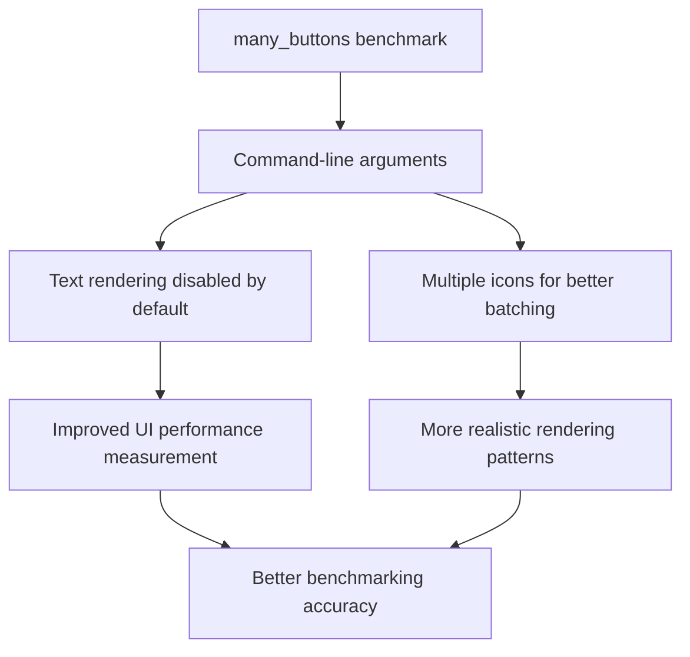

+++
title = "#20636 Disable button labels for the `many_buttons` stress test by default"
date = "2025-08-26T00:00:00"
draft = false
template = "pull_request_page.html"
in_search_index = true

[taxonomies]
list_display = ["show"]

[extra]
current_language = "en"
available_languages = {"en" = { name = "English", url = "/pull_request/bevy/2025-08/pr-20636-en-20250826" }, "zh-cn" = { name = "中文", url = "/pull_request/bevy/2025-08/pr-20636-zh-cn-20250826" }}
labels = ["A-UI", "C-Benchmarks", "D-Straightforward", "M-Deliberate-Rendering-Change"]
+++

# Disable button labels for the `many_buttons` stress test by default

## Basic Information
- **Title**: Disable button labels for the `many_buttons` stress test by default
- **PR Link**: https://github.com/bevyengine/bevy/pull/20636
- **Author**: ickshonpe
- **Status**: MERGED
- **Labels**: A-UI, S-Ready-For-Final-Review, C-Benchmarks, D-Straightforward, M-Deliberate-Rendering-Change
- **Created**: 2025-08-18T11:03:41Z
- **Merged**: 2025-08-26T03:26:48Z
- **Merged By**: alice-i-cecile

## Description Translation
The `many_buttons` benchmark isn't a good measure of UI performance because it's dominated by the text layout and rendering for the button labels. The button labels should be disabled by default, we have other text specific stress tests.

## Solution

1. Rename  the `no_text` commandline parameter to `text`. The buttons are no longer shown by default, to run the example with labels you need to use:
  ```
  cargo run --example many_buttons --release -- --text
  ```
2. Add a second button icon image, this is to break up the batches during rendering without text.
3. Spawn every button with an icon.

## The Story of This Pull Request

The `many_buttons` stress test was designed to benchmark UI performance under heavy load, but it had a fundamental measurement problem. The text rendering and layout operations for button labels were dominating the performance profile, making it difficult to isolate and measure pure UI rendering and layout performance. This PR addresses that issue by making several strategic changes to refocus the benchmark on core UI performance metrics.

The core problem was straightforward: text rendering is computationally expensive and was skewing the benchmark results. When developers ran `many_buttons` to test UI performance improvements, they were primarily measuring text performance rather than the UI system itself. The solution needed to maintain the stress test's value while providing clearer separation between text and non-text performance measurements.

The implementation took a three-pronged approach. First, the command-line interface was reworked to make text rendering opt-in rather than opt-out. The `no_text` parameter was renamed to `text` and its logic inverted. This change makes the default behavior (no text) better aligned with the benchmark's purpose of testing UI performance without text overhead:

```rust
// Before:
#[argh(switch)]
no_text: bool,

// After:  
#[argh(switch)]
text: bool,
```

Second, to maintain rendering complexity without text, the PR adds a second icon image and ensures every button receives an icon. This prevents the renderer from batching all buttons into a single draw call, which would not represent real-world UI rendering patterns:

```rust
// Before:
let image = if 0 < args.image_freq {
    Some(asset_server.load("branding/icon.png"))
} else {
    None
};

// After:
let images = if 0 < args.image_freq {
    Some(vec![
        asset_server.load("branding/icon.png"),
        asset_server.load("textures/Game Icons/wrench.png"),
    ])
} else {
    None
};
```

Third, the image distribution logic was improved to use both images in a round-robin fashion based on button position, creating more realistic rendering batches:

```rust
// Before:
image.as_ref()
    .filter(|_| (column + row) % args.image_freq == 0)
    .cloned(),

// After:
images.as_ref().map(|images| {
    images[((column + row) / args.image_freq) % images.len()].clone()
}),
```

These changes work together to create a more meaningful stress test. Without text by default, the benchmark now accurately measures UI layout and rendering performance. The addition of multiple icons maintains rendering complexity and prevents unrealistic batching optimizations. When text performance needs to be measured, developers can still use the `--text` flag to enable labels.

The impact is significant for Bevy's benchmarking suite. UI performance improvements can now be measured more accurately, and the benchmark better represents real-world UI rendering scenarios. The changes also make the benchmark more flexible - teams can test pure UI performance, text performance, or both depending on their needs.

## Visual Representation



## Key Files Changed

### `examples/stress_tests/many_buttons.rs` (+32/-25)

This is the main stress test example that spawns large numbers of buttons to test UI performance. The changes focus on making text rendering optional and improving the rendering characteristics without text.

**Key changes:**
1. Renamed and inverted the text parameter logic
2. Added support for multiple button icons
3. Modified image distribution logic

```rust
// Before argument parsing:
#[argh(switch)]
no_text: bool,

// After argument parsing:  
#[argh(switch)]
text: bool,
```

```rust
// Before image loading:
let image = if 0 < args.image_freq {
    Some(asset_server.load("branding/icon.png"))
} else {
    None
};

// After image loading:
let images = if 0 < args.image_freq {
    Some(vec![
        asset_server.load("branding/icon.png"),
        asset_server.load("textures/Game Icons/wrench.png"),
    ])
} else {
    None
};
```

```rust
// Before image assignment:
image.as_ref()
    .filter(|_| (column + row) % args.image_freq == 0)
    .cloned(),

// After image assignment:
images.as_ref().map(|images| {
    images[((column + row) / args.image_freq) % images.len()].clone()
}),
```

These changes ensure the benchmark provides more accurate UI performance measurements by default while maintaining the ability to test text rendering when needed.

## Further Reading

- [Bevy UI System Documentation](https://bevyengine.org/learn/book/getting-started/ui/)
- [Bevy Benchmarking Guide](https://bevyengine.org/learn/book/getting-started/benchmarking/)
- [Text Rendering Performance Considerations](https://bevyengine.org/learn/book/getting-started/text-rendering/)
- [UI Batching and Draw Call Optimization](https://bevyengine.org/learn/book/getting-started/rendering/ui-batching)