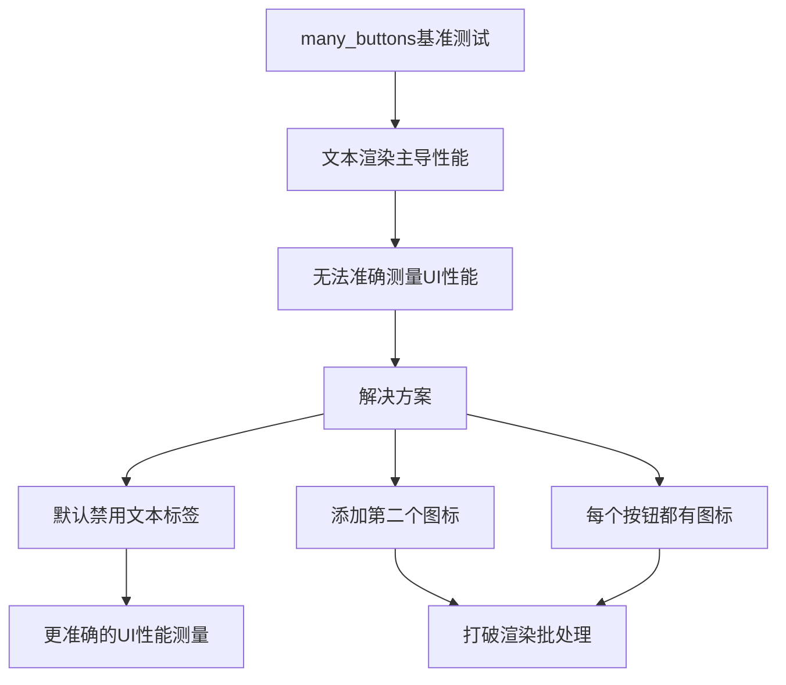

+++
title = "#20636 Disable button labels for the `many_buttons` stress test by default"
date = "2025-08-26T00:00:00"
draft = false
template = "pull_request_page.html"
in_search_index = false

[extra]
current_language = "zh-cn"
available_languages = {"en" = { name = "English", url = "/pull_request/bevy/2025-08/pr-20636-en-20250826" }, "zh-cn" = { name = "中文", url = "/pull_request/bevy/2025-08/pr-20636-zh-cn-20250826" }}
+++

# Title
Disable button labels for the `many_buttons` stress test by default

## 基本信息
- **标题**: Disable button labels for the `many_buttons` stress test by default
- **PR链接**: https://github.com/bevyengine/bevy/pull/20636
- **作者**: ickshonpe
- **状态**: 已合并
- **标签**: A-UI, S-Ready-For-Final-Review, C-Benchmarks, D-Straightforward, M-Deliberate-Rendering-Change
- **创建时间**: 2025-08-18T11:03:41Z
- **合并时间**: 2025-08-26T03:26:48Z
- **合并者**: alice-i-cecile

## 描述翻译
# 目标

`many_buttons` 基准测试不能很好地衡量 UI 性能，因为它主要受按钮标签的文本布局和渲染影响。按钮标签应该默认禁用，我们已经有其他专门的文本压力测试。

## 解决方案

1. 将命令行参数 `no_text` 重命名为 `text`。按钮默认不再显示标签，要运行带标签的示例需要使用：
   ```
   cargo run --example many_buttons --release -- --text
   ```
2. 添加第二个按钮图标图像，这是为了在没有文本的情况下在渲染过程中打破批处理。
3. 为每个按钮生成一个图标。

## 这个PR的故事

这个PR解决了一个UI性能基准测试中的关键问题。`many_buttons`示例原本被设计为压力测试UI系统的性能，但实际上它主要测量的是文本渲染性能，而不是UI系统本身的性能。

问题的核心在于文本渲染在UI性能测试中占据了主导地位。当运行`many_buttons`基准测试时，大部分时间都花在了文本布局和渲染上，这使得测试结果不能准确反映UI系统的实际性能。这对于想要优化UI系统但需要准确基准测试的开发者来说是个问题。

开发者采取了三个主要措施来解决这个问题：

首先，他们反转了文本显示的默认行为。原本的`--no-text`参数被重命名为`--text`，意味着现在默认不显示文本标签，只有明确指定`--text`标志时才会显示。这是一个语义上的重要改变，使基准测试更专注于UI性能而非文本性能。

```rust
// 修改前:
#[argh(switch)]
no_text: bool,

// 修改后:
#[argh(switch)]
text: bool,
```

其次，为了在没有文本的情况下仍然保持渲染批处理的合理性，开发者添加了第二个图标资源。原本只有一个图标时，所有按钮使用相同的图像，这会导致所有按钮被批量处理，无法测试真实的渲染性能。

```rust
// 修改前:
let image = if 0 < args.image_freq {
    Some(asset_server.load("branding/icon.png"))
} else {
    None
};

// 修改后:
let images = if 0 < args.image_freq {
    Some(vec![
        asset_server.load("branding/icon.png"),
        asset_server.load("textures/Game Icons/wrench.png"),
    ])
} else {
    None
};
```

第三，开发者修改了图标分配逻辑，确保每个按钮都有一个图标（当启用图标时），并且使用轮询方式分配不同的图标来打破渲染批处理。

```rust
// 修改前:
image
    .as_ref()
    .filter(|_| (column + row) % args.image_freq == 0)
    .cloned(),

// 修改后:
images.as_ref().map(|images| {
    images[((column + row) / args.image_freq) % images.len()].clone()
}),
```

这些改变确保了`many_buttons`基准测试现在能够更准确地测量UI系统本身的性能，而不是被文本渲染性能所主导。同时，通过添加多个图标和确保每个按钮都有图标，测试仍然能够评估渲染批处理的性能影响。

从技术角度来看，这个PR展示了良好的性能测试设计原则：隔离关注点，确保测试测量的是你想要测量的内容。对于UI系统来说，文本渲染和基本UI渲染是不同的性能特征，应该分别进行测试。

## 可视化表示



## 关键文件变更

- `examples/stress_tests/many_buttons.rs` (+32/-25)

这个文件包含了所有的修改，主要涉及三个方面：

1. 命令行参数的重命名和行为反转：
```rust
// 之前:
/// whether to add text to each button
#[argh(switch)]
no_text: bool,

// 之后:
/// whether to add labels to each button
#[argh(switch)]
text: bool,
```

2. 图标的加载和使用方式改变：
```rust
// 之前使用单个图标
let image = if 0 < args.image_freq {
    Some(asset_server.load("branding/icon.png"))
} else {
    None
};

// 之后使用图标数组
let images = if 0 < args.image_freq {
    Some(vec![
        asset_server.load("branding/icon.png"),
        asset_server.load("textures/Game Icons/wrench.png"),
    ])
} else {
    None
};
```

3. 图标分配逻辑的改进：
```rust
// 之前: 只有部分按钮有图标
image
    .as_ref()
    .filter(|_| (column + row) % args.image_freq == 0)
    .cloned(),

// 之后: 所有按钮都有图标，轮流使用不同图标
images.as_ref().map(|images| {
    images[((column + row) / args.image_freq) % images.len()].clone()
}),
```

这些变更共同确保了基准测试能够更准确地测量UI系统性能，而不是被文本渲染性能所主导。

## 延伸阅读

对于想要了解更多关于UI性能测试和Bevy UI系统的开发者，建议阅读以下资源：

1. [Bevy UI官方文档](https://bevyengine.org/learn/books/introduction/ui) - Bevy UI系统的官方指南
2. [性能基准测试最佳实践](https://github.com/bevyengine/bevy/blob/main/docs/plugins_guidelines.md#benchmarking) - Bevy项目中的基准测试指南
3. [ECS和渲染批处理](https://bevyengine.org/learn/books/introduction/ecs) - 了解实体组件系统如何影响渲染性能
4. [Bevy渲染架构](https://bevyengine.org/learn/books/introduction/rendering) - Bevy渲染系统的工作原理

这些资源将帮助开发者更好地理解UI性能优化的各个方面，以及如何在Bevy中进行有效的性能测试和优化。