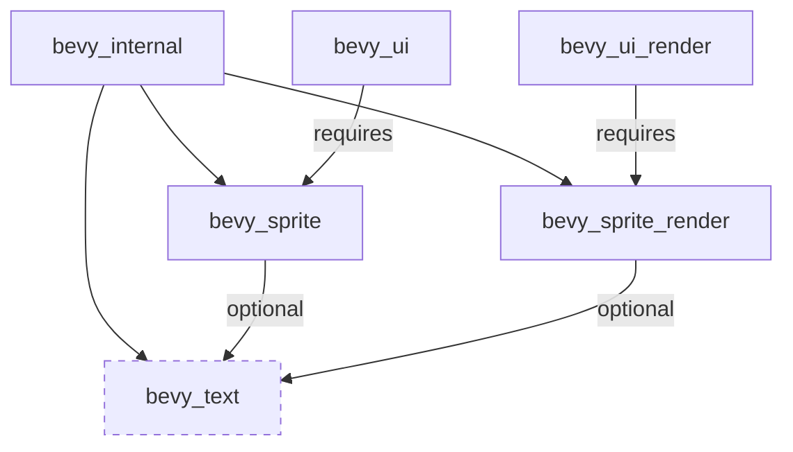

+++
title = "#20637 Text2d feature-gate"
date = "2025-08-22T00:00:00"
draft = false
template = "pull_request_page.html"
in_search_index = true

[taxonomies]
list_display = ["show"]

[extra]
current_language = "en"
available_languages = {"en" = { name = "English", url = "/pull_request/bevy/2025-08/pr-20637-en-20250822" }, "zh-cn" = { name = "中文", url = "/pull_request/bevy/2025-08/pr-20637-zh-cn-20250822" }}
labels = ["A-Rendering", "C-Code-Quality", "A-Text"]
+++

# Text2d feature-gate

## Basic Information
- **Title**: Text2d feature-gate
- **PR Link**: https://github.com/bevyengine/bevy/pull/20637
- **Author**: ickshonpe
- **Status**: MERGED
- **Labels**: A-Rendering, C-Code-Quality, S-Ready-For-Final-Review, A-Text
- **Created**: 2025-08-18T12:45:29Z
- **Merged**: 2025-08-22T22:31:05Z
- **Merged By**: james7132

## Description Translation
# Objective

Add a "text2d" feature-gate to enable text rendering using `bevy_sprite` and `bevy_sprite_render`.

## Solution

Add a "text2d" default feature, and all the necessary feature gates.
Made `bevy_window` an optional depedency for `bevy_sprite` again.

## Testing

The UI `text` example runs with the "text2d" feature disabled. 
I haven't implemented any features like this that span multiple crates before, so needs a good second look from someone.

## The Story of This Pull Request

This PR addresses a dependency management issue in Bevy's text rendering system. The core problem was that text rendering functionality was tightly coupled with sprite rendering, making it impossible to use sprites without also including text rendering capabilities. This created unnecessary bloat for users who only needed sprite functionality without text support.

The solution implements a feature gate system that makes text2d rendering optional across multiple crates. The approach involves modifying dependency declarations in Cargo.toml files and adding conditional compilation attributes in the Rust code.

The implementation starts with the root Cargo.toml, where the `bevy_text` feature is modified to remove the hard dependency on `bevy_sprite`:

```toml
# Before:
bevy_text = ["bevy_internal/bevy_text", "bevy_asset", "bevy_sprite"]

# After:
bevy_text = ["bevy_internal/bevy_text", "bevy_asset"]
```

In `bevy_internal/Cargo.toml`, the feature definitions are restructured to establish proper conditional dependencies:

```toml
bevy_text = [
  "dep:bevy_text",
  "bevy_image",
  "bevy_sprite?/bevy_text",
  "bevy_sprite_render?/bevy_text",
]
```

The key change here is the use of `?/` syntax, which means "enable this feature only if the dependency is available." This allows for optional feature propagation.

In `bevy_sprite/Cargo.toml`, several dependencies are made optional and a new `bevy_text` feature is added:

```toml
[features]
bevy_sprite_picking_backend = ["bevy_picking", "bevy_window"]
bevy_text = ["dep:bevy_text", "bevy_window"]

[dependencies]
bevy_window = { path = "../bevy_window", version = "0.17.0-dev", optional = true }
bevy_text = { path = "../bevy_text", version = "0.17.0-dev", optional = true }
```

The Rust code in `bevy_sprite/src/lib.rs` is modified with conditional compilation attributes:

```rust
// Module is conditionally compiled
#[cfg(feature = "bevy_text")]
mod text2d;

// Conditionally export text2d components
#[cfg(feature = "bevy_text")]
pub use text2d::*;

// Systems are conditionally added
#[cfg(feature = "bevy_text")]
app.add_systems(
    PostUpdate,
    (
        bevy_text::detect_text_needs_rerender::<Text2d>,
        update_text2d_layout
            .ambiguous_with(bevy_camera::CameraUpdateSystems)
            .after(bevy_text::remove_dropped_font_atlas_sets),
        calculate_bounds_text2d.in_set(VisibilitySystems::CalculateBounds),
    )
        .chain()
        .in_set(bevy_text::Text2dUpdateSystems)
        .after(bevy_app::AnimationSystems),
);
```

Similar changes are made in `bevy_sprite_render` to conditionally include text2d rendering functionality, and both `bevy_ui` and `bevy_ui_render` are updated to explicitly enable the text2d feature since UI always needs text rendering.

The impact of these changes is significant for users who want to optimize their build size. Projects that use sprites but don't need text rendering can now exclude the text rendering code, reducing binary size and compile times. The changes maintain backward compatibility by keeping the feature enabled by default.

This implementation demonstrates effective use of Rust's feature system for managing optional functionality in a large, modular codebase. The cross-crate coordination shows careful attention to dependency management and feature propagation.

## Visual Representation



## Key Files Changed

**crates/bevy_sprite/src/lib.rs** (+11/-9)
- Added conditional compilation for text2d module and functionality
- Modified system registration to be feature-gated
- Updated import statements to use fully qualified paths

**crates/bevy_internal/Cargo.toml** (+9/-4)
- Restructured feature definitions for better dependency management
- Added optional feature propagation using `?/` syntax
- Updated dependency relationships between text, sprite, and sprite_render

**crates/bevy_sprite/Cargo.toml** (+4/-3)
- Made bevy_window and bevy_text dependencies optional
- Added bevy_text feature that enables text functionality
- Updated feature dependencies for picking backend

**crates/bevy_ui_render/Cargo.toml** (+4/-2)
- Explicitly enabled bevy_text feature on bevy_sprite_render dependency
- Removed default-features = false from bevy_text dependency

```toml
# Before:
bevy_sprite_render = { path = "../bevy_sprite_render", version = "0.17.0-dev" }
bevy_text = { path = "../bevy_text", version = "0.17.0-dev", default-features = false }

# After:
bevy_sprite_render = { path = "../bevy_sprite_render", version = "0.17.0-dev", features = [
  "bevy_text",
] }
bevy_text = { path = "../bevy_text", version = "0.17.0-dev" }
```

**crates/bevy_ui/Cargo.toml** (+3/-1)
- Explicitly enabled bevy_text feature on bevy_sprite dependency

```toml
# Before:
bevy_sprite = { path = "../bevy_sprite", version = "0.17.0-dev" }

# After:
bevy_sprite = { path = "../bevy_sprite", version = "0.17.0-dev", features = [
  "bevy_text",
] }
```

## Further Reading

- [The Cargo Book: Features](https://doc.rust-lang.org/cargo/reference/features.html) - Official documentation on Rust's feature system
- [Bevy Engine: Features](https://bevyengine.org/learn/quick-start/features/) - How to use features in Bevy
- [Conditional Compilation in Rust](https://doc.rust-lang.org/reference/conditional-compilation.html) - Reference for #[cfg] attributes
- [Bevy's Modular Architecture](https://bevyengine.org/learn/quick-start/plugins/) - Understanding how Bevy's plugin system works