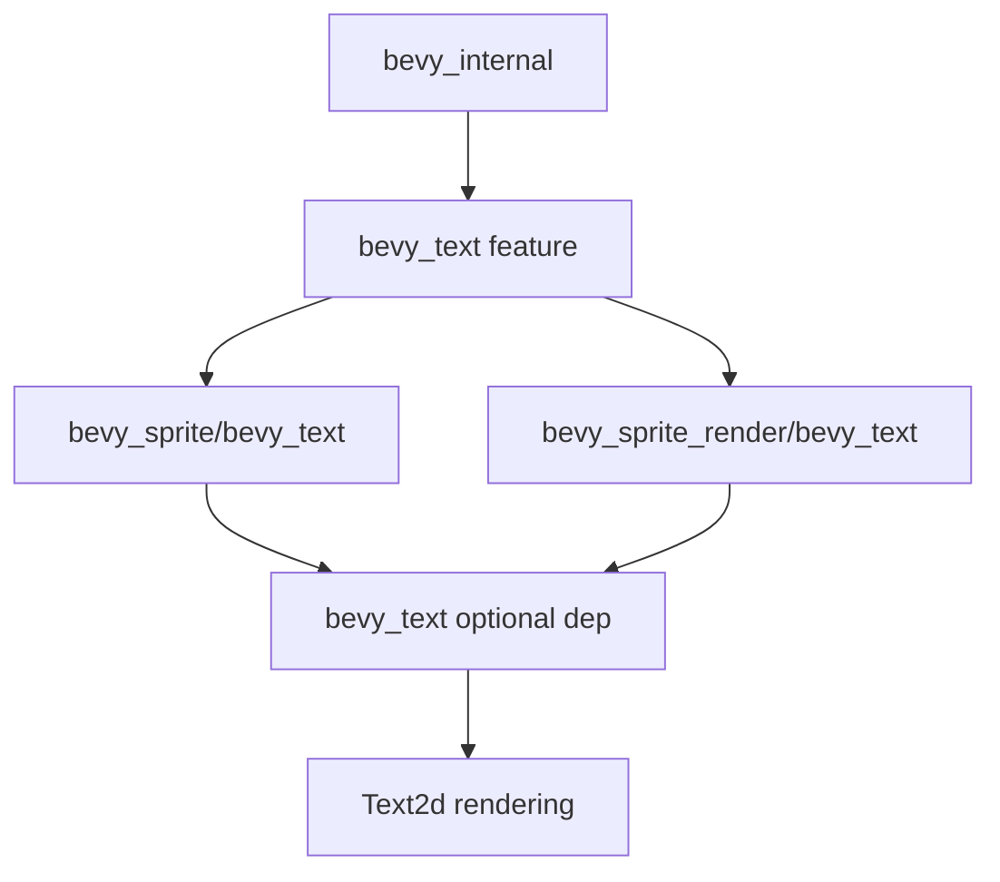

+++
title = "#20637 Text2d feature-gate"
date = "2025-08-22T00:00:00"
draft = false
template = "pull_request_page.html"
in_search_index = false

[extra]
current_language = "zh-cn"
available_languages = {"en" = { name = "English", url = "/pull_request/bevy/2025-08/pr-20637-en-20250822" }, "zh-cn" = { name = "中文", url = "/pull_request/bevy/2025-08/pr-20637-zh-cn-20250822" }}
+++

# Text2d feature-gate

## 基本信息
- **标题**: Text2d feature-gate
- **PR链接**: https://github.com/bevyengine/bevy/pull/20637
- **作者**: ickshonpe
- **状态**: 已合并
- **标签**: A-Rendering, C-Code-Quality, S-Ready-For-Final-Review, A-Text
- **创建时间**: 2025-08-18T12:45:29Z
- **合并时间**: 2025-08-22T22:31:05Z
- **合并者**: james7132

## 描述翻译
# Objective

添加 "text2d" feature-gate 来启用使用 `bevy_sprite` 和 `bevy_sprite_render` 的文本渲染功能。

## Solution

添加默认的 "text2d" feature，以及所有必要的 feature gates。
再次将 `bevy_window` 设为 `bevy_sprite` 的可选依赖。

## Testing

在禁用 "text2d" feature 的情况下，UI `text` 示例可以运行。
这是我第一次实现这种跨多个 crate 的 feature，需要有人仔细审查。

## 这个PR的故事

这个PR的核心目标是实现模块化的文本渲染功能。在Bevy引擎中，2D文本渲染依赖于多个crate的协作：`bevy_text` 处理文本布局和渲染逻辑，`bevy_sprite` 提供2D精灵支持，而 `bevy_sprite_render` 负责实际的渲染工作。之前这些组件是紧密耦合的，即使用户不需要文本渲染功能，仍然需要编译所有相关依赖。

开发者面临的问题是编译时间和二进制大小的问题。对于不需要2D文本渲染的应用（比如只使用3D文本或根本不需要文本的应用），强制依赖所有文本相关组件会增加不必要的编译负担和二进制体积。

解决方案是引入 "text2d" feature gate，通过条件编译来控制文本渲染功能的引入。这个实现涉及多个crate的协调修改：

首先，在 `bevy_internal/Cargo.toml` 中重新组织了feature依赖关系。关键的改变是将 `bevy_text` 的依赖从强制性的 `bevy_sprite` 改为可选的条件依赖：

```toml
bevy_text = [
  "dep:bevy_text",
  "bevy_image",
  "bevy_sprite?/bevy_text",
  "bevy_sprite_render?/bevy_text",
]
```

这种 `?/` 语法表示只有当上游crate启用相应feature时才传递依赖。

在 `bevy_sprite/Cargo.toml` 中，添加了 `bevy_text` feature并相应调整了依赖：

```toml
bevy_text = ["dep:bevy_text", "bevy_window"]
bevy_window = { path = "../bevy_window", version = "0.17.0-dev", optional = true }
bevy_text = { path = "../bevy_text", version = "0.17.0-dev", optional = true }
```

代码实现方面，在 `bevy_sprite/src/lib.rs` 中，使用 `#[cfg(feature = "bevy_text")]` 条件编译指令来包装所有文本相关功能：

```rust
#[cfg(feature = "bevy_text")]
mod text2d;

#[cfg(feature = "bevy_text")]
pub use text2d::*;

#[cfg(feature = "bevy_text")]
app.add_systems(
    PostUpdate,
    (
        bevy_text::detect_text_needs_rerender::<Text2d>,
        // ... 其他文本相关系统
    )
);
```

这种设计确保了当 "text2d" feature被禁用时，所有文本渲染相关的代码都不会被编译，包括模块导入、系统添加和组件定义。

类似的修改也应用于 `bevy_sprite_render` crate，确保渲染端也遵循相同的条件编译规则：

```rust
#[cfg(feature = "bevy_text")]
mod text2d;

#[cfg(feature = "bevy_text")]
use crate::text2d::extract_text2d_sprite;

#[cfg(feature = "bevy_text")]
extract_text2d_sprite.after(SpriteSystems::ExtractSprites),
```

这个实现的一个巧妙之处是保持了向后兼容性。通过将 "text2d" 设为默认feature，现有代码无需修改就能继续工作，同时为需要优化编译的用户提供了选择权。

从工程角度看，这个PR展示了良好的模块化设计原则：功能隔离、可选依赖和条件编译。它不仅减少了不必要的编译开销，还为未来的功能扩展提供了清晰的模式。

## 可视化表示



## 关键文件变更

**crates/bevy_internal/Cargo.toml** (+9/-4)
- 重新组织bevy_text的依赖关系，使其依赖于可选的bevy_sprite和bevy_sprite_render feature
- 调整bevy_window和bevy_camera的依赖链

**crates/bevy_sprite/Cargo.toml** (+4/-3)
- 添加bevy_text feature
- 使bevy_window和bevy_text成为可选依赖

**crates/bevy_sprite/src/lib.rs** (+11/-9)
- 使用条件编译包装text2d模块
- 调整系统添加逻辑，只在启用text2d时添加文本相关系统

```rust
// 修改前:
mod text2d;
pub use text2d::*;
app.add_systems(PostUpdate, (detect_text_needs_rerender::<Text2d>, ...));

// 修改后:
#[cfg(feature = "bevy_text")]
mod text2d;
#[cfg(feature = "bevy_text")]
pub use text2d::*;
#[cfg(feature = "bevy_text")]
app.add_systems(PostUpdate, (bevy_text::detect_text_needs_rerender::<Text2d>, ...));
```

**crates/bevy_sprite_render/Cargo.toml** (+4/-2)
- 添加bevy_text feature
- 使bevy_text成为可选依赖

**crates/bevy_sprite_render/src/lib.rs** 
- 使用条件编译包装text2d模块和相关提取功能

## 进一步阅读

- [Cargo Features documentation](https://doc.rust-lang.org/cargo/reference/features.html)
- [Bevy Engine ECS Guide](https://bevyengine.org/learn/books/introduction/)
- [Conditional Compilation in Rust](https://doc.rust-lang.org/reference/conditional-compilation.html)