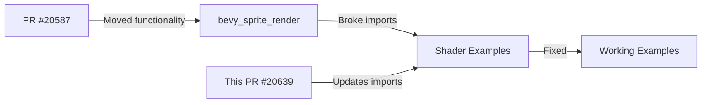

+++
title = "#20639"
date = "2025-08-18T00:00:00"
draft = false
template = "pull_request_page.html"
in_search_index = true

[taxonomies]
list_display = ["show"]

[extra]
current_language = "en"
available_languages = {"en" = { name = "English", url = "/pull_request/bevy/2025-08/pr-20639-en-20250818" }, "zh-cn" = { name = "中文", url = "/pull_request/bevy/2025-08/pr-20639-zh-cn-20250818" }}
+++

## Fixing Broken Shader Imports in Bevy's 2D Examples

### The Problem and Context
When working on the Bevy engine, PR #20587 restructured shader imports by moving sprite-related functionality from `bevy_sprite` to `bevy_sprite_render`. While this architectural change improved code organization, it unintentionally broke several 2D examples that relied on custom shaders. The core issue (#20615) manifested as compilation errors in these examples because their shader code still referenced the old import paths. Since examples serve as critical learning resources and reference implementations for Bevy users, keeping them functional is essential for both documentation and user experience.

### The Solution Approach
The fix required systematically updating all import statements in affected shaders to reference the new `bevy_sprite_render` module instead of the old `bevy_sprite` path. This approach:
1. Maintained consistency with Bevy's updated rendering architecture
2. Required minimal changes since only import paths needed modification
3. Preserved all shader functionality without altering core logic
4. Covered all broken examples identified in the issue

The solution was validated by running the affected examples (`custom_gltf_vertex_attribute`, `shader_material_2d`, and `mesh2d_manual`) to confirm they compiled and rendered correctly.

### Implementation Details
The changes exclusively modify import statements across four files - three shader assets and one Rust example file. Each change follows the same pattern: replacing `bevy_sprite::` with `bevy_sprite_render::` in import declarations.

**Shader import updates**  
For each shader file, the import path was updated to match Bevy's new module structure:

```wgsl
// File: assets/shaders/custom_gltf_2d.wgsl
// Before:
#import bevy_sprite::{
    mesh2d_view_bindings::globals,
    mesh2d_functions::{get_world_from_local, mesh2d_position_local_to_clip},
}

// After:
#import bevy_sprite_render::{
    mesh2d_view_bindings::globals,
    mesh2d_functions::{get_world_from_local, mesh2d_position_local_to_clip},
}
```

```wgsl
// File: assets/shaders/custom_material_2d.wgsl
// Before:
#import bevy_sprite::mesh2d_vertex_output::VertexOutput

// After:
#import bevy_sprite_render::mesh2d_vertex_output::VertexOutput
```

**Comment correction**  
The custom_vertex_attribute.wgsl shader also received a documentation update to reflect the new import path:

```wgsl
// File: assets/shaders/custom_vertex_attribute.wgsl
// Before:
// For 2d replace `bevy_pbr::mesh_functions` with `bevy_sprite::mesh2d_functions`

// After:
// For 2d replace `bevy_pbr::mesh_functions` with `bevy_sprite_render::mesh2d_functions`
```

**Example code fix**  
The mesh2d_manual example was updated to reference the correct import path in its embedded shader code:

```rust
// File: examples/2d/mesh2d_manual.rs
// Before:
const COLORED_MESH2D_SHADER: &str = r"
#import bevy_sprite::mesh2d_functions
";

// After:
const COLORED_MESH2D_SHADER: &str = r"
#import bevy_sprite_render::mesh2d_functions
";
```

### Technical Insights
This fix demonstrates several important aspects of Bevy's architecture:
1. **Decoupled Rendering Logic**: The move to `bevy_sprite_render` separates rendering concerns from core sprite functionality
2. **WGSL Import System**: Bevy's shader system uses WGSL's `#import` directive for code organization
3. **Asset Management**: Shader files are treated as first-class assets that need maintenance like code files
4. **Example Validation**: Examples serve as critical test cases for API changes

### The Impact
These changes immediately restore functionality to three important 2D rendering examples. For Bevy users, this means:
- Learning materials remain accurate and functional
- Custom shader implementations continue to work with current Bevy versions
- The engine demonstrates commitment to maintaining working examples
- Future similar refactors will need similar cross-cutting updates

## Visual Representation



## Key Files Changed

1. **`assets/shaders/custom_gltf_2d.wgsl`**  
   Updated import path to match new module structure  
   ```wgsl
   // Change:
   -#import bevy_sprite::{
   +#import bevy_sprite_render::{
   ```

2. **`assets/shaders/custom_material_2d.wgsl`**  
   Corrected vertex output import  
   ```wgsl
   // Change:
   -#import bevy_sprite::mesh2d_vertex_output::VertexOutput
   +#import bevy_sprite_render::mesh2d_vertex_output::VertexOutput
   ```

3. **`assets/shaders/custom_vertex_attribute.wgsl`**  
   Fixed documentation comment  
   ```wgsl
   // Change:
   -// For 2d replace `bevy_pbr::mesh_functions` with `bevy_sprite::mesh2d_functions`
   +// For 2d replace `bevy_pbr::mesh_functions` with `bevy_sprite_render::mesh2d_functions`
   ```

4. **`examples/2d/mesh2d_manual.rs`**  
   Updated embedded shader import  
   ```rust
   // Change:
   -#import bevy_sprite::mesh2d_functions
   +#import bevy_sprite_render::mesh2d_functions
   ```

## Further Reading
1. [Bevy Shader Documentation](https://bevyengine.org/learn/book/getting-started/shaders/)
2. [WGSL Import Syntax](https://gpuweb.github.io/gpuweb/wgsl/#imports)
3. [Bevy Render Pipeline Architecture](https://bevyengine.org/learn/book/getting-started/pipeline/)
4. [Original PR that introduced the break (#20587)](https://github.com/bevyengine/bevy/pull/20587)