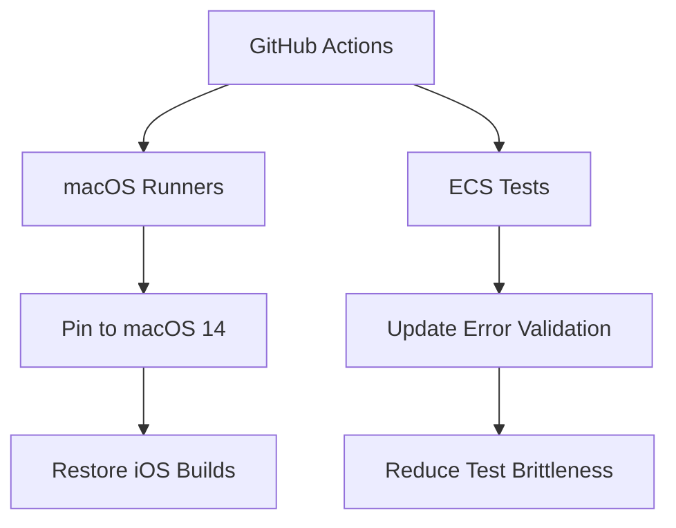

+++
title = "#20640"
date = "2025-08-18T00:00:00"
draft = false
template = "pull_request_page.html"
in_search_index = true

[taxonomies]
list_display = ["show"]

[extra]
current_language = "en"
available_languages = {"en" = { name = "English", url = "/pull_request/bevy/2025-08/pr-20640-en-20250818" }, "zh-cn" = { name = "中文", url = "/pull_request/bevy/2025-08/pr-20640-zh-cn-20250818" }}
+++

## The Story of This Pull Request

### The Problem and Context
GitHub recently updated their macOS runner images from macOS 14 to macOS 15, which broke Bevy's iOS build pipeline. The iOS SDK required for building Bevy's iOS examples was no longer available in the new environment. This caused immediate build failures in CI workflows that depended on iOS tooling, blocking development workflows. Additionally, unrelated tests in Bevy's ECS module were failing due to overly strict error message validation, causing noise in test results. Both issues required prompt resolution to maintain development velocity.

### The Solution Approach
The solution involved two parallel fixes:
1. Temporarily pin all macOS-based CI workflows to macOS 14 runners to maintain iOS build capability
2. Modify ECS tests to use substring matching instead of exact string comparisons for error messages

This approach prioritized immediate unblocking of CI pipelines while addressing flaky tests that could cause false negatives in future test runs. The macOS pinning was implemented as a temporary measure until the iOS example could be properly updated for macOS 15.

### The Implementation
The changes were implemented across GitHub workflows and Bevy's ECS module. For CI pipelines, all instances of `macos-latest` were replaced with `macos-14` to pin the runner version. This affected four workflow files responsible for example execution, screenshot generation, cache updates, and iOS validation.

For example, in `.github/workflows/example-run.yml`:
```diff
-    runs-on: macos-latest
+    runs-on: macos-14
```

Additionally, a bug was fixed in the screenshot workflow where improper variable expansion caused branch names to be passed incorrectly:
```diff
-          metadata='{"os":"${{ inputs.os }}", "commit": "${{ inputs.commit }}", "branch": "$branch"}'
+          metadata='{"os":"${{ inputs.os }}", "commit": "${{ inputs.commit }}", "branch": "'$branch'"}'
```

In the ECS module, tests were modified to verify the presence of core error messages rather than exact string matches. This made the tests more resilient to changes in error message formatting. The before/after comparison shows the improvement:

```rust
// Before:
let expected = "Parameter `Res<T>` failed validation: Resource does not exist\n";
assert!(result.unwrap_err().to_string().contains(expected));

// After:
let expected = "Resource does not exist";
let actual = result.unwrap_err().to_string();
assert!(
    actual.contains(expected),
    "Expected error message to contain `{}` but got `{}`",
    expected,
    actual
);
```

### Technical Insights
The CI changes demonstrate the importance of explicitly specifying environment versions in CI pipelines. Using `macos-latest` introduces implicit dependencies on third-party maintainers, making builds vulnerable to upstream changes. The test modifications follow the testing principle of verifying behavior rather than implementation details - by checking for substring presence instead of exact matches, the tests become more resilient to incidental changes in error message formatting.

### The Impact
These changes immediately restored CI functionality for iOS-related workflows and eliminated flaky test failures. By pinning the macOS version, the team bought time to properly update the iOS example for macOS 15. The test improvements reduced maintenance burden by making validation less brittle to unrelated changes in error messaging.

## Visual Representation



## Key Files Changed

### .github/workflows/example-run.yml
**What changed**: Pinned macOS runner to version 14  
**Why**: To maintain iOS build capability  
```diff
-    runs-on: macos-latest
+    runs-on: macos-14
```

### .github/workflows/send-screenshots-to-pixeleagle.yml
**What changed**: Fixed branch variable expansion and pinned macOS version  
**Why**: Correct metadata handling and environment stability  
```diff
-          metadata='{"os":"${{ inputs.os }}", "commit": "${{ inputs.commit }}", "branch": "$branch"}'
+          metadata='{"os":"${{ inputs.os }}", "commit": "${{ inputs.commit }}", "branch": "'$branch'"}'
...
-    runs-on: macos-latest
+    runs-on: macos-14
```

### .github/workflows/update-caches.yml
**What changed**: Pinned macOS runner for iOS cache updates  
**Why**: Ensure consistent environment for cache generation  
```diff
-          - os: macos-latest
+          - os: macos-14
```

### .github/workflows/validation-jobs.yml
**What changed**: Pinned macOS runner for iOS validation  
**Why**: Maintain build environment compatibility  
```diff
-    runs-on: macos-latest
+    runs-on: macos-14
```

### crates/bevy_ecs/src/system/system.rs
**What changed**: Updated error message validation in tests  
**Why**: Make tests resilient to error message formatting changes  
```diff
         assert!(matches!(result, Err(RunSystemError::Failed { .. })));
-        let expected = "Parameter `Res<T>` failed validation: Resource does not exist\n";
-        assert!(result.unwrap_err().to_string().contains(expected));
+
+        let expected = "Resource does not exist";
+        let actual = result.unwrap_err().to_string();
+
+        assert!(
+            actual.contains(expected),
+            "Expected error message to contain `{}` but got `{}`",
+            expected,
+            actual
+        );
```

### crates/bevy_ecs/src/system/system_registry.rs
**What changed**: Improved error message validation in registry tests  
**Why**: Reduce test brittleness and improve failure diagnostics  
```diff
         assert!(matches!(result, Err(RegisteredSystemError::Failed { .. })));
-        let expected = "System returned error: Parameter `Res<T>` failed validation: Resource does not exist\n";
-        assert!(result.unwrap_err().to_string().contains(expected));
+        let expected = "Resource does not exist";
+        let actual = result.unwrap_err().to_string();
+
+        assert!(
+            actual.contains(expected),
+            "Expected error message to contain `{}` but got `{}`",
+            expected,
+            actual
+        );
```

## Further Reading
- GitHub Actions Workflow Syntax: [Specifying runners](https://docs.github.com/en/actions/using-workflows/workflow-syntax-for-github-actions#jobsjob_idruns-on)
- Testing Best Practices: [Behavior Verification vs. Implementation Verification](https://testing.googleblog.com/2013/08/testing-on-toilet-testing-state-vs.html)
- Bevy CI Documentation: [Continuous Integration Setup](https://github.com/bevyengine/bevy/blob/main/.github/CONTRIBUTING.md#continuous-integration)