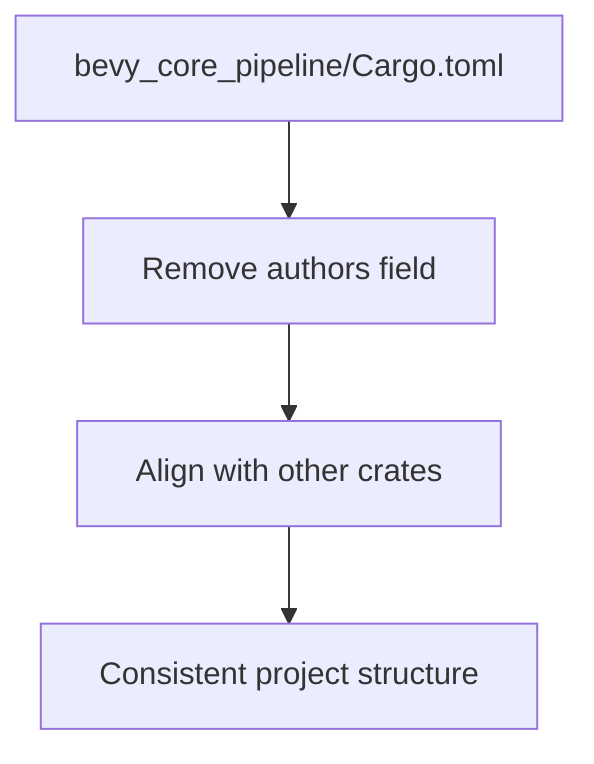

+++
title = "#20641 remove authors from bevy_core_pipeline"
date = "2025-08-18T00:00:00"
draft = false
template = "pull_request_page.html"
in_search_index = true

[taxonomies]
list_display = ["show"]

[extra]
current_language = "en"
available_languages = {"en" = { name = "English", url = "/pull_request/bevy/2025-08/pr-20641-en-20250818" }, "zh-cn" = { name = "中文", url = "/pull_request/bevy/2025-08/pr-20641-zh-cn-20250818" }}
labels = ["D-Trivial", "C-Code-Quality"]
+++

## Technical Analysis: Removing Authors Field for Consistency

### Basic Information
- **Title**: remove authors from bevy_core_pipeline
- **PR Link**: https://github.com/bevyengine/bevy/pull/20641
- **Author**: atlv24
- **Status**: MERGED
- **Labels**: D-Trivial, C-Code-Quality, S-Ready-For-Final-Review
- **Created**: 2025-08-18T18:50:56Z
- **Merged**: 2025-08-18T21:17:49Z
- **Merged By**: mockersf

### Description Translation
# Objective

- no other crate has such a field, we should be consistent

## Solution

- yeetage

### The Story of This Pull Request

The pull request addresses a minor inconsistency in Bevy's project metadata. During routine code maintenance, the author noticed that `bevy_core_pipeline` was the only crate in the project that contained an explicit `authors` field in its `Cargo.toml` manifest file. This field listed specific contributor names, while all other crates in the repository omitted this metadata.

In Rust projects managed with Cargo, the `authors` field in `Cargo.toml` is optional. When present, it typically lists the primary maintainers of a crate. However, in a large multi-crate repository like Bevy where all crates are maintained collectively, maintaining individual author lists creates unnecessary divergence and maintenance overhead. The presence of this field in just one crate violated the project's consistency standards.

The solution was straightforward: remove the `authors` field from `bevy_core_pipeline/Cargo.toml` to align with the pattern established in all other Bevy crates. This change required deleting four lines from the manifest file. The removal simplifies future maintenance by eliminating a unique configuration that would need special handling during repository-wide updates.

This change aligns with Rust packaging best practices for mono-repos, where shared metadata is typically defined at the workspace level rather than duplicated per crate. While the change is minor, it improves codebase consistency and reduces cognitive load for contributors who might otherwise wonder why this crate differs from others.

### Visual Representation



### Key Files Changed

1. **crates/bevy_core_pipeline/Cargo.toml**  
   Removed the `authors` field to match other crates' configuration.

```toml
# Before:
[package]
name = "bevy_core_pipeline"
version = "0.17.0-dev"
edition = "2024"
authors = [
  "Bevy Contributors <bevyengine@gmail.com>",
  "Carter Anderson <mcanders1@gmail.com>",
]
description = "Provides a core render pipeline for Bevy Engine."
```

```toml
# After:
[package]
name = "bevy_core_pipeline"
version = "0.17.0-dev"
edition = "2024"
description = "Provides a core render pipeline for Bevy Engine."
```

### Further Reading
- [The Cargo Manifest Format](https://doc.rust-lang.org/cargo/reference/manifest.html)
- [Rust Workspaces](https://doc.rust-lang.org/book/ch14-03-cargo-workspaces.html)
- [Bevy Contribution Guidelines](https://github.com/bevyengine/bevy/blob/main/CONTRIBUTING.md)