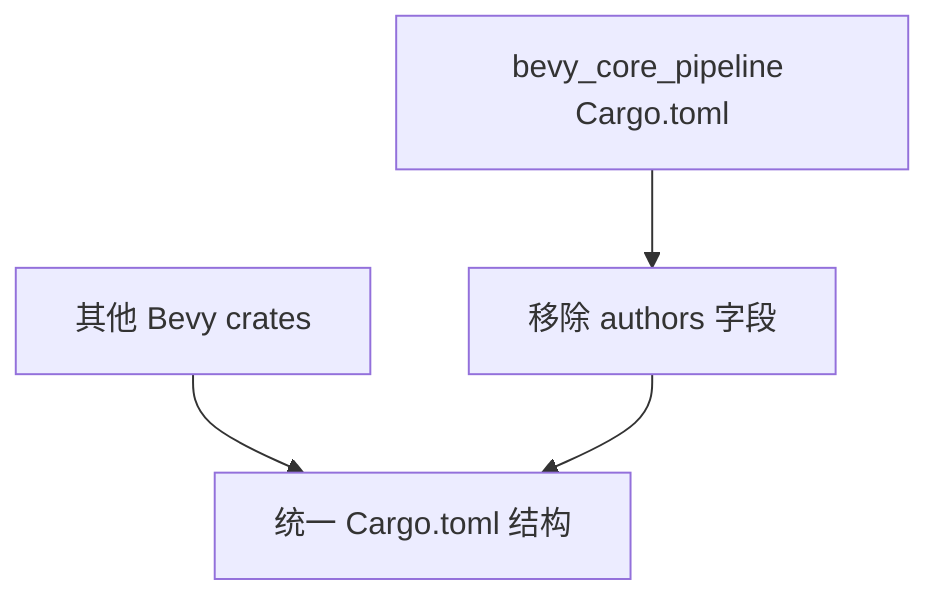

+++
title = "#20641 remove authors from bevy_core_pipeline"
date = "2025-08-18T00:00:00"
draft = false
template = "pull_request_page.html"
in_search_index = false

[extra]
current_language = "zh-cn"
available_languages = {"en" = { name = "English", url = "/pull_request/bevy/2025-08/pr-20641-en-20250818" }, "zh-cn" = { name = "中文", url = "/pull_request/bevy/2025-08/pr-20641-zh-cn-20250818" }}
labels = ["D-Trivial", "C-Code-Quality"]
+++

# remove authors from bevy_core_pipeline

## Basic Information
- **Title**: remove authors from bevy_core_pipeline
- **PR Link**: https://github.com/bevyengine/bevy/pull/20641
- **Author**: atlv24
- **Status**: MERGED
- **Labels**: D-Trivial, C-Code-Quality, S-Ready-For-Final-Review
- **Created**: 2025-08-18T18:50:56Z
- **Merged**: 2025-08-18T21:17:49Z
- **Merged By**: mockersf

## Description Translation
**目标 (Objective)**  
- 其他 crate 都没有这样的字段，我们应该保持一致  

**解决方案 (Solution)**  
- 移除 (yeetage)  

## The Story of This Pull Request

在审查 Bevy 代码库时，贡献者注意到 `bevy_core_pipeline` crate 的 Cargo.toml 文件中包含一个 `authors` 字段，这在其他 Bevy crate 中并不存在。这种不一致违反了项目保持统一代码风格和质量标准的实践，尤其考虑到 Cargo.toml 文件在整个代码库中的结构一致性很重要。

该问题被标记为 D-Trivial（琐碎修改）和 C-Code-Quality（代码质量），表明它属于小型维护任务而非功能变更。开发者决定通过直接移除 `authors` 字段来解决这个问题，使 `bevy_core_pipeline` 的配置与其他 crate 保持一致。这种修改不需要考虑备选方案，因为保持配置统一是明确目标。

具体实现简单直接：删除 Cargo.toml 中定义作者列表的四行代码。修改后，`bevy_core_pipeline` 的包声明与其他 Bevy crate 的结构完全对齐。这种变更不影响任何功能代码或编译行为，纯粹是配置清理。

从工程角度看，这类修改有助于：
1. 减少配置差异带来的认知负担
2. 简化未来工具对代码库的处理
3. 遵循 "最小意外原则" (principle of least astonishment)
4. 维护统一的贡献者归属方式（所有 crate 作者都默认归属 Bevy Contributors）

修改在提交后两小时内被合并，表明团队认可这是合理的代码质量改进。这类清理工作虽然微小，但对保持大型代码库的长期可维护性很重要。

## Visual Representation



## Key Files Changed

### `crates/bevy_core_pipeline/Cargo.toml`
**修改说明：** 移除了其他 Bevy crate 中不存在的 `authors` 字段，保持配置一致性  
**代码差异：**
```diff
--- a/crates/bevy_core_pipeline/Cargo.toml
+++ b/crates/bevy_core_pipeline/Cargo.toml
@@ -2,10 +2,6 @@
 name = "bevy_core_pipeline"
 version = "0.17.0-dev"
 edition = "2024"
-authors = [
-  "Bevy Contributors <bevyengine@gmail.com>",
-  "Carter Anderson <mcanders1@gmail.com>",
-]
 description = "Provides a core render pipeline for Bevy Engine."
 homepage = "https://bevy.org"
 repository = "https://github.com/bevyengine/bevy"
```

## Further Reading
1. [Cargo Manifest 格式规范](https://doc.rust-lang.org/cargo/reference/manifest.html)
2. [Bevy 代码风格指南](https://github.com/bevyengine/bevy/blob/main/docs/CODE_STYLE.md)
3. [语义化版本控制规范](https://semver.org/)（对 version 字段有直接影响）

## Full Code Diff
```diff
diff --git a/crates/bevy_core_pipeline/Cargo.toml b/crates/bevy_core_pipeline/Cargo.toml
index 3907fb499964a..e9b288498b0a8 100644
--- a/crates/bevy_core_pipeline/Cargo.toml
+++ b/crates/bevy_core_pipeline/Cargo.toml
@@ -2,10 +2,6 @@
 name = "bevy_core_pipeline"
 version = "0.17.0-dev"
 edition = "2024"
-authors = [
-  "Bevy Contributors <bevyengine@gmail.com>",
-  "Carter Anderson <mcanders1@gmail.com>",
-]
 description = "Provides a core render pipeline for Bevy Engine."
 homepage = "https://bevy.org"
 repository = "https://github.com/bevyengine/bevy"
```