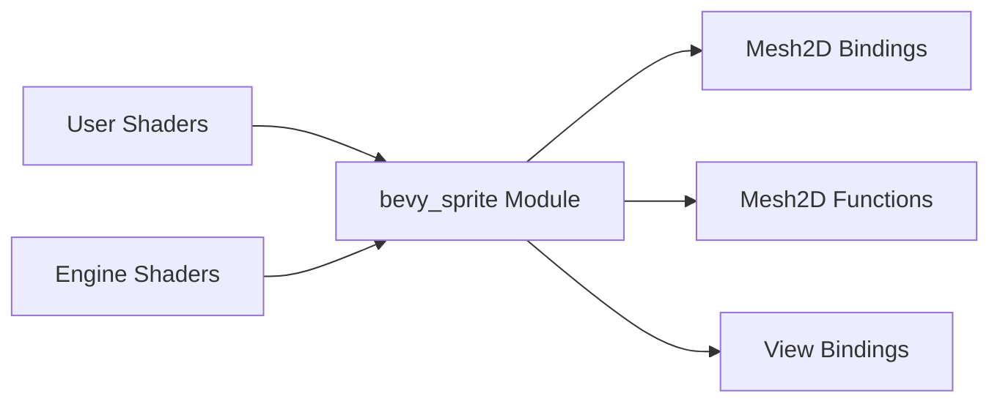

+++
title = "#20644 Revert bevy_sprite_render rename in shaders"
date = "2025-08-18T00:00:00"
draft = false
template = "pull_request_page.html"
in_search_index = true

[taxonomies]
list_display = ["show"]

[extra]
current_language = "en"
available_languages = {"en" = { name = "English", url = "/pull_request/bevy/2025-08/pr-20644-en-20250818" }, "zh-cn" = { name = "中文", url = "/pull_request/bevy/2025-08/pr-20644-zh-cn-20250818" }}
labels = ["A-Rendering", "C-Usability"]
+++

### Revert bevy_sprite_render rename in shaders

#### Basic Information
- **Title**: Revert bevy_sprite_render rename in shaders  
- **PR Link**: https://github.com/bevyengine/bevy/pull/20644  
- **Author**: tychedelia  
- **Status**: MERGED  
- **Labels**: A-Rendering, C-Usability, S-Needs-Review  
- **Created**: 2025-08-18T22:20:08Z  
- **Merged**: 2025-08-18T23:33:52Z  
- **Merged By**: mockersf  

#### Description Translation
Fixes #20643  

#### The Story of This Pull Request

**The Problem and Context**  
A previous PR (#20629) renamed the `bevy_sprite` module to `bevy_sprite_render` in WGSL shader code. While well-intentioned, this change broke backward compatibility for existing user shaders. Projects with custom shaders referencing `bevy_sprite::` paths suddenly failed to compile since the module name no longer matched. This violated the stability expectations for Bevy's public-facing shader interfaces and blocked users from upgrading their projects.

**The Solution Approach**  
The straightforward solution was to revert the module name change across all affected shader files. After evaluating alternatives like maintaining dual import paths or migration tools, the revert was chosen because:  
1. It provided immediate backward compatibility  
2. Required minimal code changes  
3. Avoided complex migration logic  
4. Maintained consistency with historical naming conventions  

**The Implementation**  
The changeset systematically replaces all occurrences of `bevy_sprite_render` with `bevy_sprite` across WGSL files. This includes:  
- Import path definitions (`#define_import_path`)  
- Module imports (`#import bevy_sprite_render::...`)  
- Internal cross-references between shader components  

The implementation preserves all existing functionality while restoring the original module name. For example, in `mesh2d_bindings.wgsl`:  

```wgsl
// Before:
#define_import_path bevy_sprite_render::mesh2d_bindings
#import bevy_sprite_render::mesh2d_types::Mesh2d

// After:
#define_import_path bevy_sprite::mesh2d_bindings
#import bevy_sprite::mesh2d_types::Mesh2d
```

Similarly, example shaders in `/assets` were updated to reference `bevy_sprite` instead of `bevy_sprite_render`, ensuring documentation and examples match the actual implementation.

**Technical Insights**  
Key technical considerations:  
1. **Shader Stability**: Shader paths serve as public API contracts. Changes require careful migration strategies.  
2. **Cross-Module Consistency**: All related files needed simultaneous updates to maintain internal consistency.  
3. **User Impact**: The revert prioritizes user experience by minimizing upgrade friction.  

**The Impact**  
This change:  
1. Restores backward compatibility for all user shaders  
2. Eliminates compilation errors when upgrading Bevy versions  
3. Maintains consistency with existing documentation and examples  
4. Reduces maintenance overhead by avoiding dual import paths  

The quick resolution (1.5 hours from PR to merge) demonstrates the importance of maintaining stable public interfaces in graphics pipelines.

#### Visual Representation


#### Key Files Changed

1. **`crates/bevy_sprite_render/src/mesh2d/mesh2d_bindings.wgsl`**  
   Updated module path to restore backward compatibility:  
   ```wgsl
   // Before:
   #define_import_path bevy_sprite_render::mesh2d_bindings
   #import bevy_sprite_render::mesh2d_types::Mesh2d
   
   // After:
   #define_import_path bevy_sprite::mesh2d_bindings
   #import bevy_sprite::mesh2d_types::Mesh2d
   ```

2. **`assets/shaders/custom_gltf_2d.wgsl`**  
   Fixed example shader import path:  
   ```wgsl
   // Before:
   #import bevy_sprite_render::{
   
   // After:
   #import bevy_sprite::{
   ```

3. **`crates/bevy_sprite_render/src/render/sprite.wgsl`**  
   Corrected internal reference:  
   ```wgsl
   // Before:
   #import bevy_sprite_render::sprite_view_bindings::view
   
   // After:
   #import bevy_sprite::sprite_view_bindings::view
   ```

4. **`assets/shaders/custom_vertex_attribute.wgsl`**  
   Updated documentation comment:  
   ```wgsl
   // Before:
   // For 2d replace `bevy_pbr::mesh_functions` with `bevy_sprite_render::mesh2d_functions`
   
   // After:
   // For 2d replace `bevy_pbr::mesh_functions` with `bevy_sprite::mesh2d_functions`
   ```

#### Further Reading
1. [WGSL Import System Documentation](https://gpuweb.github.io/gpuweb/wgsl/#imports)  
2. [Bevy Shader Pipeline Guide](https://bevyengine.org/learn/book/getting-started/shaders/)  
3. [Semantic Versioning for Shaders](https://www.jeremyong.com/graphics/2021/08/31/semver-for-shaders/)  

<details>
<summary>Full Code Diff</summary>

```diff
diff --git a/assets/shaders/custom_gltf_2d.wgsl b/assets/shaders/custom_gltf_2d.wgsl
index e24315eb8d011..b92b09858bf76 100644
--- a/assets/shaders/custom_gltf_2d.wgsl
+++ b/assets/shaders/custom_gltf_2d.wgsl
@@ -1,4 +1,4 @@
-#import bevy_sprite_render::{
+#import bevy_sprite::{
     mesh2d_view_bindings::globals,
     mesh2d_functions::{get_world_from_local, mesh2d_position_local_to_clip},
 }
diff --git a/assets/shaders/custom_material_2d.wgsl b/assets/shaders/custom_material_2d.wgsl
index 672686d74e227..a90cd76b6cd08 100644
--- a/assets/shaders/custom_material_2d.wgsl
+++ b/assets/shaders/custom_material_2d.wgsl
@@ -1,4 +1,4 @@
-#import bevy_sprite_render::mesh2d_vertex_output::VertexOutput
+#import bevy_sprite::mesh2d_vertex_output::VertexOutput
 // we can import items from shader modules in the assets folder with a quoted path
 #import "shaders/custom_material_import.wgsl"::COLOR_MULTIPLIER
 
diff --git a/assets/shaders/custom_vertex_attribute.wgsl b/assets/shaders/custom_vertex_attribute.wgsl
index cb6b48b2d32a8..55a78126712b6 100644
--- a/assets/shaders/custom_vertex_attribute.wgsl
+++ b/assets/shaders/custom_vertex_attribute.wgsl
@@ -1,4 +1,4 @@
-// For 2d replace `bevy_pbr::mesh_functions` with `bevy_sprite_render::mesh2d_functions`
+// For 2d replace `bevy_pbr::mesh_functions` with `bevy_sprite::mesh2d_functions`
 // and `mesh_position_local_to_clip` with `mesh2d_position_local_to_clip`.
 #import bevy_pbr::mesh_functions::{get_world_from_local, mesh_position_local_to_clip}
 
diff --git a/crates/bevy_sprite_render/src/mesh2d/color_material.wgsl b/crates/bevy_sprite_render/src/mesh2d/color_material.wgsl
index c969977bbc67f..bb3972426bbe5 100644
--- a/crates/bevy_sprite_render/src/mesh2d/color_material.wgsl
+++ b/crates/bevy_sprite_render/src/mesh2d/color_material.wgsl
@@ -1,4 +1,4 @@
-#import bevy_sprite_render::{
+#import bevy_sprite::{
     mesh2d_vertex_output::VertexOutput,
     mesh2d_view_bindings::view,
 }
diff --git a/crates/bevy_sprite_render/src/mesh2d/mesh2d.wgsl b/crates/bevy_sprite_render/src/mesh2d/mesh2d.wgsl
index b5f0b45ae97ea..e909608be8ba1 100644
--- a/crates/bevy_sprite_render/src/mesh2d/mesh2d.wgsl
+++ b/crates/bevy_sprite_render/src/mesh2d/mesh2d.wgsl
@@ -1,4 +1,4 @@
-#import bevy_sprite_render::{
+#import bevy_sprite::{
     mesh2d_functions as mesh_functions,
     mesh2d_vertex_output::VertexOutput,
     mesh2d_view_bindings::view,
diff --git a/crates/bevy_sprite_render/src/mesh2d/mesh2d_bindings.wgsl b/crates/bevy_sprite_render/src/mesh2d/mesh2d_bindings.wgsl
index 5f24007da573d..fc2bf643d5437 100644
--- a/crates/bevy_sprite_render/src/mesh2d/mesh2d_bindings.wgsl
+++ b/crates/bevy_sprite_render/src/mesh2d/mesh2d_bindings.wgsl
@@ -1,6 +1,6 @@
-#define_import_path bevy_sprite_render::mesh2d_bindings
+#define_import_path bevy_sprite::mesh2d_bindings
 
-#import bevy_sprite_render::mesh2d_types::Mesh2d
+#import bevy_sprite::mesh2d_types::Mesh2d
 
 #ifdef PER_OBJECT_BUFFER_BATCH_SIZE
 @group(1) @binding(0) var<uniform> mesh: array<Mesh2d, #{PER_OBJECT_BUFFER_BATCH_SIZE}u>;
diff --git a/crates/bevy_sprite_render/src/mesh2d/mesh2d_functions.wgsl b/crates/bevy_sprite_render/src/mesh2d/mesh2d_functions.wgsl
index 7564514f77297..dbd73fb171f3f 100644
--- a/crates/bevy_sprite_render/src/mesh2d/mesh2d_functions.wgsl
+++ b/crates/bevy_sprite_render/src/mesh2d/mesh2d_functions.wgsl
@@ -1,6 +1,6 @@
-#define_import_path bevy_sprite_render::mesh2d_functions
+#define_import_path bevy_sprite::mesh2d_functions
 
-#import bevy_sprite_render::{
+#import bevy_sprite::{
     mesh2d_view_bindings::view,
     mesh2d_bindings::mesh,
 }
diff --git a/crates/bevy_sprite_render/src/mesh2d/mesh2d_types.wgsl b/crates/bevy_sprite_render/src/mesh2d/mesh2d_types.wgsl
index f7aeee0cd4231..e29264e0bf4f3 100644
--- a/crates/bevy_sprite_render/src/mesh2d/mesh2d_types.wgsl
+++ b/crates/bevy_sprite_render/src/mesh2d/mesh2d_types.wgsl
@@ -1,4 +1,4 @@
-#define_import_path bevy_sprite_render::mesh2d_types
+#define_import_path bevy_sprite::mesh2d_types
 
 struct Mesh2d {
     // Affine 4x3 matrix transposed to 3x4
diff --git a/crates/bevy_sprite_render/src/mesh2d/mesh2d_vertex_output.wgsl b/crates/bevy_sprite_render/src/mesh2d/mesh2d_vertex_output.wgsl
index 32e5363024f13..c7839caffeebb 100644
--- a/crates/bevy_sprite_render/src/mesh2d/mesh2d_vertex_output.wgsl
+++ b/crates/bevy_sprite_render/src/mesh2d/mesh2d_vertex_output.wgsl
@@ -1,4 +1,4 @@
-#define_import_path bevy_sprite_render::mesh2d_vertex_output
+#define_import_path bevy_sprite::mesh2d_vertex_output
 
 struct VertexOutput {
     // this is `clip position` when the struct is used as a vertex stage output 
diff --git a/crates/bevy_sprite_render/src/mesh2d/mesh2d_view_bindings.wgsl b/crates/bevy_sprite_render/src/mesh2d/mesh2d_view_bindings.wgsl
index cb3635a9a2a8d..cc43da65ce35c 100644
--- a/crates/bevy_sprite_render/src/mesh2d/mesh2d_view_bindings.wgsl
+++ b/crates/bevy_sprite_render/src/mesh2d/mesh2d_view_bindings.wgsl
@@ -1,4 +1,4 @@
-#define_import_path bevy_sprite_render::mesh2d_view_bindings
+#define_import_path bevy_sprite::mesh2d_view_bindings
 
 #import bevy_render::view::View
 #import bevy_render::globals::Globals
diff --git a/crates/bevy_sprite_render/src/mesh2d/mesh2d_view_types.wgsl b/crates/bevy_sprite_render/src/mesh2d/mesh2d_view_types.wgsl
index 2b7b55b676cea..7868a05d40ff8 100644
--- a/crates/bevy_sprite_render/src/mesh2d/mesh2d_view_types.wgsl
+++ b/crates/bevy_sprite_render/src/mesh2d/mesh2d_view_types.wgsl
@@ -1,4 +1,4 @@
-#define_import_path bevy_sprite_render::mesh2d_view_types
+#define_import_path bevy_sprite::mesh2d_view_types
 
 #import bevy_render::view
 #import bevy_render::globals
diff --git a/crates/bevy_sprite_render/src/mesh2d/wireframe2d.wgsl b/crates/bevy_sprite_render/src/mesh2d/wireframe2d.wgsl
index bc24e47c28fd3..c7bb3aa791b18 100644
--- a/crates/bevy_sprite_render/src/mesh2d/wireframe2d.wgsl
+++ b/crates/bevy_sprite_render/src/mesh2d/wireframe2d.wgsl
@@ -1,4 +1,4 @@
-#import bevy_sprite_render::mesh2d_vertex_output::VertexOutput
+#import bevy_sprite::mesh2d_vertex_output::VertexOutput
 
 struct PushConstants {
     color: vec4<f32>
diff --git a/crates/bevy_sprite_render/src/render/sprite.wgsl b/crates/bevy_sprite_render/src/render/sprite.wgsl
index f82332c02d630..03e43d0d5b5a3 100644
--- a/crates/bevy_sprite_render/src/render/sprite.wgsl
+++ b/crates/bevy_sprite_render/src/render/sprite.wgsl
@@ -7,7 +7,7 @@
     view::View,
 }
 
-#import bevy_sprite_render::sprite_view_bindings::view
+#import bevy_sprite::sprite_view_bindings::view
 
 struct VertexInput {
     @builtin(vertex_index) index: u32,
diff --git a/crates/bevy_sprite_render/src/render/sprite_view_bindings.wgsl b/crates/bevy_sprite_render/src/render/sprite_view_bindings.wgsl
index 6826c0a8c5031..e3e990538c5f5 100644
--- a/crates/bevy_sprite_render/src/render/sprite_view_bindings.wgsl
+++ b/crates/bevy_sprite_render/src/render/sprite_view_bindings.wgsl
@@ -1,4 +1,4 @@
-#define_import_path bevy_sprite_render::sprite_view_bindings
+#define_import_path bevy_sprite::sprite_view_bindings
 
 #import bevy_render::view::View
 
diff --git a/crates/bevy_sprite_render/src/tilemap_chunk/tilemap_chunk_material.wgsl b/crates/bevy_sprite_render/src/tilemap_chunk/tilemap_chunk_material.wgsl
index b6bf1321f256a..a1442aa006f9a 100644
--- a/crates/bevy_sprite_render/src/tilemap_chunk/tilemap_chunk_material.wgsl
+++ b/crates/bevy_sprite_render/src/tilemap_chunk/tilemap_chunk_material.wgsl
@@ -1,4 +1,4 @@
-#import bevy_sprite_render::{
+#import bevy_sprite::{
     mesh2d_functions as mesh_functions,
     mesh2d_view_bindings::view,
     mesh2d_vertex_output::VertexOutput,
```

</details>