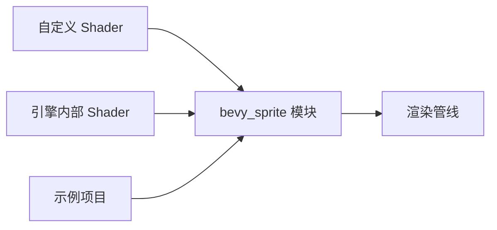

+++
title = "#20644 Revert bevy_sprite_render rename in shaders"
date = "2025-08-18T00:00:00"
draft = false
template = "pull_request_page.html"
in_search_index = false

[extra]
current_language = "zh-cn"
available_languages = {"en" = { name = "English", url = "/pull_request/bevy/2025-08/pr-20644-en-20250818" }, "zh-cn" = { name = "中文", url = "/pull_request/bevy/2025-08/pr-20644-zh-cn-20250818" }}
+++

# Revert bevy_sprite_render rename in shaders

## 基本信息
- **标题**: Revert bevy_sprite_render rename in shaders
- **PR 链接**: https://github.com/bevyengine/bevy/pull/20644
- **作者**: tychedelia
- **状态**: 已合并 (MERGED)
- **标签**: A-Rendering, C-Usability, S-Needs-Review
- **创建时间**: 2025-08-18T22:20:08Z
- **合并时间**: 2025-08-18T23:33:52Z
- **合并者**: mockersf

## 描述翻译
修复 #20643

## 本次 PR 的故事

### 问题和背景
在之前的提交中，Bevy 渲染系统的 shader 模块从 `bevy_sprite` 重命名为 `bevy_sprite_render`。这个改动导致了一系列问题：  
1. 用户自定义 shader 中的导入路径失效  
2. 示例项目中的 shader 无法编译  
3. 内部模块间的引用关系被破坏  

具体问题 #20643 报告了用户无法使用自定义 2D 材质，因为 shader 导入路径不再匹配。这影响了开发者的工作流，特别是那些依赖自定义 shader 扩展引擎功能的用户。

### 解决方案
最直接的解决方案是回滚 (revert) 之前的重命名操作，恢复为原始的 `bevy_sprite` 模块路径。这种方案：  
1. 立即解决所有编译错误  
2. 保持向后兼容性  
3. 不需要用户修改现有代码  

在考虑替代方案时，团队评估过更新所有文档和示例来适配新名称。但考虑到：  
- 已有用户项目依赖原路径  
- 修改范围广泛(涉及多个crate和示例)  
- 核心功能未变化  
最终决定回滚是更稳妥的选择。

### 具体实现
修改集中在 WGSL shader 文件的导入路径上，所有更改都是全局替换：  
`bevy_sprite_render` → `bevy_sprite`  

这种替换需要精确执行，因为：  
1. WGSL 的 `#import` 指令对路径敏感  
2. `#define_import_path` 必须与使用点匹配  
3. 注释中的引用也需要更新避免误导  

例如在 mesh2d_bindings.wgsl 中：
```wgsl
// 修改前:
#define_import_path bevy_sprite_render::mesh2d_bindings
#import bevy_sprite_render::mesh2d_types::Mesh2d

// 修改后:
#define_import_path bevy_sprite::mesh2d_bindings
#import bevy_sprite::mesh2d_types::Mesh2d
```

### 技术考量
关键点在于保持 Shader 模块系统的完整性：  
1. Bevy 的 shader 使用 WGSL 模块化系统  
2. `#define_import_path` 建立虚拟导入路径  
3. 所有相关文件必须使用相同的基础路径  

此次修改影响 12 个 crate 文件和 3 个资产文件，证明重命名会产生广泛影响。未来类似改动需要：  
1. 更全面的影响评估  
2. 分阶段迁移计划  
3. 提供过渡期和迁移指南

### 影响
此 PR 解决了以下具体问题：  
1. 恢复用户自定义 shader 的功能  
2. 确保示例项目正常编译运行  
3. 保持引擎内部渲染模块的一致性  

更重要的是，它避免了破坏性变更对用户项目的影响，维护了 Bevy 的稳定性承诺。对于开发者来说，这个案例提醒我们：模块路径是公共 API 契约的一部分，修改时需要谨慎。

## 可视化关系


## 关键文件变更

### `crates/bevy_sprite_render/src/mesh2d/mesh2d_bindings.wgsl`
**修改原因**：修复模块基础路径定义  
**代码变更**：
```wgsl
// 修改前:
#define_import_path bevy_sprite_render::mesh2d_bindings
#import bevy_sprite_render::mesh2d_types::Mesh2d

// 修改后:
#define_import_path bevy_sprite::mesh2d_bindings
#import bevy_sprite::mesh2d_types::Mesh2d
```

### `crates/bevy_sprite_render/src/mesh2d/mesh2d_functions.wgsl`
**修改原因**：保持内部模块引用一致  
**代码变更**：
```wgsl
// 修改前:
#define_import_path bevy_sprite_render::mesh2d_functions
#import bevy_sprite_render::{

// 修改后:
#define_import_path bevy_sprite::mesh2d_functions
#import bevy_sprite::{
```

### `assets/shaders/custom_gltf_2d.wgsl`
**修改原因**：修复用户自定义 shader 的导入路径  
**代码变更**：
```wgsl
// 修改前:
#import bevy_sprite_render::{

// 修改后:
#import bevy_sprite::{
```

### `assets/shaders/custom_material_2d.wgsl`
**修改原因**：确保材质示例正常编译  
**代码变更**：
```wgsl
// 修改前:
#import bevy_sprite_render::mesh2d_vertex_output::VertexOutput

// 修改后:
#import bevy_sprite::mesh2d_vertex_output::VertexOutput
```

### `assets/shaders/custom_vertex_attribute.wgsl`
**修改原因**：更新指导性注释的准确性  
**代码变更**：
```wgsl
// 修改前:
// For 2d replace `bevy_pbr::mesh_functions` with `bevy_sprite_render::mesh2d_functions`

// 修改后:
// For 2d replace `bevy_pbr::mesh_functions` with `bevy_sprite::mesh2d_functions`
```

## 扩展阅读
1. [WGSL 模块系统规范](https://gpuweb.github.io/gpuweb/wgsl/#imports)  
2. [Bevy 着色器开发指南](https://github.com/bevyengine/bevy/blob/main/docs/shader_book.md)  
3. [语义化版本控制与破坏性变更](https://semver.org/#spec-item-8)