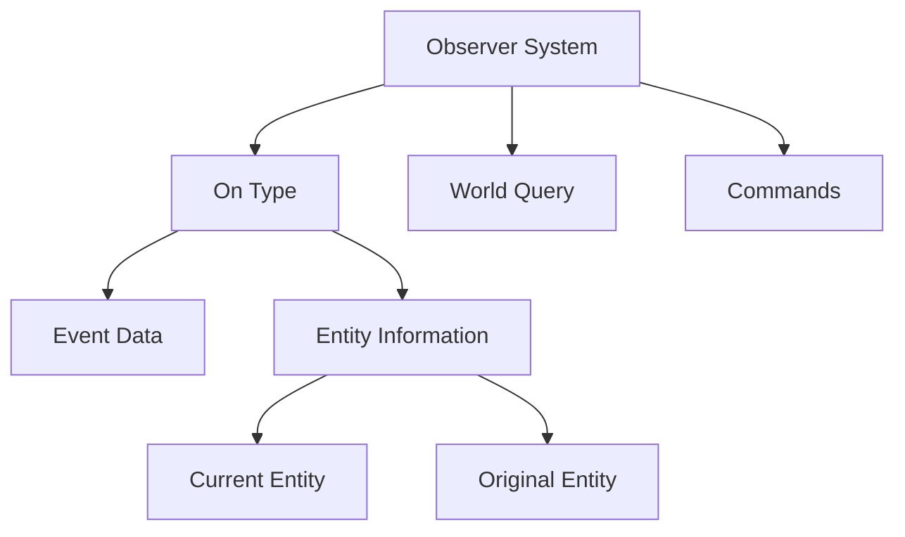

+++
title = "#20648 Improve `On` Terminology"
date = "2025-08-21T00:00:00"
draft = false
template = "pull_request_page.html"
in_search_index = false

[extra]
current_language = "zh-cn"
available_languages = {"en" = { name = "English", url = "/pull_request/bevy/2025-08/pr-20648-en-20250821" }, "zh-cn" = { name = "中文", url = "/pull_request/bevy/2025-08/pr-20648-zh-cn-20250821" }}
+++

# Improve `On` Terminology

## 基本信息
- **标题**: Improve `On` Terminology
- **PR链接**: https://github.com/bevyengine/bevy/pull/20648
- **作者**: cart
- **状态**: MERGED
- **标签**: A-ECS, C-Code-Quality, C-Usability, S-Ready-For-Final-Review, M-Needs-Migration-Guide
- **创建时间**: 2025-08-19T02:09:02Z
- **合并时间**: 2025-08-21T09:19:10Z
- **合并者**: cart

## 描述翻译
# Objective

修复 #19263（并扩展其范围）

在`Observers`中，我们已经开始远离"trigger"术语。具体来说，我们已经将`Trigger`重命名为`On`。我认为这是一个很好的举措，但目前我们处于一个尴尬的中间状态。用户与`On`交互时，就像它是一个事件一样：`On<E>`暴露事件并直接解引用到它。我认为我们应该完全接受这种思维方式，以提高清晰度。

## Solution

- 将所有`trigger: On<SomeEvent>`的情况重命名为`event: On<SomeEvent>`。
- 将`On::target`重命名为`On::entity`。这样在编写`query.get(event.entity())`时读起来更好，并且与`EntityEvent`术语更有效地配对。
- 将`On::original_target`重命名为`On::original_entity`，原因相同。
- 在适当的地方利用`Deref`行为

```rust
// Before
entity.observe(|trigger: On<Explode>| {
  println!("{} exploded!", trigger.target());
})

// After
entity.observe(|event: On<Explode>| {
  println!("{} exploded!", event.entity());
})
```

## The Story of This Pull Request

这个PR解决了Bevy引擎中观察者(Observers)系统的术语一致性问题。问题源于从"trigger"到"On"的术语迁移过程中留下的不一致性，导致开发者体验不够直观。

### 问题和背景

在Bevy的早期版本中，观察者系统使用`Trigger`类型来处理事件。虽然这个类型已经被重命名为`On`，但代码库中仍然存在大量使用旧术语的地方。特别是：

1. 参数名称仍然使用`trigger`，而类型已经是`On`
2. 方法名`target`和`original_target`与事件概念不够匹配
3. 没有充分利用`Deref`特性来简化事件数据访问

这种不一致导致代码可读性降低，开发者需要记住两种不同的术语体系，增加了认知负担。

### 解决方案方法

开发者采取了系统性的方法来解决术语不一致问题：

1. **统一参数命名**：将所有观察者函数中的参数名从`trigger`改为`event`
2. **改进方法命名**：将`On::target`改为`On::entity`，`On::original_target`改为`On::original_entity`
3. **利用语言特性**：充分利用`Deref`特性，允许直接访问事件字段而不需要显式调用`event()`

这些更改使得API更加一致和直观，符合开发者对事件处理的心理模型。

### 实现细节

这个PR涉及大规模的重命名操作，修改了31个crates文件、28个示例文件、5个发布内容文件和2个基准测试文件。关键变化包括：

**核心观察者系统的改进**：
在`crates/bevy_ecs/src/observer/mod.rs`中，重命名了关键方法并更新了内部数据结构：

```rust
// Before:
pub fn target(&self) -> Entity {
    self.trigger.current_target.unwrap_or(Entity::PLACEHOLDER)
}

// After:
pub fn entity(&self) -> Entity {
    self.trigger.entity.unwrap_or(Entity::PLACEHOLDER)
}
```

**UI组件的更新**：
在UI相关的组件如`core_button.rs`、`core_slider.rs`中，更新了所有观察者函数：

```rust
// Before:
fn button_on_key_event(
    mut trigger: On<FocusedInput<KeyboardInput>>,
    q_state: Query<(&CoreButton, Has<InteractionDisabled>)>,
    mut commands: Commands,
) {
    if let Ok((bstate, disabled)) = q_state.get(trigger.target())
    // ...
}

// After:
fn button_on_key_event(
    mut event: On<FocusedInput<KeyboardInput>>,
    q_state: Query<(&CoreButton, Has<InteractionDisabled>)>,
    mut commands: Commands,
) {
    if let Ok((bstate, disabled)) = q_state.get(event.entity())
    // ...
}
```

**文档和示例的同步更新**：
更新了所有相关文档和示例代码，确保术语一致性：

```rust
// Before:
world.add_observer(|trigger: On<Speak>| {
    println!("{}", trigger.event().message);
});

// After:
world.add_observer(|event: On<Speak>| {
    println!("{}", event.message);
});
```

### 技术洞察

这个PR展示了几个重要的软件工程原则：

1. **一致性胜过优化**：通过统一的术语，降低了代码的认知复杂度
2. **利用语言特性**：通过`Deref`特性提供了更简洁的API
3. **大规模重构的安全性**：通过类型系统和编译器保证重命名的正确性

值得注意的是，这个更改是向后兼容的，没有改变任何功能行为，只是提高了代码的可读性和一致性。

### 影响

这些更改对Bevy生态系统产生了广泛影响：

1. **更好的开发者体验**：新的术语更加直观，减少了心理负担
2. **更一致的代码库**：所有模块使用相同的术语体系
3. **改进的文档**：示例和文档现在使用一致的术语

迁移指南已经更新，帮助现有代码库适应这些更改。虽然这是一个大规模的重命名，但由于只是语法层面的更改，不会影响运行时性能。

## Visual Representation



## Key Files Changed

最重要的文件更改：

1. `crates/bevy_ecs/src/observer/mod.rs` (+44/-50)
   - 修改了观察者核心实现，重命名了关键方法和字段
   - 更新了内部数据结构以反映新的术语

2. `crates/bevy_core_widgets/src/core_slider.rs` (+44/-44)
   - 更新了滑块组件的所有观察者函数
   - 统一参数名称为`event`

3. `examples/ui/core_widgets_observers.rs` (+30/-30)
   - 更新了UI组件示例，使用新的术语
   - 展示了如何正确使用`event.entity()`方法

4. `crates/bevy_core_widgets/src/core_button.rs` (+24/-24)
   - 更新了按钮组件的观察者处理函数
   - 使用了新的`Deref`特性简化事件访问

5. `crates/bevy_ecs/src/observer/distributed_storage.rs` (+14/-14)
   - 更新了分布式存储的观察者实现
   - 改进了文档字符串中的示例代码

## Further Reading

建议阅读资源：

1. [Bevy Observers 官方文档](https://bevyengine.org/learn/book/observers/)
2. [Rust Deref 特性详解](https://doc.rust-lang.org/std/ops/trait.Deref.html)
3. [软件架构中的命名约定](https://martinfowler.com/bliki/UbiquitousLanguage.html)

对于想要深入了解观察者系统的开发者，建议查看Bevy的ECS架构文档和观察者设计模式的相关资料。