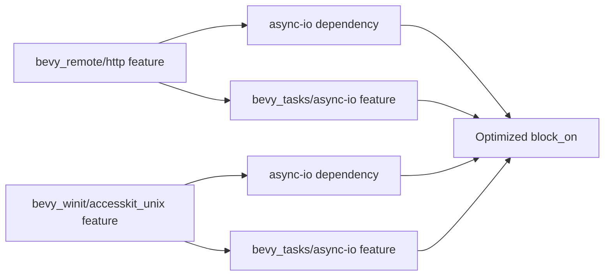

+++
title = "#20653 Enabling bevy_tasks/async-io Feature When async-io is in Use"
date = "2025-08-19T00:00:00"
draft = false
template = "pull_request_page.html"
in_search_index = true

[taxonomies]
list_display = ["show"]

[extra]
current_language = "en"
available_languages = {"en" = { name = "English", url = "/pull_request/bevy/2025-08/pr-20653-en-20250819" }, "zh-cn" = { name = "中文", url = "/pull_request/bevy/2025-08/pr-20653-zh-cn-20250819" }}
labels = ["D-Trivial", "A-Accessibility", "A-Editor", "A-Tasks"]
+++

# Title: Enabling bevy_tasks/async-io Feature When async-io is in Use

## Basic Information
- **Title**: Enable bevy_tasks/async-io when async-io is in use
- **PR Link**: https://github.com/bevyengine/bevy/pull/20653
- **Author**: james7132
- **Status**: MERGED
- **Labels**: D-Trivial, A-Accessibility, S-Ready-For-Final-Review, A-Editor, A-Tasks
- **Created**: 2025-08-19T06:51:30Z
- **Merged**: 2025-08-19T17:02:00Z
- **Merged By**: alice-i-cecile

## Description Translation
# Objective
bevy_tasks has a feature that otherwise goes unused in first-party crates to enable use of async-io's block_on instead of futures_lite::block_on. This enables the idle time between tasks to be used to process async-io's work.  
We do actually conditionally use `async-io` in a few locations.

## Solution
Enable the feature when those features are in use.

## Future Work
 - [ ] smol-hyper unfortunately pulls in both async-io and async-executor. If we do end up merging #20331, we may want https://github.com/notgull/smol-hyper/pull/3 to keep async-executor out of the dependency tree.

## Testing
CI

## The Story of This Pull Request

This PR addresses a straightforward but important optimization in Bevy's async task execution system. The core issue was that `bevy_tasks` includes an `async-io` feature flag that enables the use of `async-io`'s `block_on` implementation instead of `futures_lite::block_on`, but this feature wasn't being activated even when `async-io` was actually being used elsewhere in the codebase.

The problem occurs in two specific modules: `bevy_remote` and `bevy_winit`. Both of these crates conditionally depend on `async-io` through their feature flags (`http` for `bevy_remote` and `accesskit_unix` for `bevy_winit`), but they weren't enabling the corresponding `async-io` feature in `bevy_tasks`. This meant that even though `async-io` was present in the dependency tree, `bevy_tasks` wasn't taking advantage of its potentially more efficient task scheduling capabilities.

The `async-io` crate's `block_on` implementation has a key advantage: it can utilize idle time between tasks to process `async-io`'s own work, potentially leading to better performance in async-heavy applications. Without this feature enabled, Bevy was leaving performance on the table in scenarios where `async-io` was already being used.

The solution is simple but effective: enable the `bevy_tasks/async-io` feature in both crates when their respective features that pull in `async-io` are enabled. This ensures that when `async-io` is available, `bevy_tasks` will automatically use its optimized `block_on` implementation instead of the default `futures_lite` version.

The implementation required minimal changes - just adding the feature flag to the appropriate feature definitions in the Cargo.toml files. This is a clean solution that maintains the existing conditional dependency structure while ensuring all components properly coordinate their feature usage.

From an architectural perspective, this change improves the consistency of the feature flag system. Features that introduce dependencies should generally enable the corresponding features in dependent crates to ensure optimal performance and functionality. This PR follows that principle by properly propagating the `async-io` feature through the dependency graph.

The impact is primarily performance-related: applications using the `http` feature of `bevy_remote` or the `accesskit_unix` feature of `bevy_winit` will now benefit from `async-io`'s more efficient task scheduling without any code changes required. This is a clear win for users of these features.

The PR also notes future work regarding `smol-hyper`, which currently pulls in both `async-io` and `async-executor`. If PR #20331 is merged, there may be an opportunity to further optimize the dependency tree by keeping `async-executor` out, but that's outside the scope of this current change.

## Visual Representation



## Key Files Changed

### `crates/bevy_remote/Cargo.toml`
This file was modified to enable the `bevy_tasks/async-io` feature when the `http` feature is used, since `http` already pulls in `async-io`.

```toml
# Before:
http = ["dep:async-io", "dep:smol-hyper"]

# After:
http = ["dep:async-io", "dep:smol-hyper", "bevy_tasks/async-io"]
```

### `crates/bevy_winit/Cargo.toml`
This file was modified to enable the `bevy_tasks/async-io` feature when the `accesskit_unix` feature is used, since `accesskit_unix` already pulls in `async-io` through `accesskit_winit`.

```toml
# Before:
accesskit_unix = ["accesskit_winit/accesskit_unix", "accesskit_winit/async-io"]

# After:
accesskit_unix = [
  "accesskit_winit/accesskit_unix",
  "accesskit_winit/async-io",
  "bevy_tasks/async-io",
]
```

## Further Reading

- [async-io crate documentation](https://docs.rs/async-io) - Learn about async-io's block_on implementation and its advantages
- [Bevy Tasks documentation](https://docs.rs/bevy_tasks) - Understanding Bevy's task execution system
- [Cargo features documentation](https://doc.rust-lang.org/cargo/reference/features.html) - How to properly use and propagate feature flags in Rust
- [PR #20331](https://github.com/bevyengine/bevy/pull/20331) - Related work that might affect future dependency optimization