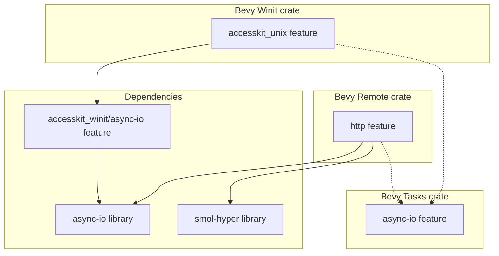

+++
title = "#20653 Enable bevy_tasks/async-io when async-io is in use"
date = "2025-08-19T00:00:00"
draft = false
template = "pull_request_page.html"
in_search_index = false

[extra]
current_language = "zh-cn"
available_languages = {"en" = { name = "English", url = "/pull_request/bevy/2025-08/pr-20653-en-20250819" }, "zh-cn" = { name = "中文", url = "/pull_request/bevy/2025-08/pr-20653-zh-cn-20250819" }}
+++

# Enable bevy_tasks/async-io when async-io is in use

## 基本信息
- **标题**: Enable bevy_tasks/async-io when async-io is in use
- **PR链接**: https://github.com/bevyengine/bevy/pull/20653
- **作者**: james7132
- **状态**: 已合并
- **标签**: D-Trivial, A-Accessibility, S-Ready-For-Final-Review, A-Editor, A-Tasks
- **创建时间**: 2025-08-19T06:51:30Z
- **合并时间**: 2025-08-19T17:02:00Z
- **合并人**: alice-i-cecile

## 描述翻译
# Objective
bevy_tasks 有一个特性（feature）在一方（first-party）crate 中未被使用，该特性用于启用 async-io 的 block_on 而不是 futures_lite::block_on。这使得任务之间的空闲时间可用于处理 async-io 的工作。
实际上，我们在几个地方有条件地使用了 `async-io`。

## Solution
当这些特性被使用时启用该特性。

## Future Work
 - [ ] smol-hyper 不幸地同时引入了 async-io 和 async-executor。如果我们最终合并了 #20331，我们可能希望 https://github.com/notgull/smol-hyper/pull/3 来将 async-executor 排除在依赖树之外。

## Testing
CI

## 这个 PR 的故事

这个 PR 解决了一个依赖管理中的配置问题。在 Bevy 引擎中，`bevy_tasks` crate 提供了一个 `async-io` 特性，这个特性允许使用 `async-io` 库的 `block_on` 实现来替代 `futures_lite::block_on`。这种替换的关键优势在于，`async-io` 的实现在任务执行间隙能够更有效地处理异步 I/O 工作，从而提升整体性能。

然而，尽管项目中有几个地方确实使用了 `async-io` 库（通过其他依赖），但 `bevy_tasks/async-io` 特性却没有被相应地启用。这意味着即使环境支持，引擎也无法利用 `async-io` 带来的性能优化。这属于一种配置遗漏，导致功能与依赖不匹配。

开发者 james7132 识别到了这个问题。解决方案很直接：在那些确实使用了 `async-io` 库的 Cargo features 中，显式地启用 `bevy_tasks` 的对应 `async-io` 特性。这确保了当 `async-io` 库可用时，`bevy_tasks` 会使用其更高效的 `block_on` 实现。

具体修改涉及两个 crate 的 `Cargo.toml` 文件：
1. 在 `bevy_remote` crate 中，其 `http` feature 已经依赖了 `async-io` 和 `smol-hyper`。修改是在这个 feature 的定义中增加了 `bevy_tasks/async-io`，确保当启用 `http` 时，`bevy_tasks` 也切换到使用 `async-io` 的模式。
2. 在 `bevy_winit` crate 中，其 `accesskit_unix` feature 已经依赖了 `accesskit_winit` crate 的 `async-io` feature。修改同样是在这个 feature 的定义中增加了 `bevy_tasks/async-io`。

这个修改是一个典型的依赖特性联动配置，确保了底层库（`bevy_tasks`）的行为与上层引入的依赖（`async-io`）保持一致，从而发挥出应有的性能优势。这是一个小而重要的优化，体现了对项目依赖图和特性交互的细致理解。

PR 描述中还提到了一个未来的工作项，关于 `smol-hyper` 同时引入了 `async-io` 和 `async-executor` 的问题，并指向了一个可能的外部 PR 来解决依赖冗余，这表明作者对依赖树的整洁性有进一步的考虑。

## 可视化表示



## 关键文件变更

**crates/bevy_remote/Cargo.toml** (+5/-1)
- **变更描述**: 在 `http` feature 中添加了对 `bevy_tasks/async-io` 特性的依赖
- **代码片段**:
```toml
# 修改后:
[features]
default = ["http", "bevy_asset"]
http = ["dep:async-io", "dep:smol-hyper", "bevy_tasks/async-io"]
bevy_asset = ["dep:bevy_asset"]
```
- **关联性**: 确保当启用远程 HTTP 功能时，任务系统使用优化的 async-io block_on 实现

**crates/bevy_winit/Cargo.toml** (+1/-1)
- **变更描述**: 在 `accesskit_unix` feature 中添加了对 `bevy_tasks/async-io` 特性的依赖
- **代码片段**:
```toml
# 修改后:
accesskit_unix = [
  "accesskit_winit/accesskit_unix",
  "accesskit_winit/async-io",
  "bevy_tasks/async-io",
]
```
- **关联性**: 确保在 Unix 平台上使用 accessibility 工具包时，任务系统使用优化的 async-io block_on 实现

## 延伸阅读

- [Cargo Features documentation](https://doc.rust-lang.org/cargo/reference/features.html) - 了解 Cargo 特性系统的工作原理
- [async-io crate](https://crates.io/crates/async-io) - 了解 async-io 库的功能和优势
- [Conditional compilation in Rust](https://doc.rust-lang.org/reference/conditional-compilation.html) - 理解 Rust 中的条件编译机制

# 完整代码差异
```diff
diff --git a/crates/bevy_remote/Cargo.toml b/crates/bevy_remote/Cargo.toml
index 899ac8b846cad..371f763ccd3ea 100644
--- a/crates/bevy_remote/Cargo.toml
+++ b/crates/bevy_remote/Cargo.toml
@@ -10,7 +10,7 @@ keywords = ["bevy"]
 
 [features]
 default = ["http", "bevy_asset"]
-http = ["dep:async-io", "dep:smol-hyper"]
+http = ["dep:async-io", "dep:smol-hyper", "bevy_tasks/async-io"]
 bevy_asset = ["dep:bevy_asset"]
 
 [dependencies]
diff --git a/crates/bevy_winit/Cargo.toml b/crates/bevy_winit/Cargo.toml
index c3fb6df482383..72e65d459434b 100644
--- a/crates/bevy_winit/Cargo.toml
+++ b/crates/bevy_winit/Cargo.toml
@@ -13,7 +13,11 @@ default = ["x11"]
 trace = []
 wayland = ["winit/wayland", "winit/wayland-csd-adwaita"]
 x11 = ["winit/x11"]
-accesskit_unix = ["accesskit_winit/accesskit_unix", "accesskit_winit/async-io"]
+accesskit_unix = [
+  "accesskit_winit/accesskit_unix",
+  "accesskit_winit/async-io",
+  "bevy_tasks/async-io",
+]
 
 serialize = [
   "bevy_input/serialize",
```