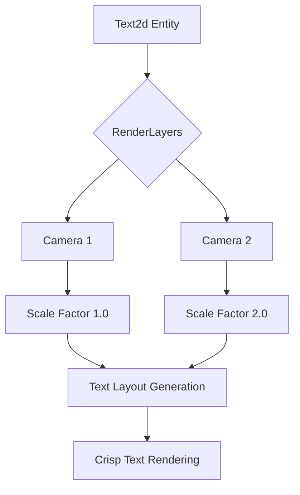

+++
title = "#20656 `Text2d` multi target scale factors support"
date = "2025-08-26T00:00:00"
draft = false
template = "pull_request_page.html"
in_search_index = true

[taxonomies]
list_display = ["show"]

[extra]
current_language = "en"
available_languages = {"en" = { name = "English", url = "/pull_request/bevy/2025-08/pr-20656-en-20250826" }, "zh-cn" = { name = "中文", url = "/pull_request/bevy/2025-08/pr-20656-zh-cn-20250826" }}
labels = ["C-Bug", "A-Rendering", "A-Text", "D-Straightforward"]
+++

# `Text2d` multi target scale factors support

## Basic Information
- **Title**: `Text2d` multi target scale factors support
- **PR Link**: https://github.com/bevyengine/bevy/pull/20656
- **Author**: ickshonpe
- **Status**: MERGED
- **Labels**: C-Bug, A-Rendering, S-Ready-For-Final-Review, A-Text, M-Needs-Release-Note, X-Uncontroversial, D-Straightforward
- **Created**: 2025-08-19T16:20:02Z
- **Merged**: 2025-08-26T03:25:46Z
- **Merged By**: alice-i-cecile

## Description
Use the scale factor of the render target for `Text2d` entities, instead of always using the scale factor of the primary window.

Fixes #17342
Fixes #1890

## Solution

Iterate the cameras, find the first camera with `RenderLayers` intersecting the `Text2d` entity's `RenderLayers` and use that camera's target's scale factor.

This also allows us to remove the `bevy_window` dependency from `bevy_sprite_render` and make it optional for `bevy_sprite` on the "bevy_sprite_picking_backend" feature.

`Text2d` is still limited to generating only one text layout per `Text2d` entity. If a `Text2d` entity is simultaneously rendered to multiple targets with different scale factors then the maximum of the target scale factors is used.

## Testing

I think I'm using `RenderLayers` and `VisibleEntities` correctly, and my tests and the examples seem to work, but it would be best if a rendering SME gave this a glance just to to make sure that I'm not doing something naive.

Comes with a new example `multi_window_text` that can be used for testing:
```
cargo run --example multi_window_text
```
If the changes are working correctly, the secondary window's text should be twice as big as the primary window's text without blurriness.

## Showcase


All the text uses a font-size of `30`.  The secondary window has a scale factor of `2.`, so the secondary window's text uses glyphs drawn at double the resolution. On main, `Text2d` use glyphs drawn at the same size for both windows, and so the text drawn with `Text2d` to the secondary window is blurry:


## The Story of This Pull Request

This PR addresses a long-standing issue with `Text2d` rendering in multi-window setups. The core problem was that `Text2d` entities always used the scale factor of the primary window, regardless of which render target they were being drawn to. This caused blurry text when rendering to secondary windows with different scale factors.

The solution involved rearchitecting how `Text2d` determines the appropriate scale factor for text rendering. Instead of querying the primary window, the system now iterates through all cameras and finds the first camera whose `RenderLayers` intersect with the `Text2d` entity's `RenderLayers`. It then uses that camera's target scale factor for text layout generation.

The implementation required changes across multiple systems:

1. **Camera Query Integration**: The `update_text2d_layout` system now queries camera entities instead of windows, collecting target scale factors along with their render layer masks.

2. **Render Layer Matching**: For each `Text2d` entity, the system finds cameras whose render layers intersect with the entity's layers and selects the maximum scale factor from matching cameras.

3. **Scale Factor Tracking**: Added a `scale_factor` field to `TextLayoutInfo` to track which scale factor was used for layout generation, enabling proper scaling during extraction.

4. **Dependency Cleanup**: Removed the `bevy_window` dependency from `bevy_sprite_render` since window scale factors are no longer queried directly.

The system handles edge cases gracefully: if a `Text2d` entity is visible to multiple cameras with different scale factors, it uses the maximum scale factor to ensure text remains crisp across all targets. This approach maintains backward compatibility while fixing the blurry text issue.

A new example `multi_window_text` demonstrates the fix, showing crisp text in both primary and secondary windows with different scale factors. The example also illustrates how `RenderLayers` can be used to control which cameras render which text entities.

## Visual Representation



## Key Files Changed

### `crates/bevy_sprite/src/text2d.rs` (+76/-28)
This file contains the core logic changes for multi-window scale factor support. The `update_text2d_layout` system was completely rewritten to query cameras instead of windows and handle render layer matching.

**Key changes:**
```rust
// Before: Query primary window only
let scale_factor = windows
    .single()
    .ok()
    .map(|window| window.resolution.scale_factor())
    .or(*last_scale_factor)
    .unwrap_or(1.);

// After: Query all cameras and match render layers
target_scale_factors.extend(
    camera_query
        .iter()
        .filter(|(_, visible_entities, _)| {
            !visible_entities.get(TypeId::of::<Sprite>()).is_empty()
        })
        .filter_map(|(camera, _, maybe_camera_mask)| {
            camera.target_scaling_factor().map(|scale_factor| {
                (scale_factor, maybe_camera_mask.cloned().unwrap_or_default())
            })
        }),
);
```

### `crates/bevy_sprite_render/src/text2d/mod.rs` (+3/-10)
Removed window query dependency and now uses the scale factor stored in `TextLayoutInfo` for proper scaling during extraction.

**Key changes:**
```rust
// Before: Use primary window scale factor
let scale_factor = windows
    .single()
    .map(|window| window.resolution.scale_factor())
    .unwrap_or(1.0);

// After: Use scale factor from text layout info
let scaling = GlobalTransform::from_scale(
    Vec2::splat(text_layout_info.scale_factor.recip()).extend(1.),
);
```

### `examples/window/multi_window_text.rs` (+116/-0)
New example demonstrating multi-window text rendering with different scale factors, showing both `Text` and `Text2d` components working correctly across windows.

### `crates/bevy_text/src/pipeline.rs` (+1/-0)
Added `scale_factor` field to `TextLayoutInfo` to track which scale factor was used for text layout generation.

### `Cargo.toml` (+11/-0)
Added new example and removed `bevy_window` dependency from `bevy_sprite_render`.

## Further Reading

- [Bevy Render Layers Documentation](https://docs.rs/bevy/latest/bevy/render/view/struct.RenderLayers.html)
- [Window Scale Factors in Bevy](https://docs.rs/bevy/latest/bevy/window/struct.Window.html#method.scale_factor)
- [Text Rendering in Bevy](https://bevy-cheatbook.github.io/features/text.html)