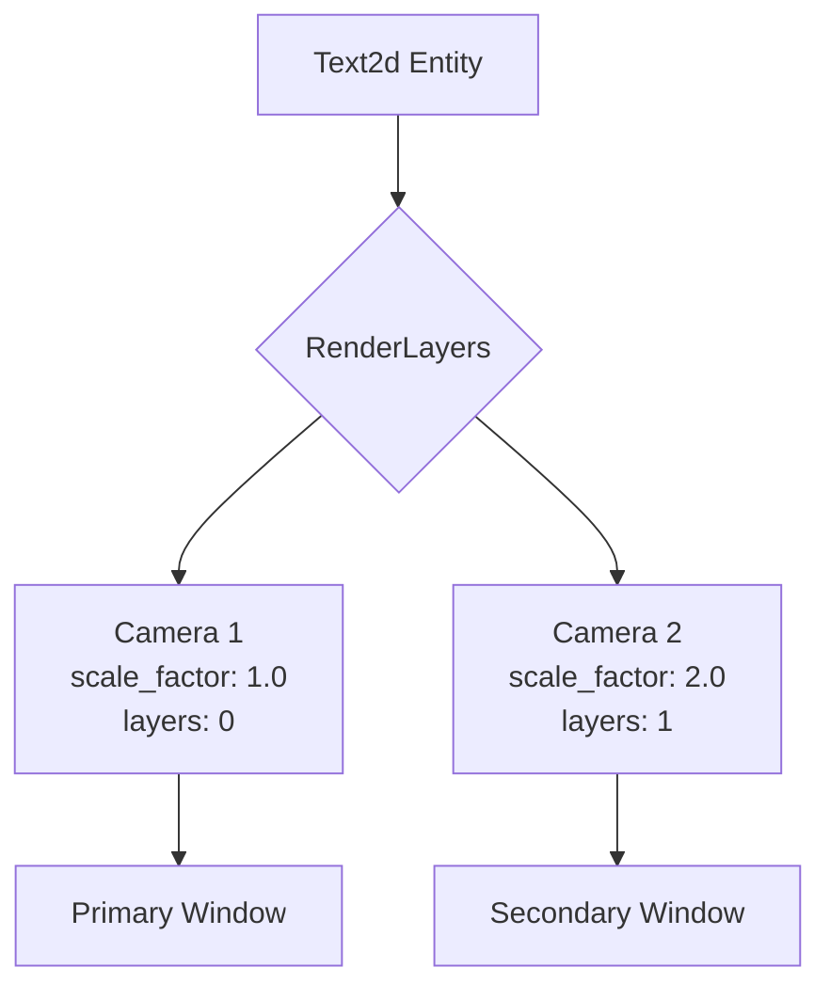

+++
title = "#20656 `Text2d` multi target scale factors support"
date = "2025-08-26T00:00:00"
draft = false
template = "pull_request_page.html"
in_search_index = false

[extra]
current_language = "zh-cn"
available_languages = {"en" = { name = "English", url = "/pull_request/bevy/2025-08/pr-20656-en-20250826" }, "zh-cn" = { name = "中文", url = "/pull_request/bevy/2025-08/pr-20656-zh-cn-20250826" }}
labels = ["C-Bug", "A-Rendering", "A-Text", "D-Straightforward"]
+++

# Title
`Text2d` multi target scale factors support

## Basic Information
- **Title**: `Text2d` multi target scale factors support
- **PR Link**: https://github.com/bevyengine/bevy/pull/20656
- **Author**: ickshonpe
- **Status**: MERGED
- **Labels**: C-Bug, A-Rendering, S-Ready-For-Final-Review, A-Text, M-Needs-Release-Note, X-Uncontroversial, D-Straightforward
- **Created**: 2025-08-19T16:20:02Z
- **Merged**: 2025-08-26T03:25:46Z
- **Merged By**: alice-i-cecile

## Description Translation
# 目标

使用渲染目标的缩放因子来处理 `Text2d` 实体，而不是始终使用主窗口的缩放因子。

修复 #17342
修复 #1890

## 解决方案

遍历所有相机，找到第一个 `RenderLayers` 与 `Text2d` 实体的 `RenderLayers` 相交的相机，并使用该相机目标的缩放因子。

这也使我们能够从 `bevy_sprite_render` 中移除 `bevy_window` 依赖，并在 "bevy_sprite_picking_backend" 特性中使其对 `bevy_sprite` 变为可选。

`Text2d` 仍然限制为每个 `Text2d` 实体只能生成一个文本布局。如果一个 `Text2d` 实体同时渲染到多个具有不同缩放因子的目标，则使用目标缩放因子的最大值。

## 测试

我认为我正在正确使用 `RenderLayers` 和 `VisibleEntities`，我的测试和示例似乎都能正常工作，但最好由渲染专家检查一下，以确保我没有做天真的实现。

附带一个新的示例 `multi_window_text` 用于测试：
```
cargo run --example multi_window_text
```
如果更改正确工作，辅助窗口的文本应该比主窗口的文本大两倍且没有模糊。

## 展示


所有文本都使用字体大小 `30`。辅助窗口的缩放因子为 `2.`，因此辅助窗口的文本使用以双倍分辨率绘制的字形。在 main 分支上，`Text2d` 对两个窗口使用相同大小的字形，因此使用 `Text2d` 绘制到辅助窗口的文本是模糊的：


## The Story of This Pull Request

这个 PR 解决了 Bevy 中 `Text2d` 组件在多窗口环境下的缩放问题。问题的核心在于，无论文本实际渲染到哪个窗口，系统总是使用主窗口的缩放因子来计算文本布局，导致在非主窗口（特别是具有不同缩放因子的窗口）中渲染的文本出现模糊。

### 问题背景
在之前的实现中，`Text2d` 系统通过查询 `PrimaryWindow` 来获取缩放因子：

```rust
let scale_factor = windows
    .single()
    .ok()
    .map(|window| window.resolution.scale_factor())
    .or(*last_scale_factor)
    .unwrap_or(1.);
```

这种方法存在两个主要问题：
1. 它假设所有文本都渲染到主窗口
2. 当存在多个窗口且缩放因子不同时，非主窗口中的文本会使用错误的缩放因子，导致渲染质量下降

### 解决方案
开发者采用了基于相机渲染目标的解决方案。新的实现通过以下步骤确定正确的缩放因子：

1. 收集所有相机的目标缩放因子和渲染层信息
2. 对于每个 `Text2d` 实体，找到与其渲染层相交的所有相机
3. 使用这些相机中最大的缩放因子来生成文本布局

关键实现代码：

```rust
let scale_factor = if entity_mask == previous_mask && 0. < previous_scale_factor {
    previous_scale_factor
} else {
    let Some((scale_factor, mask)) = target_scale_factors
        .iter()
        .filter(|(_, camera_mask)| camera_mask.intersects(entity_mask))
        .max_by_key(|(scale_factor, _)| FloatOrd(*scale_factor))
    else {
        continue;
    };
    previous_scale_factor = *scale_factor;
    previous_mask = mask;
    *scale_factor
};
```

### 架构改进
这个解决方案带来了一个重要的架构改进：移除了 `bevy_sprite_render` 对 `bevy_window` 的依赖。现在，缩放因子信息直接从相机组件获取，而不是通过窗口查询：

```rust
// 在 bevy_sprite_render/Cargo.toml 中移除了 bevy_window 依赖
bevy_window = { path = "../bevy_window", version = "0.17.0-dev" }  // 已移除
```

### 性能优化
实现中包含了一个简单的缓存机制来优化性能：如果当前实体的渲染层与前一个实体相同，就重用之前计算的缩放因子，避免重复的过滤和比较操作。

### 限制与权衡
当前的实现有一个明确的限制：每个 `Text2d` 实体只能生成一个文本布局。如果同一个实体需要渲染到多个具有不同缩放因子的目标，系统会选择最大的缩放因子。这意味着在某些情况下，文本可能会以高于需要的分辨率渲染，然后被缩小，但这保证了文本质量的优化。

### 测试验证
为了验证解决方案，开发者添加了一个新的示例 `multi_window_text`，展示了如何在不同缩放因子的多个窗口中正确渲染文本。这个示例清晰地演示了修复前后的差异：

```rust
// 主窗口使用缩放因子 1.0
resolution: WindowResolution::default().with_scale_factor_override(1.)

// 辅助窗口使用缩放因子 2.0  
resolution: WindowResolution::default().with_scale_factor_override(2.)
```

## Visual Representation



## Key Files Changed

### `crates/bevy_sprite/src/text2d.rs` (+76/-28)
这是核心的修改文件，实现了新的缩放因子计算逻辑。

**主要变更：**
- 移除了对 `PrimaryWindow` 的依赖
- 添加了基于相机和渲染层的缩放因子计算
- 实现了缩放因子缓存优化

**关键代码片段：**
```rust
// 之前：
let scale_factor = windows.single().map(|window| window.resolution.scale_factor())

// 之后：
let scale_factor = target_scale_factors
    .iter()
    .filter(|(_, camera_mask)| camera_mask.intersects(entity_mask))
    .max_by_key(|(scale_factor, _)| FloatOrd(*scale_factor))
```

### `crates/bevy_sprite_render/Cargo.toml` (+0/-1)
移除了对 `bevy_window` 的依赖，简化了包结构。

### `crates/bevy_sprite_render/src/text2d/mod.rs` (+3/-10)
更新了文本提取系统，使用每个文本布局的独立缩放因子而不是全局窗口缩放因子。

```rust
// 之前：
let scaling = GlobalTransform::from_scale(Vec2::splat(scale_factor.recip()).extend(1.))

// 之后：
let scaling = GlobalTransform::from_scale(
    Vec2::splat(text_layout_info.scale_factor.recip()).extend(1.),
)
```

### `examples/window/multi_window_text.rs` (+116/-0)
新增的测试示例，展示了多窗口文本渲染的正确用法。

### `release-content/release-notes/text2d-window-independent-scale-factor-support.md` (+9/-0)
添加了发布说明，解释了这项变更对用户的影响。

## Further Reading

- [Bevy 官方文档 - 渲染管线](https://bevyengine.org/learn/books/introduction/rendering/pipeline)
- [Bevy 示例 - UI 系统](https://github.com/bevyengine/bevy/tree/main/examples/ui)
- [GitHub Issue #17342](https://github.com/bevyengine/bevy/issues/17342) - 原始问题报告
- [GitHub Issue #1890](https://github.com/bevyengine/bevy/issues/1890) - 相关的文本渲染问题