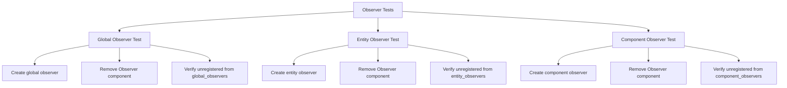

+++
title = "#20657 Regression tests for observers whose Observer component is removed."
date = "2025-08-19T00:00:00"
draft = false
template = "pull_request_page.html"
in_search_index = true

[taxonomies]
list_display = ["show"]

[extra]
current_language = "en"
available_languages = {"en" = { name = "English", url = "/pull_request/bevy/2025-08/pr-20657-en-20250819" }, "zh-cn" = { name = "中文", url = "/pull_request/bevy/2025-08/pr-20657-zh-cn-20250819" }}
labels = ["A-ECS", "C-Testing", "D-Straightforward"]
+++

# Regression tests for observers whose Observer component is removed.

## Basic Information
- **Title**: Regression tests for observers whose Observer component is removed.
- **PR Link**: https://github.com/bevyengine/bevy/pull/20657
- **Author**: gwafotapa
- **Status**: MERGED
- **Labels**: A-ECS, S-Ready-For-Final-Review, C-Testing, X-Uncontroversial, D-Straightforward
- **Created**: 2025-08-19T17:08:49Z
- **Merged**: 2025-08-19T18:39:46Z
- **Merged By**: alice-i-cecile

## Description Translation
Regression test of #19673 .

The issue above has been fixed by the observer overhaul. This PR adds the regression tests.

## The Story of This Pull Request

This PR addresses a specific gap in Bevy's test coverage for the Entity Component System (ECS) observer functionality. The core issue was ensuring that when an Observer component is removed from an entity, the observer is properly unregistered from all relevant observer tracking systems to prevent stale references and potential bugs.

The problem stemmed from a previous issue (#19673) where observers weren't being properly cleaned up when their Observer component was removed. While that specific bug had been fixed by the observer overhaul, there were no regression tests to prevent similar issues from reoccurring in the future. This is a common pattern in software engineering - after fixing a bug, adding tests to ensure it doesn't regress is crucial for maintaining code quality.

The solution approach was straightforward: add comprehensive test coverage for three different types of observers (global, entity-based, and component-based) to verify that removing the Observer component correctly cleans up all observer registrations. Each test follows a consistent pattern:
1. Create an observer of a specific type
2. Remove the Observer component
3. Verify that the observer is no longer registered in the appropriate tracking structure

The implementation consists of three test functions that cover the main observer types in Bevy's ECS:

1. **Global observers**: Observers that watch for events across the entire world
2. **Entity observers**: Observers that are tied to specific entities
3. **Component observers**: Observers that watch for component-specific events

Each test uses the same verification pattern - after removing the Observer component, it checks that the observer is no longer present in the appropriate observer collection. The tests use Bevy's internal observer APIs to directly inspect the observer tracking structures, ensuring the cleanup is working correctly at the implementation level.

The technical insight here is that observers in Bevy are managed through multiple layered data structures, and proper cleanup requires removing references from all relevant locations. The tests verify that the observer overhaul correctly handles this cleanup process across different observer types.

The impact of these changes is improved test coverage and regression protection for a critical part of Bevy's ECS system. These tests ensure that observer cleanup works correctly, preventing memory leaks, stale references, and potential panics that could occur if observers weren't properly unregistered.

## Visual Representation



## Key Files Changed

### `crates/bevy_ecs/src/observer/mod.rs` (+44/-0)

This file received three new test functions that verify proper observer cleanup when the Observer component is removed. The tests cover all major observer types in Bevy's ECS system.

**Key changes:**
```rust
#[test]
fn unregister_global_observer() {
    let mut world = World::new();
    let mut observer = world.add_observer(|_: On<EventA>| {});
    observer.remove::<Observer>();
    let id = observer.id();
    let event_key = EventA::event_key(&world).unwrap();
    assert!(!world
        .observers
        .get_observers_mut(event_key)
        .global_observers
        .contains_key(&id));
}

#[test]
fn unregister_entity_observer() {
    let mut world = World::new();
    let entity = world.spawn_empty().id();
    let observer = Observer::new(|_: On<EventA>| {}).with_entity(entity);
    let mut observer = world.spawn(observer);
    observer.remove::<Observer>();
    let event_key = EventA::event_key(&world).unwrap();
    assert!(!world
        .observers
        .get_observers_mut(event_key)
        .entity_observers
        .contains_key(&entity));
}

#[test]
fn unregister_component_observer() {
    let mut world = World::new();
    let a = world.register_component::<A>();
    let observer = Observer::new(|_: On<EventA>| {}).with_component(a);
    let mut observer = world.spawn(observer);
    observer.remove::<Observer>();
    let event_key = EventA::event_key(&world).unwrap();
    assert!(!world
        .observers
        .get_observers_mut(event_key)
        .get_component_observers()
        .contains_key(&a));
}
```

These tests follow a consistent pattern:
1. Create a World and set up an observer of a specific type
2. Remove the Observer component from the observer entity
3. Verify that the observer is no longer present in the appropriate observer collection

The tests use internal observer APIs (`get_observers_mut`, `global_observers`, `entity_observers`, `get_component_observers`) to directly inspect the observer tracking structures, ensuring that the cleanup is working correctly at the implementation level.

## Further Reading

- [Bevy ECS Observers Documentation](https://bevyengine.org/learn/advanced-topics/observers/)
- [Regression Testing Best Practices](https://martinfowler.com/articles/testing-culture.html#RegressionTests)
- [Entity Component System Pattern](https://en.wikipedia.org/wiki/Entity_component_system)
- [Test-Driven Development](https://en.wikipedia.org/wiki/Test-driven_development)