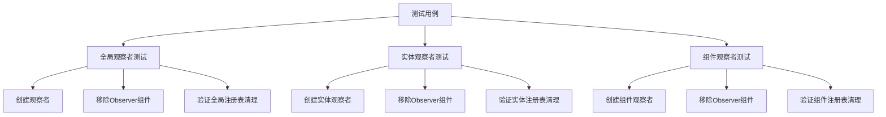

+++
title = "#20657 Regression tests for observers whose Observer component is removed"
date = "2025-08-19T00:00:00"
draft = false
template = "pull_request_page.html"
in_search_index = false

[extra]
current_language = "zh-cn"
available_languages = {"en" = { name = "English", url = "/pull_request/bevy/2025-08/pr-20657-en-20250819" }, "zh-cn" = { name = "中文", url = "/pull_request/bevy/2025-08/pr-20657-zh-cn-20250819" }}
+++

# Regression tests for observers whose Observer component is removed

## 基本信息
- **标题**: Regression tests for observers whose Observer component is removed
- **PR链接**: https://github.com/bevyengine/bevy/pull/20657
- **作者**: gwafotapa
- **状态**: 已合并
- **标签**: A-ECS, S-Ready-For-Final-Review, C-Testing, X-Uncontroversial, D-Straightforward
- **创建时间**: 2025-08-19T17:08:49Z
- **合并时间**: 2025-08-19T18:39:46Z
- **合并者**: alice-i-cecile

## 描述翻译
为 #19673 添加回归测试。

上述问题已在观察者系统重构中修复。此PR添加了回归测试。

## 这个Pull Request的故事

这个PR的核心目的是添加回归测试，确保之前修复的一个观察者系统bug不会再次出现。问题#19673涉及当观察者的Observer组件被移除时，系统没有正确地从内部注册表中注销观察者，可能导致内存泄漏或意外行为。

观察者系统是Bevy ECS的核心组成部分，负责处理事件和响应式编程模式。当开发者创建一个观察者来监听特定事件或组件变化时，系统会在内部维护注册表来高效地路由事件。如果观察者实体被移除或其Observer组件被删除，系统需要清理这些注册表条目以防止陈旧的引用。

之前的修复已经解决了这个核心问题，但缺少相应的测试来确保修复的持久性。这就是本PR的价值所在 - 它添加了三个针对性的测试用例，覆盖了不同类型的观察者注销场景。

测试的实现遵循了Bevy的标准测试模式：创建World环境，设置观察者，执行移除操作，然后验证内部状态。每个测试都针对特定类型的观察者：

1. **全局观察者**：监听所有实体的事件
2. **实体观察者**：监听特定实体的事件  
3. **组件观察者**：监听特定组件类型的事件

测试的关键在于验证`world.observers`内部数据结构中相应的观察者条目确实被移除了。这通过检查`global_observers`、`entity_observers`和`component_observers`映射表来实现。

这种测试方法体现了良好的测试实践：直接验证内部状态而不仅仅是外部行为，确保实现细节的正确性。虽然这些测试依赖于一些内部API（如`get_observers_mut`），但在框架代码的测试中这是可以接受的，因为它们需要验证框架本身的正确性。

从工程角度看，这个PR展示了回归测试的重要性。即使问题已经修复，没有测试意味着同样的bug可能在未来的重构中再次出现。通过添加这些测试，开发者确保了修复的长期有效性。

## 可视化表示



## 关键文件变更

**文件**: `crates/bevy_ecs/src/observer/mod.rs` (+44/-0)

这个文件添加了三个测试函数来验证观察者注销功能：

```rust
#[test]
fn unregister_global_observer() {
    let mut world = World::new();
    let mut observer = world.add_observer(|_: On<EventA>| {});
    observer.remove::<Observer>();
    let id = observer.id();
    let event_key = EventA::event_key(&world).unwrap();
    assert!(!world
        .observers
        .get_observers_mut(event_key)
        .global_observers
        .contains_key(&id));
}

#[test]
fn unregister_entity_observer() {
    let mut world = World::new();
    let entity = world.spawn_empty().id();
    let observer = Observer::new(|_: On<EventA>| {}).with_entity(entity);
    let mut observer = world.spawn(observer);
    observer.remove::<Observer>();
    let event_key = EventA::event_key(&world).unwrap();
    assert!(!world
        .observers
        .get_observers_mut(event_key)
        .entity_observers
        .contains_key(&entity));
}

#[test]
fn unregister_component_observer() {
    let mut world = World::new();
    let a = world.register_component::<A>();
    let observer = Observer::new(|_: On<EventA>| {}).with_component(a);
    let mut observer = world.spawn(observer);
    observer.remove::<Observer>();
    let event_key = EventA::event_key(&world).unwrap();
    assert!(!world
        .observers
        .get_observers_mut(event_key)
        .get_component_observers()
        .contains_key(&a));
}
```

这些测试验证了当Observer组件被移除时，相应的观察者会从所有相关的内部注册表中正确清理。每个测试都遵循相同的模式：创建观察者、移除组件、验证清理。

## 扩展阅读

- [Bevy观察者系统文档](https://docs.rs/bevy_ecs/latest/bevy_ecs/observer/index.html)
- [回归测试的最佳实践](https://en.wikipedia.org/wiki/Regression_testing)
- [Bevy ECS测试指南](https://github.com/bevyengine/bevy/blob/main/CRATE_DEV_TESTS.md)