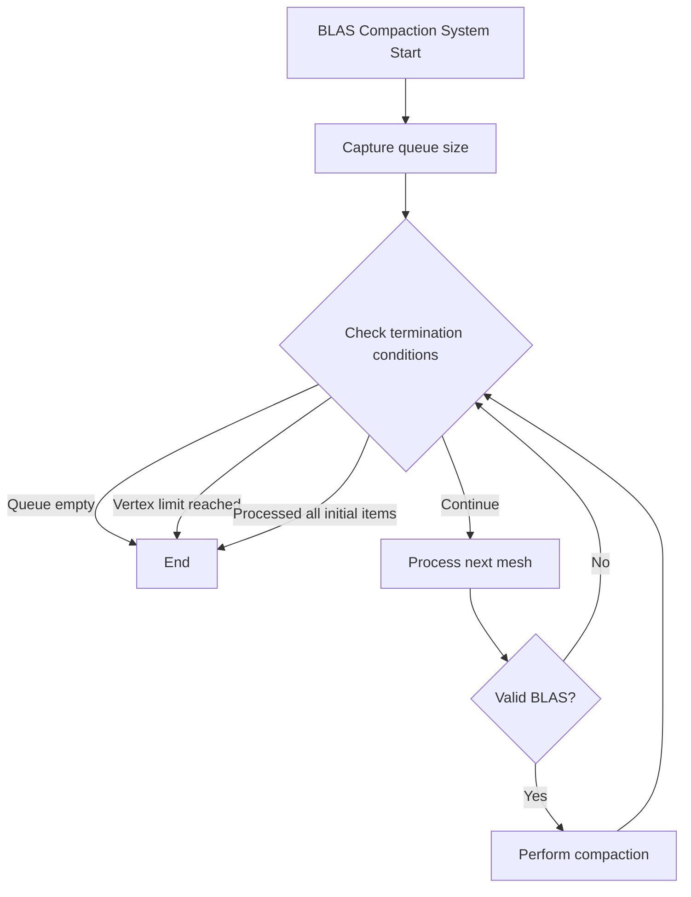

+++
title = "#20659 Prevent infinite loop during BLAS compaction"
date = "2025-08-20T00:00:00"
draft = false
template = "pull_request_page.html"
in_search_index = true

[taxonomies]
list_display = ["show"]

[extra]
current_language = "en"
available_languages = {"en" = { name = "English", url = "/pull_request/bevy/2025-08/pr-20659-en-20250820" }, "zh-cn" = { name = "中文", url = "/pull_request/bevy/2025-08/pr-20659-zh-cn-20250820" }}
labels = ["C-Bug", "A-Rendering", "D-Straightforward"]
+++

# Prevent infinite loop during BLAS compaction

## Basic Information
- **Title**: Prevent infinite loop during BLAS compaction
- **PR Link**: https://github.com/bevyengine/bevy/pull/20659
- **Author**: JMS55
- **Status**: MERGED
- **Labels**: C-Bug, A-Rendering, S-Ready-For-Final-Review, X-Uncontroversial, D-Straightforward
- **Created**: 2025-08-19T18:24:05Z
- **Merged**: 2025-08-20T22:55:26Z
- **Merged By**: alice-i-cecile

## Description Translation
Not sure why exactly this was happening, but the old logic I was using to prevent checking BLAS compaction status more than once per system run wasn't working. This fixes that.

## The Story of This Pull Request

This PR addresses a critical bug in Bevy's raytracing system where the BLAS (Bottom Level Acceleration Structure) compaction process could enter an infinite loop. The issue was in the `compact_raytracing_blas` system that manages mesh compaction for raytracing acceleration structures.

The original implementation used a circular buffer approach with `first_mesh_processed` to track when it had completed a full cycle through the compaction queue. However, this logic had a fundamental flaw: if the first mesh in the queue was removed (due to not having a valid BLAS), the tracking mechanism would break, potentially causing the system to process the same meshes repeatedly without making progress.

The solution replaces the circular tracking with a more robust approach that uses two explicit counters:
1. `queue_size` captures the initial length of the compaction queue
2. `meshes_processed` tracks how many meshes have been processed in the current frame

The new while loop condition ensures termination through three explicit checks:
- The queue isn't empty
- The vertex compaction limit hasn't been exceeded
- The number of processed meshes hasn't exceeded the initial queue size

This approach guarantees that the system will always terminate while still respecting the performance constraints (MAX_COMPACTION_VERTICES_PER_FRAME) that prevent compaction from consuming too many resources in a single frame.

The fix is minimal and surgical - it changes only the control flow logic without affecting the actual compaction algorithms or data structures. This demonstrates good engineering practice: when fixing bugs, make the smallest possible change that addresses the root cause.

## Visual Representation



## Key Files Changed

### `crates/bevy_solari/src/scene/blas.rs` (+10/-12)

This file contains the core BLAS management logic for Bevy's raytracing system. The changes fix the infinite loop bug in the compaction process.

**Before:**
```rust
let mut first_mesh_processed = None;

let mut vertices_compacted = 0;
while vertices_compacted < MAX_COMPACTION_VERTICES_PER_FRAME
    && let Some((mesh, vertex_count, compaction_started)) =
        blas_manager.compaction_queue.pop_front()
{
    // Stop iterating once we loop back around to the start of the list
    if Some(mesh) == first_mesh_processed {
        break;
    }
    if first_mesh_processed.is_none() {
        first_mesh_processed = Some(mesh);
    }
```

**After:**
```rust
let queue_size = blas_manager.compaction_queue.len();
let mut meshes_processed = 0;
let mut vertices_compacted = 0;

while !blas_manager.compaction_queue.is_empty()
    && vertices_compacted < MAX_COMPACTION_VERTICES_PER_FRAME
    && meshes_processed < queue_size
{
    meshes_processed += 1;

    let (mesh, vertex_count, compaction_started) =
        blas_manager.compaction_queue.pop_front().unwrap();
```

### `release-content/release-notes/bevy_solari.md` (+1/-1)

This file tracks the release notes for Bevy Solari (raytracing module). The change simply adds this PR to the list of included pull requests.

**Change:**
```markdown
-pull_requests: [19058, 19620, 19790, 20020, 20113, 20156, 20213, 20242, 20259, 20406, 20457, 20580, 20596, 20622]
+pull_requests: [19058, 19620, 19790, 20020, 20113, 20156, 20213, 20242, 20259, 20406, 20457, 20580, 20596, 20622, 20659]
```

## Further Reading

- [Bevy Engine GitHub Repository](https://github.com/bevyengine/bevy)
- [Ray Tracing Gems - Acceleration Structure Management](http://www.realtimerendering.com/raytracinggems/rtg2/index.html)
- [Vulkan Ray Tracing Tutorial - Acceleration Structures](https://nvpro-samples.github.io/vk_raytracing_tutorial_KHR/)
- [Bevy Documentation on ECS Systems](https://bevyengine.org/learn/book/getting-started/ecs/)