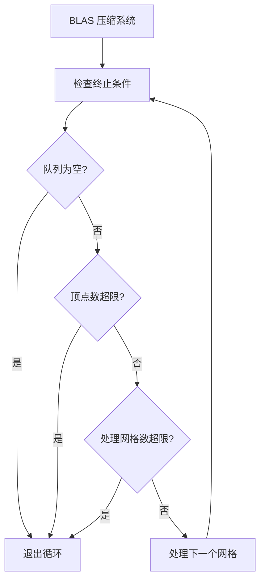

+++
title = "#20659 Prevent infinite loop during BLAS compaction"
date = "2025-08-20T00:00:00"
draft = false
template = "pull_request_page.html"
in_search_index = false

[extra]
current_language = "zh-cn"
available_languages = {"en" = { name = "English", url = "/pull_request/bevy/2025-08/pr-20659-en-20250820" }, "zh-cn" = { name = "中文", url = "/pull_request/bevy/2025-08/pr-20659-zh-cn-20250820" }}
+++

# 防止 BLAS 压缩期间出现无限循环

## 基本信息
- **标题**: Prevent infinite loop during BLAS compaction
- **PR 链接**: https://github.com/bevyengine/bevy/pull/20659
- **作者**: JMS55
- **状态**: 已合并
- **标签**: C-Bug, A-Rendering, S-Ready-For-Final-Review, X-Uncontroversial, D-Straightforward
- **创建时间**: 2025-08-19T18:24:05Z
- **合并时间**: 2025-08-20T22:55:26Z
- **合并者**: alice-i-cecile

## 描述翻译
不确定为什么会发生这种情况，但我之前用来防止每系统运行中多次检查 BLAS 压缩状态的逻辑没有正常工作。这个修复解决了这个问题。

## 本次 PR 的故事

在 Bevy 的渲染系统中，BLAS（Bottom Level Acceleration Structure，底层加速结构）压缩是一个关键的性能优化过程，用于管理光线追踪场景中的几何数据。PR #20659 解决了一个可能导致无限循环的边界情况问题。

问题的核心在于原有的循环终止逻辑存在缺陷。原来的实现试图通过跟踪第一个处理的网格来防止重复处理：

```rust
let mut first_mesh_processed = None;
while vertices_compacted < MAX_COMPACTION_VERTICES_PER_FRAME
    && let Some((mesh, vertex_count, compaction_started)) =
        blas_manager.compaction_queue.pop_front()
{
    // Stop iterating once we loop back around to the start of the list
    if Some(mesh) == first_mesh_processed {
        break;
    }
    if first_mesh_processed.is_none() {
        first_mesh_processed = Some(mesh);
    }
    // ... 处理逻辑
}
```

这种方法的问题在于它假设队列是静态的，但实际上在处理过程中，队列可能会动态变化。如果某个网格在处理过程中被移除了队列，或者队列的顺序发生了变化，这种基于第一个网格的检查就会失效，导致无限循环。

新的解决方案采用了更加可靠的方法，通过三个明确的终止条件来控制循环：

```rust
let queue_size = blas_manager.compaction_queue.len();
let mut meshes_processed = 0;
let mut vertices_compacted = 0;

while !blas_manager.compaction_queue.is_empty()
    && vertices_compacted < MAX_COMPACTION_VERTICES_PER_FRAME
    && meshes_processed < queue_size
{
    meshes_processed += 1;
    
    let (mesh, vertex_count, compaction_started) =
        blas_manager.compaction_queue.pop_front().unwrap();
    // ... 处理逻辑
}
```

这个改进的逻辑确保了：
1. 队列不为空时才继续处理
2. 每帧压缩的顶点数不超过最大限制
3. 处理的网格数量不超过初始队列大小

这种方法更加健壮，因为它不依赖于队列内容的特定顺序或标识符，而是使用明确的计数器来限制处理范围。

从工程角度来看，这是一个典型的边界条件修复。原来的解决方案在大多数情况下都能正常工作，但在特定的边缘情况下会失败。新的实现通过更加明确和可靠的终止条件，消除了潜在的不确定性。

这种类型的修复在系统编程中很常见，特别是在处理动态数据结构和并发环境时。关键在于找到既简单又可靠的解决方案，而不是过度复杂的逻辑。

## 可视化表示



## 关键文件变更

### `crates/bevy_solari/src/scene/blas.rs` (+10/-12)
这个文件包含了 BLAS 压缩的核心逻辑修改。主要的变更是在循环控制逻辑上，从基于标识符的检查改为基于明确计数器的检查。

**变更前:**
```rust
let mut first_mesh_processed = None;

let mut vertices_compacted = 0;
while vertices_compacted < MAX_COMPACTION_VERTICES_PER_FRAME
    && let Some((mesh, vertex_count, compaction_started)) =
        blas_manager.compaction_queue.pop_front()
{
    // Stop iterating once we loop back around to the start of the list
    if Some(mesh) == first_mesh_processed {
        break;
    }
    if first_mesh_processed.is_none() {
        first_mesh_processed = Some(mesh);
    }
    // ... 剩余处理逻辑
}
```

**变更后:**
```rust
let queue_size = blas_manager.compaction_queue.len();
let mut meshes_processed = 0;
let mut vertices_compacted = 0;

while !blas_manager.compaction_queue.is_empty()
    && vertices_compacted < MAX_COMPACTION_VERTICES_PER_FRAME
    && meshes_processed < queue_size
{
    meshes_processed += 1;

    let (mesh, vertex_count, compaction_started) =
        blas_manager.compaction_queue.pop_front().unwrap();
    // ... 剩余处理逻辑
}
```

### `release-content/release-notes/bevy_solari.md` (+1/-1)
这个文件只是更新了发布说明，将本次 PR 的编号添加到相关功能的功能列表中。

**变更前:**
```markdown
pull_requests: [19058, 19620, 19790, 20020, 20113, 20156, 20213, 20242, 20259, 20406, 20457, 20580, 20596, 20622]
```

**变更后:**
```markdown
pull_requests: [19058, 19620, 19790, 20020, 20113, 20156, 20213, 20242, 20259, 20406, 20457, 20580, 20596, 20622, 20659]
```

## 进一步阅读

- [Bevy 引擎官方文档](https://bevyengine.org/learn/)
- [光线追踪加速结构介绍](https://developer.nvidia.com/rtx/raytracing/rtx5)
- [Rust 并发编程模式](https://doc.rust-lang.org/book/ch16-00-concurrency.html)
- [边界条件测试的最佳实践](https://en.wikipedia.org/wiki/Boundary_testing)