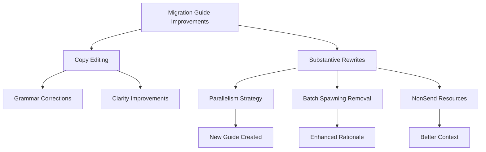

+++
title = "#20661 0.17 migration guide tune up"
date = "2025-08-28T00:00:00"
draft = false
template = "pull_request_page.html"
in_search_index = true

[taxonomies]
list_display = ["show"]

[extra]
current_language = "en"
available_languages = {"en" = { name = "English", url = "/pull_request/bevy/2025-08/pr-20661-en-20250828" }, "zh-cn" = { name = "中文", url = "/pull_request/bevy/2025-08/pr-20661-zh-cn-20250828" }}
labels = ["C-Docs", "A-Cross-Cutting", "D-Straightforward"]
+++

# 0.17 migration guide tune up

## Basic Information
- **Title**: 0.17 migration guide tune up
- **PR Link**: https://github.com/bevyengine/bevy/pull/20661
- **Author**: alice-i-cecile
- **Status**: MERGED
- **Labels**: C-Docs, S-Ready-For-Final-Review, A-Cross-Cutting, D-Straightforward
- **Created**: 2025-08-19T23:45:17Z
- **Merged**: 2025-08-28T17:20:52Z
- **Merged By**: alice-i-cecile

## Description Translation
# Objective

The release candidate draws near!

## Solution

Polish the migration guides.

This is mostly uncontroversial copy-editing, but I've made more substantive changes in a handful of places to better contextualize controversial or complex changes.

## The Story of This Pull Request

As Bevy approached its 0.17 release candidate, the engineering team recognized the need to refine the migration guides to ensure developers could smoothly transition between versions. This PR represents a comprehensive polish of existing documentation, focusing on clarity, accuracy, and better contextualization of complex changes.

The core problem was straightforward: migration guides needed refinement to effectively communicate breaking changes to developers. While many changes were minor copy edits, several required more substantive rewrites to properly explain the rationale behind architectural decisions and provide practical migration strategies.

The solution approach involved systematic review and improvement of all migration guides. For most files, this meant grammatical corrections, clearer phrasing, and better formatting. However, in key areas, the author made more significant changes:

1. Replaced the outdated `remove_archetypecomponentid.md` with a new, more comprehensive `parallelism_strategy_changes.md` that better explained the scheduler changes
2. Enhanced explanations for the removal of deprecated batch spawning functions with clearer rationale and alternative approaches
3. Improved documentation around NonSend resource changes with better context about the long-term direction

The implementation shows careful attention to technical communication. For example, the parallelism strategy changes now include concrete code examples showing both the problematic pattern and the solution using `Without` filters. The batch spawning removal guide now explains the performance implications and privacy violations that motivated the deprecation.

Technical insights from this work include:
- Migration guides should explain not just what changed, but why it changed
- Concrete code examples are essential for understanding migration paths
- Complex architectural decisions require clear rationale explanations
- Documentation should anticipate developer questions and address them proactively

The impact of these changes is significant for the developer experience. Well-polished migration guides reduce upgrade friction, prevent common mistakes, and help developers understand the architectural direction of the framework. The improvements particularly help with controversial changes like the parallelism strategy modification, where understanding the performance trade-offs is crucial.



## Key Files Changed

### `release-content/migration-guides/parallelism_strategy_changes.md` (+30/-0)
**What changed**: Created a new migration guide to replace the removed `remove_archetypecomponentid.md` with more comprehensive explanation of scheduler parallelism changes.

**Code snippets**:
```markdown
The scheduler will now prevent systems from running in parallel if there *could* be an archetype that they conflict on, even if there aren't actually any.
To expand on this, previously, the scheduler would look at the entities that exist to determine if there's any overlap.
Now, it determines it solely on the basis of the function signatures of the systems that are run.
```

### `release-content/migration-guides/remove_archetypecomponentid.md` (+0/-19)
**What changed**: Removed this outdated guide as its content was superseded by the more comprehensive `parallelism_strategy_changes.md`.

### `release-content/migration-guides/replace_non_send_resources.md` (+12/-4)
**What changed**: Enhanced explanation of NonSend resource changes with better context about long-term direction and implementation details.

**Code snippets**:
```markdown
We are [working](https://discord.com/channels/691052431525675048/1332109626962874468) to move `!Send` data out of the ECS, in order to simplify internal implementation,
reduce the risk of soundness problems and unblock features such as resources-as-entities and improved scheduling.
```

### `release-content/migration-guides/remove_deprecated_batch_spawning.md` (+8/-5)
**What changed**: Improved explanation of why batch spawning functions were removed, with clearer rationale and better migration alternatives.

**Code snippets**:
```markdown
These functions, when used incorrectly, could cause major performance problems and generally violated the privacy of the ECS internals in ways
that the Bevy maintainers were not prepared to support long-term.
```

### `release-content/migration-guides/dragenter_includes_dragged_entity.md` (+2/-2)
**What changed**: Minor copy editing for consistency and clarity.

**Code snippets**:
```markdown
# Before:
DragEnter events are now triggered when entering any entity...

# After:
`DragEnter` events are now triggered when entering any entity...
```

## Further Reading

- [Bevy ECS Documentation](https://bevyengine.org/learn/ecs/)
- [System Scheduling in Bevy](https://bevyengine.org/learn/scheduling/)
- [Migration Guide Best Practices](https://diataxis.fr/how-to-guides/)
- [Rust API Guidelines](https://rust-lang.github.io/api-guidelines/documentation.html)