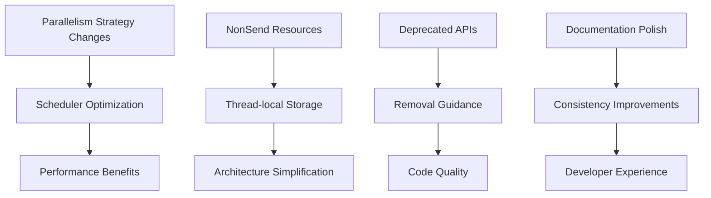

+++
title = "#20661 0.17 migration guide tune up"
date = "2025-08-28T00:00:00"
draft = false
template = "pull_request_page.html"
in_search_index = false

[extra]
current_language = "zh-cn"
available_languages = {"en" = { name = "English", url = "/pull_request/bevy/2025-08/pr-20661-en-20250828" }, "zh-cn" = { name = "中文", url = "/pull_request/bevy/2025-08/pr-20661-zh-cn-20250828" }}
labels = ["C-Docs", "A-Cross-Cutting", "D-Straightforward"]
+++

# Title

## Basic Information
- **Title**: 0.17 migration guide tune up
- **PR Link**: https://github.com/bevyengine/bevy/pull/20661
- **Author**: alice-i-cecile
- **Status**: MERGED
- **Labels**: C-Docs, S-Ready-For-Final-Review, A-Cross-Cutting, D-Straightforward
- **Created**: 2025-08-19T23:45:17Z
- **Merged**: 2025-08-28T17:20:52Z
- **Merged By**: alice-i-cecile

## Description Translation
随着发布候选版本的临近，本次PR主要对迁移指南进行了润色和优化。大部分是简单的文本编辑，但在一些关键位置做了更实质性的修改，以更好地解释有争议或复杂的变更。

## The Story of This Pull Request

这个PR是Bevy 0.17版本发布前的文档整理工作。随着发布候选版本的临近，核心贡献者alice-i-cecile对迁移指南进行了系统性的优化和修正。

迁移指南是开发者从旧版本升级到新版本的关键参考资料。在0.17版本中，Bevy引入了多项重大变更，包括调度器并行策略的调整、NonSend资源的重构、以及多个已弃用API的移除。这些变更需要清晰、准确的文档来指导开发者进行迁移。

PR的主要工作分为几个方面：首先是纠正拼写和语法错误，提高文档的可读性；其次是统一术语和格式，保持文档的一致性；最重要的是对一些复杂的技术变更进行更详细的解释，帮助开发者理解变更背后的原因和正确的迁移方式。

一个典型的例子是关于调度器并行策略的变更。原来的`remove_archetypecomponentid.md`文档被完全重写并替换为新的`parallelism_strategy_changes.md`。这个变更涉及到Bevy调度器核心行为的重大调整 - 从基于实际存在的archetype进行冲突检测，改为基于系统签名进行保守的冲突预测。

```rust
// 变更前这两个系统可能并行执行
fn player_system(query: Query<(&mut Transform, &Player)>) {}
fn enemy_system(query: Query<(&mut Transform, &Enemy)>) {}

// 变更后需要明确使用Without过滤器才能并行
fn player_system(query: Query<(&mut Transform, &Player), Without<Enemy>>) {}
fn enemy_system(query: Query<(&mut Transform, &Enemy), Without<Player>>) {}
```

这个变更虽然理论上减少了潜在的并行机会，但实际上通过减少调度时的运行时检查开销，提升了整体性能。新的文档不仅解释了what和how，还解释了why - 这是高质量技术文档的关键特征。

另一个重要的变更是对NonSend资源处理方式的说明。在`replace_non_send_resources.md`中，作者详细解释了Bevy团队正在将`!Send`数据移出ECS的长期目标，以及当前版本的临时解决方案：

```rust
// 新的thread_local模式示例
thread_local! {
    static GILRS: RefCell<Option<Gilrs>> = const { RefCell::new(None) };
}

// 相应的资源访问方式变更
let gilrs = bevy_gilrs::GILRS
    .get()
    .expect("GILRS resource not initialized");
```

这些修改体现了Bevy项目对向后兼容性和开发者体验的重视。每个破坏性变更都配有清晰的迁移指南，帮助开发者理解和适应新的API。

从工程角度看，这个PR展示了良好的文档实践：准确的技术描述、一致的术语使用、实用的代码示例，以及对变更背景的充分解释。这些品质对于大型开源项目的长期维护至关重要。

## Visual Representation



## Key Files Changed

### `release-content/migration-guides/parallelism_strategy_changes.md` (+30/-0)
新增文件，详细解释调度器并行策略的重大变更。替换了原来的`remove_archetypecomponentid.md`，提供了更全面的技术背景和迁移指导。

```markdown
---
title: Changes to Bevy's system parallelism strategy
pull_requests: [16885]
---

The scheduler will now prevent systems from running in parallel if there *could* be an archetype that they conflict on, even if there aren't actually any.
```

### `release-content/migration-guides/remove_archetypecomponentid.md` (+0/-19)
被删除的文件，其内容被合并到新的并行策略文档中，提供了更完整的解释。

### `release-content/migration-guides/replace_non_send_resources.md` (+12/-4)
大幅扩展了对NonSend资源变更的解释，增加了技术背景和长期规划信息。

```markdown
// 新增内容：
We are [working](https://discord.com/channels/691052431525675048/1332109626962874468) to move `!Send` data out of the ECS, in order to simplify internal implementation,
reduce the risk of soundness problems and unblock features such as resources-as-entities and improved scheduling.
```

### `release-content/migration-guides/remove_deprecated_batch_spawning.md` (+8/-5)
增强了已弃用批处理生成API的移除说明，提供了更详细的替代方案。

```markdown
// 增强的迁移建议：
3. Use your own stable identifier and a map to `Entity` identifiers, with the help of the `EntityMapper` trait.
```

### `release-content/migration-guides/dragenter_includes_dragged_entity.md` (+2/-2)
小的格式修正，统一了术语使用。

```markdown
// 变更前：
DragEnter events are now triggered...

// 变更后：
`DragEnter` events are now triggered...
```

## Further Reading

- [Bevy ECS Scheduling Documentation](https://bevyengine.org/learn/advanced/ecs/scheduling/)
- [Rust Send and Sync Traits](https://doc.rust-lang.org/nomicon/send-and-sync.html)
- [Entity Component System Pattern](https://en.wikipedia.org/wiki/Entity_component_system)
- [Bevy Discord Community](https://discord.gg/bevy) for real-time discussion