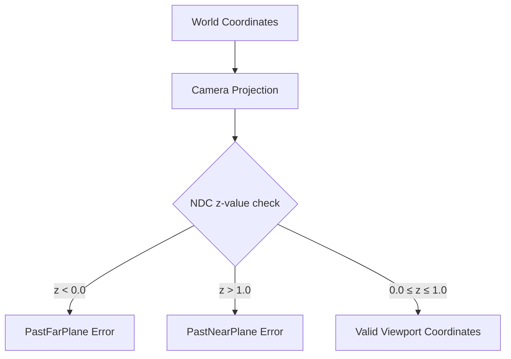

+++
title = "#20662 Fix world_to_viewport return error codes"
date = "2025-08-20T00:00:00"
draft = false
template = "pull_request_page.html"
in_search_index = true

[taxonomies]
list_display = ["show"]

[extra]
current_language = "en"
available_languages = {"en" = { name = "English", url = "/pull_request/bevy/2025-08/pr-20662-en-20250820" }, "zh-cn" = { name = "中文", url = "/pull_request/bevy/2025-08/pr-20662-zh-cn-20250820" }}
labels = ["C-Bug", "A-Rendering"]
+++

# Fix world_to_viewport return error codes

## Basic Information
- **Title**: Fix world_to_viewport return error codes
- **PR Link**: https://github.com/bevyengine/bevy/pull/20662
- **Author**: atlv24
- **Status**: MERGED
- **Labels**: C-Bug, A-Rendering, S-Ready-For-Final-Review
- **Created**: 2025-08-20T00:05:23Z
- **Merged**: 2025-08-20T02:54:56Z
- **Merged By**: alice-i-cecile

## Description Translation
**Objective**

- We use infinite reverse Z. The far plane is 0.0, the near plane is 1.0. The errors are wrong.

**Solution**

- make them right

**Testing**


## The Story of This Pull Request

This PR addresses a bug in Bevy's camera system where error codes for coordinate transformation were incorrectly mapped when using infinite reverse Z projection. In computer graphics, reverse Z is a technique that improves depth buffer precision by reversing the typical depth range, placing the far plane at 0.0 and near plane at 1.0.

The core issue was in the `world_to_viewport` and `world_to_viewport_3d` methods of the `Camera` component. These methods transform 3D world coordinates to 2D viewport coordinates, returning appropriate error codes when coordinates fall outside the camera's frustum. However, the error conditions were incorrectly mapped for reverse Z projection.

When using reverse Z:
- Values less than 0.0 are beyond the far plane (which is at 0.0)
- Values greater than 1.0 are beyond the near plane (which is at 1.0)

The original code had these conditions reversed, returning `PastNearPlane` for z < 0.0 and `PastFarPlane` for z > 1.0. This PR simply swaps these error conditions to match the reverse Z coordinate system.

The fix is minimal but important for correct error reporting in rendering systems using reverse Z projection. Developers relying on these error codes for visibility testing or frustum culling would receive incorrect information about why coordinates were outside the viewport.

## Visual Representation



## Key Files Changed

**crates/bevy_camera/src/camera.rs** (+4/-4)

This file contains the core camera functionality in Bevy. The changes fix error code mapping in coordinate transformation methods when using reverse Z projection.

**Key changes:**
```rust
// Before:
if ndc_space_coords.z < 0.0 {
    return Err(ViewportConversionError::PastNearPlane);
}
if ndc_space_coords.z > 1.0 {
    return Err(ViewportConversionError::PastFarPlane);
}

// After:
if ndc_space_coords.z < 0.0 {
    return Err(ViewportConversionError::PastFarPlane);
}
if ndc_space_coords.z > 1.0 {
    return Err(ViewportConversionError::PastNearPlane);
}
```

The same fix was applied to both `world_to_viewport` and `world_to_viewport_3d` methods, ensuring consistent behavior across both coordinate transformation functions.

## Further Reading

- [Reverse Z and Infinite Projection Matrix](https://developer.nvidia.com/content/depth-precision-visualized) - NVIDIA's explanation of reverse Z depth buffering
- [Bevy Camera Documentation](https://docs.rs/bevy_camera/latest/bevy_camera/) - Official Bevy camera module documentation
- [Coordinate Systems in Computer Graphics](https://learnopengl.com/Getting-started/Coordinate-Systems) - Overview of world, view, and projection spaces