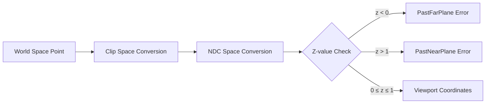

+++
title = "#20662 Fix world_to_viewport return error codes"
date = "2025-08-20T00:00:00"
draft = false
template = "pull_request_page.html"
in_search_index = false

[extra]
current_language = "zh-cn"
available_languages = {"en" = { name = "English", url = "/pull_request/bevy/2025-08/pr-20662-en-20250820" }, "zh-cn" = { name = "中文", url = "/pull_request/bevy/2025-08/pr-20662-zh-cn-20250820" }}
+++

# Title
## 基本信息
- **标题**: Fix world_to_viewport return error codes
- **PR链接**: https://github.com/bevyengine/bevy/pull/20662
- **作者**: atlv24
- **状态**: 已合并
- **标签**: C-Bug, A-Rendering, S-Ready-For-Final-Review
- **创建时间**: 2025-08-20T00:05:23Z
- **合并时间**: 2025-08-20T02:54:56Z
- **合并者**: alice-i-cecile

## 描述翻译
### Objective
- 我们使用无限反向Z（infinite reverse Z）。远平面为0.0，近平面为1.0。当前的错误码是错误的。

### Solution
- 修正这些错误码

### Testing
- 无额外说明

## 这个Pull Request的故事

### 问题与背景
在Bevy引擎的摄像机系统中，`world_to_viewport`方法负责将世界坐标系中的点转换到视口坐标系。当使用无限反向Z（infinite reverse Z）投影时，深度值的范围与传统投影不同：远平面对应0.0，近平面对应1.0。然而，原有的错误处理代码仍然基于传统投影的假设，导致返回的错误码与实际情况相反。

这是一个重要的bug修复，因为错误的错误码会误导开发者对点是否在视锥体内的判断，进而影响渲染逻辑和调试过程。

### 解决方案
解决方案直接而明确：交换两个错误条件的返回码。当点的NDC（Normalized Device Coordinates）z坐标小于0时，表示点超出了远平面（PastFarPlane）；当z坐标大于1时，表示点超出了近平面（PastNearPlane）。这与无限反向Z的坐标系定义一致。

### 实现细节
修改集中在`crates/bevy_camera/src/camera.rs`文件中的两个方法：`world_to_viewport`和`world_to_viewport_using_clip_space_coords`。每个方法都有两个条件判断，分别检查NDC z坐标是否小于0或大于1。原有的实现错误地将这两个条件与`PastNearPlane`和`PastFarPlane`错误码关联。

修改后的代码：
```rust
// 修改前：
if ndc_space_coords.z < 0.0 {
    return Err(ViewportConversionError::PastNearPlane);
}
if ndc_space_coords.z > 1.0 {
    return Err(ViewportConversionError::PastFarPlane);
}

// 修改后：
if ndc_space_coords.z < 0.0 {
    return Err(ViewportConversionError::PastFarPlane);
}
if ndc_space_coords.z > 1.0 {
    return Err(ViewportConversionError::PastNearPlane);
}
```

### 技术洞察
这个修复涉及到了图形学中不同深度坐标系的理解：
- 传统深度：近平面对应-1或0，远平面对应1
- 反向深度（Reverse Z）：近平面对应1，远平面对应0
- 无限反向Z（Infinite Reverse Z）：近平面对应1，远平面趋近于0

在无限反向Z中，由于使用双精度或特殊的投影矩阵，远平面可以 effectively 延伸到无穷远，z值可以小于0。因此，z < 0 确实表示点超出了远平面，而z > 1表示点超出了近平面。

### 影响
这个修复确保了错误码的正确性，使开发者能够准确判断点是否在视锥体内以及具体是哪个方向超出了范围。这对于实现正确的视锥体剔除、调试摄像机相关问题和确保渲染准确性都非常重要。

## 视觉表示



## 关键文件更改

### `crates/bevy_camera/src/camera.rs` (+4/-4)

这个文件包含了摄像机相关的核心功能，特别是坐标转换方法。修改涉及两个方法的错误处理逻辑，确保在使用无限反向Z投影时返回正确的错误码。

**修改前**:
```rust
if ndc_space_coords.z < 0.0 {
    return Err(ViewportConversionError::PastNearPlane);
}
if ndc_space_coords.z > 1.0 {
    return Err(ViewportConversionError::PastFarPlane);
}
```

**修改后**:
```rust
if ndc_space_coords.z < 0.0 {
    return Err(ViewportConversionError::PastFarPlane);
}
if ndc_space_coords.z > 1.0 {
    return Err(ViewportConversionError::PastNearPlane);
}
```

这些修改直接解决了PR中描述的问题，确保错误码与无限反向Z的坐标系定义一致。

## 扩展阅读

- [Bevy Camera Documentation](https://docs.rs/bevy_camera/latest/bevy_camera/) - Bevy摄像机模块的官方文档
- [Understanding Reverse Z](https://www.danielecarbone.com/understanding-reverse-z/) - 反向Z缓冲的详细解释
- [Infinite Projection Matrix](https://www.terathon.com/gdc07_lengyel.pdf) - 无限投影矩阵的数学原理