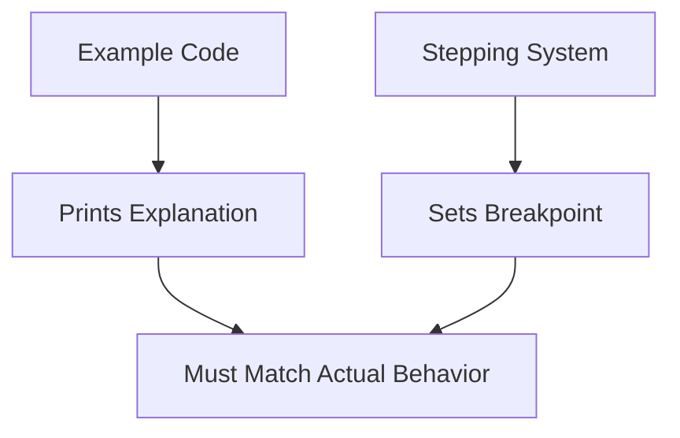

+++
title = "#20663 Fix a comment error in example system_stepping.rs"
date = "2025-08-20T00:00:00"
draft = false
template = "pull_request_page.html"
in_search_index = true

[taxonomies]
list_display = ["show"]

[extra]
current_language = "en"
available_languages = {"en" = { name = "English", url = "/pull_request/bevy/2025-08/pr-20663-en-20250820" }, "zh-cn" = { name = "中文", url = "/pull_request/bevy/2025-08/pr-20663-zh-cn-20250820" }}
labels = ["D-Trivial", "A-ECS", "C-Examples"]
+++

# Fix a comment error in example system_stepping.rs

## Basic Information
- **Title**: Fix a comment error in example system_stepping.rs
- **PR Link**: https://github.com/bevyengine/bevy/pull/20663
- **Author**: Mysvac
- **Status**: MERGED
- **Labels**: D-Trivial, A-ECS, C-Examples, S-Ready-For-Final-Review
- **Created**: 2025-08-20T04:50:03Z
- **Merged**: 2025-08-20T05:36:54Z
- **Merged By**: alice-i-cecile

## Description Translation
# Objective

Examples ECS system_stepping.rs :

```rust
  println!(
      r#"
           ....................................
           in order of one, two, three.  Stepping stops system execution in
           the Update schedule when it encounters the breakpoint for
           update_system_three(). // <------
           ................."#
  );
  let mut stepping = app.world_mut().resource_mut::<Stepping>();
  stepping.set_breakpoint(Update, update_system_two); // <------
  stepping.continue_frame();
  app.update();
  ....................
```

I think this should be "breakpoint for update_system_two()." instead of "breakpoint for update_system_three().".

## Solution

Change `update_system_three` to `update_system_two` in `println!` .

## Testing

Only modified one comment, not tested.

## The Story of This Pull Request

This PR addresses a simple but important documentation issue in Bevy's ECS system stepping example. The `system_stepping.rs` example demonstrates how to use Bevy's debugging tool for stepping through systems during execution. The example sets breakpoints and shows how execution flow can be controlled programmatically.

The problem was a mismatch between the comment in the printed output and the actual code behavior. In the example, the code sets a breakpoint on `update_system_two`, but the accompanying comment incorrectly stated that the breakpoint was set for `update_system_three`. This discrepancy could confuse developers trying to understand how system stepping works in Bevy.

The solution was straightforward - update the comment string to correctly reflect which system the breakpoint targets. While this change is minor, it's important for maintaining accurate documentation, especially in examples that serve as learning tools for developers.

The fix ensures that the example's output accurately describes what's happening in the code: when the stepping system encounters the breakpoint for `update_system_two`, it will pause execution at that specific system rather than at `update_system_three`.

This type of documentation fix is crucial for maintaining code quality, as inaccurate comments in examples can mislead developers and create confusion about how specific features work.

## Visual Representation



## Key Files Changed

- `examples/ecs/system_stepping.rs` (+1/-1)

This file contains the system stepping example that demonstrates Bevy's debugging capabilities. The change fixes an incorrect comment that didn't match the actual breakpoint being set.

```rust
// File: examples/ecs/system_stepping.rs
// Before:
             the Update schedule when it encounters the breakpoint for
             update_system_three().

// After:
             the Update schedule when it encounters the breakpoint for
             update_system_two().
```

The change ensures the printed explanation matches the actual breakpoint being set in the code (`update_system_two`), maintaining consistency between documentation and implementation.

## Further Reading

- [Bevy ECS Documentation](https://bevyengine.org/learn/book/ecs/)
- [System Stepping RFC](https://github.com/bevyengine/bevy/discussions/1680)
- [Bevy Examples Guide](https://github.com/bevyengine/bevy/blob/main/examples/README.md)

# Full Code Diff
```diff
diff --git a/examples/ecs/system_stepping.rs b/examples/ecs/system_stepping.rs
index 01b2f7ce71436..cf351a80b32ed 100644
--- a/examples/ecs/system_stepping.rs
+++ b/examples/ecs/system_stepping.rs
@@ -151,7 +151,7 @@ fn main() {
              they form a chained dependency on update_system_one() and run
              in order of one, two, three.  Stepping stops system execution in
              the Update schedule when it encounters the breakpoint for
-             update_system_three().
+             update_system_two().
              During the step we run update_system_two() along with the
              pre_update_system().
              During the final continue pre_update_system() and
```