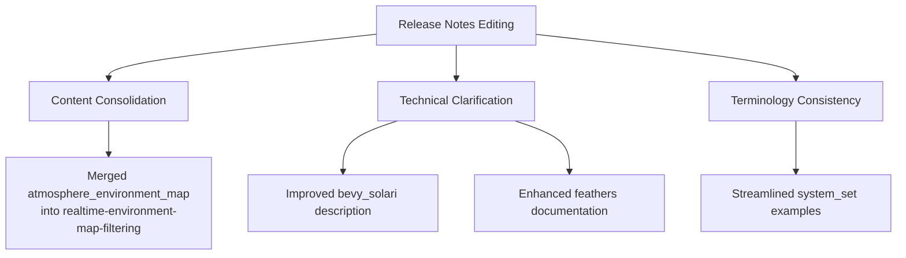

+++
title = "#20665 Editing pass for 0.17 release notes"
date = "2025-08-28T00:00:00"
draft = false
template = "pull_request_page.html"
in_search_index = true

[taxonomies]
list_display = ["show"]

[extra]
current_language = "en"
available_languages = {"en" = { name = "English", url = "/pull_request/bevy/2025-08/pr-20665-en-20250828" }, "zh-cn" = { name = "中文", url = "/pull_request/bevy/2025-08/pr-20665-zh-cn-20250828" }}
labels = ["C-Docs", "A-Cross-Cutting", "D-Straightforward"]
+++

# Title

## Basic Information
- **Title**: Editing pass for 0.17 release notes
- **PR Link**: https://github.com/bevyengine/bevy/pull/20665
- **Author**: alice-i-cecile
- **Status**: MERGED
- **Labels**: C-Docs, S-Ready-For-Final-Review, A-Cross-Cutting, D-Straightforward
- **Created**: 2025-08-20T05:25:08Z
- **Merged**: 2025-08-28T05:55:18Z
- **Merged By**: alice-i-cecile

## Description Translation

# Objective

- Release notes get a lot of eyes and need to be interesting, clear and approachable.

## Solution

- Polish them!
- I've stuck to relatively small editorial changes. There's some that I think should be merged, cut or even added, but those changes are harder to review.
- Images etc come later, after we move repos
- I'm sure we'll need more editing, but this is a nice start.

## The Story of This Pull Request

This PR represents a comprehensive editorial pass over Bevy's 0.17 release notes, focusing on improving clarity, accuracy, and approachability without making structural changes. The author recognized that release notes serve as critical documentation for both existing users and newcomers, requiring careful attention to language and presentation.

The editing approach prioritized straightforward improvements: clarifying technical descriptions, fixing grammatical issues, improving sentence flow, and ensuring consistent terminology. The changes maintain technical accuracy while making the content more accessible to readers with varying levels of Bevy expertise.

Several significant content reorganizations occurred. The most notable was consolidating environment map functionality documentation. The standalone `atmosphere_environment_map.md` file was removed and its content integrated into `realtime-environment-map-filtering.md`, creating a more coherent narrative about environment map filtering capabilities. This consolidation eliminates redundancy and presents related features together.

Technical descriptions were refined throughout. In `bevy_solari.md`, the introduction was rephrased to better frame the project's experimental nature, and DLSS support was described more accurately. The `feathers.md` documentation received substantial rewording to clarify the widget set's purpose and current development status, managing expectations about its capabilities while encouraging community experimentation.

The editing also addressed consistency in technical terminology. In `system_set_naming_convention.md`, the list of renamed system sets was trimmed to focus on the most representative examples rather than attempting comprehensive coverage, making the change more digestible for readers.

These editorial improvements demonstrate several important documentation principles: maintaining technical precision while improving readability, consolidating related concepts, and managing reader expectations about new and experimental features. The changes ensure the release notes effectively communicate Bevy's advancements while remaining accessible to the broader community.

## Visual Representation



## Key Files Changed

### `release-content/release-notes/atmosphere_environment_map.md` (+0/-25)
**Purpose**: Complete removal as content was merged into another file
**Change**: This file was deleted and its content integrated into `realtime-environment-map-filtering.md` to create a more cohesive narrative about environment mapping.

### `release-content/release-notes/realtime-environment-map-filtering.md` (+12/-6)
**Purpose**: Enhanced and consolidated environment mapping documentation
**Changes**:
```markdown
# Before:
(TODO: Embed screenshot of realtime filtering)

# After:
(TODO: Embed screenshot of atmosphere-generated reflections)

We've made sure works with our built-in atmosphere shader too.
To enable this, add the new component `AtmosphereEnvironmentMapLight` to the camera entity.

This is fully dynamic per-view effect: no pre-baked environment maps are needed.
However, please be aware that light probes are not yet supported.
```

### `release-content/release-notes/bevy_solari.md` (+2/-2)
**Purpose**: Improved technical accuracy and framing
**Changes**:
```markdown
# Before:
In Bevy 0.17, we've made the first steps towards realtime raytraced lighting in the form of the new bevy_solari crate.

# After:
With the new `bevy_solari` crate, we're making our first steps towards realtime raytraced lighting.
```

### `release-content/release-notes/feathers.md` (+12/-4)
**Purpose**: Clarified purpose and current state of Feathers UI toolkit
**Changes**:
```markdown
# Before:
- Robust theming support ensuring consistent visual styling across applications

# After:
- Robust-if-primitive theming support ensuring consistent visual styling across applications

# Added content:
This is still early in development, and is currently hidden behind an experimental feature flag:
`experimental_bevy_feathers`.
If you're looking to experiment with building tooling for Bevy, turn that on and use `feathers` as is!
```

### `release-content/release-notes/system_set_naming_convention.md` (+3/-23)
**Purpose**: Streamlined examples and improved readability
**Changes**:
```markdown
# Before:
- `AccessibilitySystem` → `AccessibilitySystems`
- `GizmoRenderSystem` → `GizmoRenderSystems`
- `PickSet` → `PickingSystems`
[20+ more examples]

# After:
- `GizmoRenderSystem` → `GizmoRenderSystems`
- `PickSet` → `PickingSystems`
- `Animation` → `AnimationSystems`
- `Update2dText` → `Text2dUpdateSystems`
```

## Further Reading

- [Bevy's Documentation Guide](https://github.com/bevyengine/bevy/blob/main/docs/DOCUMENTATION_GUIDE.md) - Best practices for Bevy documentation
- [Technical Writing Guidelines](https://developers.google.com/tech-writing) - Google's technical writing resources
- [The Art of Release Notes](https://www.pagerduty.com/blog/art-of-release-notes/) - Strategies for effective release notes
- [Bevy's RFC Process](https://github.com/bevyengine/rfcs) - For understanding how major changes are proposed and documented