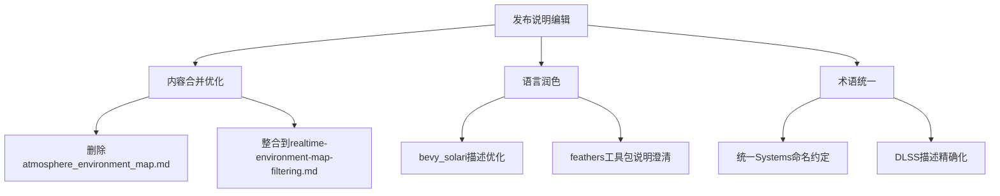

+++
title = "#20665 Editing pass for 0.17 release notes"
date = "2025-08-28T00:00:00"
draft = false
template = "pull_request_page.html"
in_search_index = false

[extra]
current_language = "zh-cn"
available_languages = {"en" = { name = "English", url = "/pull_request/bevy/2025-08/pr-20665-en-20250828" }, "zh-cn" = { name = "中文", url = "/pull_request/bevy/2025-08/pr-20665-zh-cn-20250828" }}
labels = ["C-Docs", "A-Cross-Cutting", "D-Straightforward"]
+++

# Editing pass for 0.17 release notes

## Basic Information
- **Title**: Editing pass for 0.17 release notes
- **PR Link**: https://github.com/bevyengine/bevy/pull/20665
- **Author**: alice-i-cecile
- **Status**: MERGED
- **Labels**: C-Docs, S-Ready-For-Final-Review, A-Cross-Cutting, D-Straightforward
- **Created**: 2025-08-20T05:25:08Z
- **Merged**: 2025-08-28T05:55:18Z
- **Merged By**: alice-i-cecile

## Description Translation
**目标**

- 发布说明会被很多人阅读，需要做到有趣、清晰且易于理解。

**解决方案**

- 对它们进行润色！
- 我坚持进行相对较小的编辑改动。有一些我认为应该合并、删减甚至添加的内容，但这些改动更难审查。
- 图片等内容将在我们迁移仓库后添加
- 我确定我们还需要更多编辑，但这是一个好的开始。

## The Story of This Pull Request

这个PR的核心任务是优化Bevy 0.17版本的发布说明文档。发布说明是用户了解新版本特性的重要渠道，需要确保内容准确、清晰且具有吸引力。

开发团队面临的问题是现有的发布说明初稿在语言表达、内容组织和技术准确性方面需要改进。这些文档会被广大开发者阅读，因此需要专业级的编辑处理，但又不能过度修改以至于难以审查。

解决方案采取了渐进式的方法：首先进行相对保守的语言润色和结构调整，保留更大的架构性改动（如内容合并或重组）供后续PR处理。这种策略平衡了即时改进需求和可审查性。

从技术写作的角度，这次编辑主要关注几个方面：消除冗余内容、统一术语使用、提高语言简洁性、确保技术准确性。例如，将`atmosphere_environment_map.md`的内容合并到`realtime-environment-map-filtering.md`中，避免了重复描述环境映射功能。

在术语使用上，PR统一了系统集的命名约定说明，明确了`*Systems`后缀的标准，这有助于生态系统的一致性。对于`bevy_solari`等新功能的描述，编辑使其更加精确地反映了技术的当前状态和限制。

这些修改虽然主要是文本层面的，但对用户体验有实质性影响。清晰的发布说明能帮助开发者更快理解新功能，减少学习成本，并促进社区对新技术的一致理解。

## Visual Representation



## Key Files Changed

### `release-content/release-notes/atmosphere_environment_map.md` (+0/-25)
**修改说明**：完全删除此文件，将其内容整合到`realtime-environment-map-filtering.md`中，避免内容重复。
**相关代码**：
```markdown
# 文件已完全删除
---
title: Generated environment map for procedural atmosphere
authors: ["@mate-h"]
pull_requests: [20529]
---

(TODO: Embed screenshot of atmosphere-generated reflections)

You can now have dynamic reflections and ambient light in your scene that match the procedural sky.

[...完整内容已删除]
```

### `release-content/release-notes/realtime-environment-map-filtering.md` (+12/-6)
**修改说明**：整合了大气环境映射内容，增强文档完整性，提供更统一的环境映射功能说明。
**相关代码**：
```markdown
# 修改后：
---
title: Realtime-filtered environment maps
authors: ["@mate-h"]
pull_requests: [19076, 20529]  # 添加了20529 PR引用
---

(TODO: Embed screenshot of atmosphere-generated reflections)  # 添加截图占位

An environment map needs to be processed to be able to support uses beyond a simple skybox,
[...]
We've made sure works with our built-in atmosphere shader too.
To enable this, add the new component `AtmosphereEnvironmentMapLight` to the camera entity.

This is fully dynamic per-view effect: no pre-baked environment maps are needed.
However, please be aware that light probes are not yet supported.

Special thanks to @atlv24, @JMS55 and @ecoskey for reviews, feedback, and assistance.
```

### `release-content/release-notes/bevy_solari.md` (+2/-2)
**修改说明**：调整语言表述，更准确地描述bevy_solari的状态和功能。
**相关代码**：
```markdown
# 修改前：
In Bevy 0.17, we've made the first steps towards realtime raytraced lighting in the form of the new bevy_solari crate.

# 修改后：
With the new `bevy_solari` crate, we're making our first steps towards realtime raytraced lighting.

# 修改前：
Additionally, if you have a NVIDIA GPU, you can enable DLSS Ray Reconstruction with the realtime mode for a combination of denoising (Bevy Solari does not otherwise come with a denoiser), lower rendering times, and anti aliasing

# 修改后：
Additionally, if you have a NVIDIA GPU, you can enable DLSS Ray Reconstruction with the realtime mode for a combination of denoising (Bevy Solari does not currently come with any alternate denoisers), lower rendering times, and anti-aliasing
```

### `release-content/release-notes/feathers.md` (+12/-4)
**修改说明**：澄清Feathers UI工具包的定位、当前状态和使用建议。
**相关代码**：
```markdown
# 添加了TODO说明
TODO: add screenshot of `feathers` in practice

# 修改前：
- Robust theming support ensuring consistent visual styling across applications

# 修改后：
- Robust-if-primitive theming support ensuring consistent visual styling across applications

# 添加了使用指引：
This is still early in development, and is currently hidden behind an experimental feature flag:
`experimental_bevy_feathers`.
If you're looking to experiment with building tooling for Bevy, turn that on and use `feathers` as is!
[...]
But if you can't wait to get your hands on `bevy_ui` widgets for your game,
copy the code into your project and start hacking away at it!
```

### `release-content/release-notes/system_set_naming_convention.md` (+3/-23)
**修改说明**：简化了系统集重命名列表，聚焦于说明命名约定而非详尽列表。
**相关代码**：
```markdown
# 修改前：
its own system sets to follow a consistent `*Systems` naming convention. Renamed types include:
[...长列表...]

# 修改后：
its own system sets to follow a consistent `*Systems` naming convention.
As you can see by this very incomplete list of renames, our naming was all over the place:
[...仅保留几个示例...]
```

## Further Reading

- [Bevy官方文档](https://bevyengine.org/learn/)
- [Rust文档编写指南](https://doc.rust-lang.org/rustdoc/how-to-write-documentation.html)
- [技术写作最佳实践](https://developers.google.com/tech-writing)
- [Bevy社区Discord](https://discord.gg/bevy) 获取实时讨论和帮助