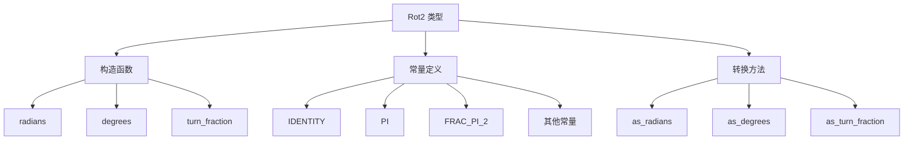

+++
title = "#20667 Fix documentation for `Rot2"
date = "2025-08-20T00:00:00"
draft = false
template = "pull_request_page.html"
in_search_index = false

[extra]
current_language = "zh-cn"
available_languages = {"en" = { name = "English", url = "/pull_request/bevy/2025-08/pr-20667-en-20250820" }, "zh-cn" = { name = "中文", url = "/pull_request/bevy/2025-08/pr-20667-zh-cn-20250820" }}
+++

# 修复 `Rot2` 文档

## 基本信息
- **标题**: Fix documentation for `Rot2`
- **PR 链接**: https://github.com/bevyengine/bevy/pull/20667
- **作者**: IQuick143
- **状态**: 已合并
- **标签**: C-Docs, S-Ready-For-Final-Review, A-Math, D-Straightforward
- **创建时间**: 2025-08-20T09:24:59Z
- **合并时间**: 2025-08-20T17:09:03Z
- **合并人**: alice-i-cecile

## 描述翻译
# Objective

- `Rot2` 上的某些文档片段不精确或具有误导性
- 尝试使文档更全面
 
## Solution

- 重写一堆文档注释，在没有弧度值的地方去掉 `in radians`
- 通过更准确清晰的解释来澄清关于"clamping"输入角度的注释

## Testing

- CI

## 本次 PR 的故事

这个 PR 解决了 Bevy 数学库中 `Rot2` 类型文档存在的准确性问题。`Rot2` 是 Bevy 引擎中用于表示 2D 旋转的数据结构，基于单位复数实现（使用余弦和正弦值）。

**问题发现与背景**

在审查 `Rot2` 的文档时，作者发现了几处不准确和可能误导开发者的描述。主要问题包括：

1. 不必要的"弧度"单位说明：在不需要指定单位的地方使用了"in radians"
2. 关于角度"clamping"的错误描述：原文档暗示输入角度会被限制在特定范围内，但实际上使用的是模运算
3. 常量旋转的描述不够清晰：缺少对应的角度说明

**解决方案与实现**

PR 作者采取了直接而有效的方法：系统性重写所有不准确的文档注释。关键改进包括：

- 将类型描述从"逆时针 2D 旋转"简化为更通用的"2D 旋转"
- 为所有旋转常量添加对应的角度描述（如 `FRAC_PI_4` 对应"逆时针旋转 45°"）
- 用"循环绕回"(loop around)替代"限制"(clamping)的描述，准确反映实际行为
- 添加更多示例代码展示旋转的周期性特性

**技术细节与洞察**

核心改进在于准确描述了角度处理的数学行为。原来的"clamping"说法不正确，因为实现使用的是模运算而非截断：

```rust
// 实际实现使用三角函数，自动处理角度周期性的
Self {
    cos: radians.cos(),
    sin: radians.sin(),
}
```

三角函数 `cos()` 和 `sin()` 本身就会处理任意角度的周期性，输入角度会自动模 2π，这才是"循环绕回"行为的数学基础。

**影响与价值**

这些文档改进虽然看似简单，但对开发者有重要意义：

1. 准确理解 API 行为：避免开发者误以为角度会被截断
2. 更好的示例代码：展示了旋转的等价性（如 365° 等于 5°）
3. 更完整的常量文档：帮助开发者快速理解常用旋转值

这种文档精确性的提升有助于减少使用时的困惑和潜在错误。

## 视觉表示



## 关键文件更改

- `crates/bevy_math/src/rotation2d.rs` (+41/-13)

这个文件包含了 `Rot2` 类型的完整实现，所有文档改进都集中在此。

**主要变更详情：**

1. **类型描述简化**：
```rust
// 之前：
/// A counterclockwise 2D rotation.

// 之后：
/// A 2D rotation.
```

2. **常量文档增强**：
```rust
// 之前：
pub const IDENTITY: Self = Self { cos: 1.0, sin: 0.0 };

// 之后：
pub const IDENTITY: Self = Self { cos: 1.0, sin: 0.0 };
/// No rotation.
/// Also equals a full turn that returns back to its original position.
```

3. **构造函数文档重写**：
```rust
// 之前：
/// The input rotation will always be clamped to the range `(-π, π]` by design.

// 之后：
/// Angles larger than or equal to 2π (in either direction) loop around to smaller rotations, since a full rotation returns an object to its starting orientation.
```

4. **添加更多示例**：
```rust
// 新增示例展示旋转等价性：
/// // A rotation by 3π and 1π are the same
/// #[cfg(feature = "approx")]
/// assert_relative_eq!(Rot2::radians(3.0 * PI), Rot2::radians(PI));
```

这些更改共同提供了更准确、更完整的 `Rot2` 类型文档，帮助开发者正确理解和使用 2D 旋转功能。

## 进一步阅读

- [Bevy Math 模块文档](https://docs.rs/bevy_math/latest/bevy_math/)
- [单位复数和旋转的数学原理](https://en.wikipedia.org/wiki/Rotation_matrix#In_two_dimensions)
- [弧度与角度转换](https://en.wikipedia.org/wiki/Radian)
- [三角函数周期性](https://en.wikipedia.org/wiki/Trigonometric_functions#Unit-circle_definitions)

## 完整代码差异

```diff
diff --git a/crates/bevy_math/src/rotation2d.rs b/crates/bevy_math/src/rotation2d.rs
index 0fe7ee0c613ee..bcaf7f63b0dec 100644
--- a/crates/bevy_math/src/rotation2d.rs
+++ b/crates/bevy_math/src/rotation2d.rs
@@ -12,7 +12,7 @@ use bevy_reflect::{std_traits::ReflectDefault, Reflect};
 #[cfg(all(feature = "serialize", feature = "bevy_reflect"))]
 use bevy_reflect::{ReflectDeserialize, ReflectSerialize};
 
-/// A counterclockwise 2D rotation.
+/// A 2D rotation.
 ///
 /// # Example
 ///
@@ -21,7 +21,7 @@ use bevy_reflect::{ReflectDeserialize, ReflectSerialize};
 /// # use bevy_math::{Rot2, Vec2};
 /// use std::f32::consts::PI;
 ///
-/// // Create rotations from radians or degrees
+/// // Create rotations from counterclockwise angles in radians or degrees
 /// let rotation1 = Rot2::radians(PI / 2.0);
 /// let rotation2 = Rot2::degrees(45.0);
 ///
@@ -50,11 +50,11 @@ use bevy_reflect::{ReflectDeserialize, ReflectSerialize};
 )]
 #[doc(alias = "rotation", alias = "rotation2d", alias = "rotation_2d")]
 pub struct Rot2 {
-    /// The cosine of the rotation angle in radians.
+    /// The cosine of the rotation angle.
     ///
     /// This is the real part of the unit complex number representing the rotation.
     pub cos: f32,
-    /// The sine of the rotation angle in radians.
+    /// The sine of the rotation angle.
     ///
     /// This is the imaginary part of the unit complex number representing the rotation.
     pub sin: f32,
@@ -68,46 +68,60 @@ impl Default for Rot2 {
 
 impl Rot2 {
     /// No rotation.
+    /// Also equals a full turn that returns back to its original position.
+    ///  ```
+    /// # use approx::assert_relative_eq;
+    /// # use bevy_math::Rot2;
+    /// #[cfg(feature = "approx")]
+    /// assert_relative_eq!(Rot2::IDENTITY, Rot2::degrees(360.0), epsilon = 2e-7);
+    /// ```
     pub const IDENTITY: Self = Self { cos: 1.0, sin: 0.0 };
 
     /// A rotation of π radians.
+    /// Corresponds to a half-turn.
     pub const PI: Self = Self {
         cos: -1.0,
         sin: 0.0,
     };
 
     /// A counterclockwise rotation of π/2 radians.
+    /// Corresponds to a counterclockwise quarter-turn.
     pub const FRAC_PI_2: Self = Self { cos: 0.0, sin: 1.0 };
 
     /// A counterclockwise rotation of π/3 radians.
+    /// Corresponds to a counterclockwise turn by 60°.
     pub const FRAC_PI_3: Self = Self {
         cos: 0.5,
         sin: 0.866_025_4,
     };
 
     /// A counterclockwise rotation of π/4 radians.
+    /// Corresponds to a counterclockwise turn by 45°.
     pub const FRAC_PI_4: Self = Self {
         cos: core::f32::consts::FRAC_1_SQRT_2,
         sin: core::f32::consts::FRAC_1_SQRT_2,
     };
 
     /// A counterclockwise rotation of π/6 radians.
+    /// Corresponds to a counterclockwise turn by 30°.
     pub const FRAC_PI_6: Self = Self {
         cos: 0.866_025_4,
         sin: 0.5,
     };
 
     /// A counterclockwise rotation of π/8 radians.
+    /// Corresponds to a counterclockwise turn by 22.5°.
     pub const FRAC_PI_8: Self = Self {
         cos: 0.923_879_5,
         sin: 0.382_683_43,
     };
 
     /// Creates a [`Rot2`] from a counterclockwise angle in radians.
+    /// A negative argument corresponds to a clockwise rotation.
     ///
     /// # Note
     ///
-    /// The input rotation will always be clamped to the range `(-π, π]` by design.
+    /// Angles larger than or equal to 2π (in either direction) loop around to smaller rotations, since a full rotation returns an object to its starting orientation.
     ///
     /// # Example
     ///
@@ -124,6 +138,10 @@ impl Rot2 {
     /// let rot3 = Rot2::radians(PI);
     /// #[cfg(feature = "approx")]
     /// assert_relative_eq!(rot1 * rot1, rot3);
+    ///
+    /// // A rotation by 3π and 1π are the same
+    /// #[cfg(feature = "approx")]
+    /// assert_relative_eq!(Rot2::radians(3.0 * PI), Rot2::radians(PI));
     /// ```
     #[inline]
     pub fn radians(radians: f32) -> Self {
@@ -132,16 +150,17 @@ impl Rot2 {
     }
 
     /// Creates a [`Rot2`] from a counterclockwise angle in degrees.
+    /// A negative argument corresponds to a clockwise rotation.
     ///
     /// # Note
     ///
-    /// The input rotation will always be clamped to the range `(-180°, 180°]` by design.
+    /// Angles larger than or equal to 360° (in either direction) loop around to smaller rotations, since a full rotation returns an object to its starting orientation.
     ///
     /// # Example
     ///
     /// ```
     /// # use bevy_math::Rot2;
-    /// # use approx::assert_relative_eq;
+    /// # use approx::{assert_relative_eq, assert_abs_diff_eq};
     ///
     /// let rot1 = Rot2::degrees(270.0);
     /// let rot2 = Rot2::degrees(-90.0);
@@ -151,6 +170,10 @@ impl Rot2 {
     /// let rot3 = Rot2::degrees(180.0);
     /// #[cfg(feature = "approx")]
     /// assert_relative_eq!(rot1 * rot1, rot3);
+    ///
+    /// // A rotation by 365° and 5° are the same
+    /// #[cfg(feature = "approx")]
+    /// assert_abs_diff_eq!(Rot2::degrees(365.0), Rot2::degrees(5.0), epsilon = 2e-7);
     /// ```
     #[inline]
     pub fn degrees(degrees: f32) -> Self {
@@ -158,10 +181,11 @@ impl Rot2 {
     }
 
     /// Creates a [`Rot2`] from a counterclockwise fraction of a full turn of 360 degrees.
+    /// A negative argument corresponds to a clockwise rotation.
     ///
     /// # Note
     ///
-    /// The input rotation will always be clamped to the range `(-50%, 50%]` by design.
+    /// Angles larger than or equal to 1 turn (in either direction) loop around to smaller rotations, since a full rotation returns an object to its starting orientation.
     ///
     /// # Example
     ///
@@ -177,13 +201,17 @@ impl Rot2 {
     /// let rot3 = Rot2::turn_fraction(0.5);
     /// #[cfg(feature = "approx")]
     /// assert_relative_eq!(rot1 * rot1, rot3);
+    ///
+    /// // A rotation by 1.5 turns and 0.5 turns are the same
+    /// #[cfg(feature = "approx")]
+    /// assert_relative_eq!(Rot2::turn_fraction(1.5), Rot2::turn_fraction(0.5));
     /// ```
     #[inline]
     pub fn turn_fraction(fraction: f32) -> Self {
         Self::radians(TAU * fraction)
     }
 
-    /// Creates a [`Rot2`] from the sine and cosine of an angle in radians.
+    /// Creates a [`Rot2`] from the sine and cosine of an angle.
     ///
     /// The rotation is only valid if `sin * sin + cos * cos == 1.0`.
     ///
@@ -200,25 +228,25 @@ impl Rot2 {
         rotation
     }
 
-    /// Returns the rotation in radians in the `(-pi, pi]` range.
+    /// Returns a corresponding rotation angle in radians in the `(-pi, pi]` range.
     #[inline]
     pub fn as_radians(self) -> f32 {
         ops::atan2(self.sin, self.cos)
     }
 
-    /// Returns the rotation in degrees in the `(-180, 180]` range.
+    /// Returns a corresponding rotation angle in degrees in the `(-180, 180]` range.
     #[inline]
     pub fn as_degrees(self) -> f32 {
         self.as_radians().to_degrees()
     }
 
-    /// Returns the rotation as a fraction of a full 360 degree turn.
+    /// Returns a corresponding rotation angle as a fraction of a full 360 degree turn in the `(-0.5, 0.5]` range.
     #[inline]
     pub fn as_turn_fraction(self) -> f32 {
         self.as_radians() / TAU
     }
 
-    /// Returns the sine and cosine of the rotation angle in radians.
+    /// Returns the sine and cosine of the rotation angle.
     #[inline]
     pub const fn sin_cos(self) -> (f32, f32) {
         (self.sin, self.cos)
```