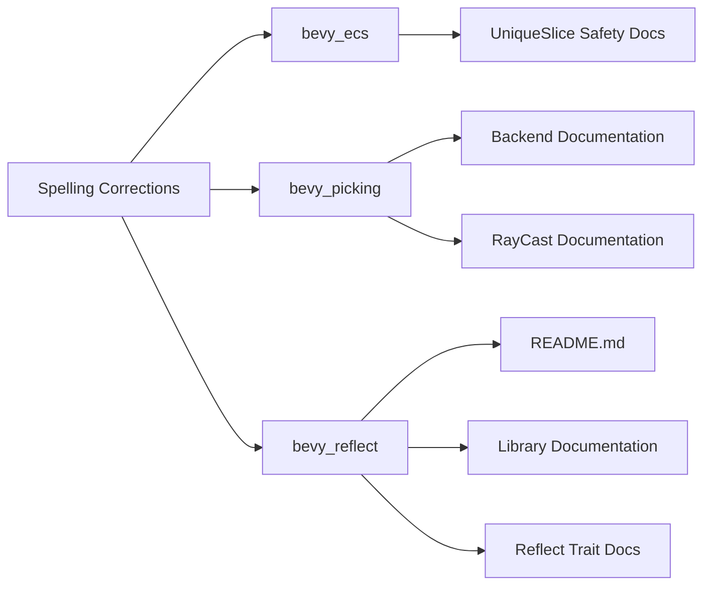

+++
title = "#20669 casted -> cast and downcasted -> downcast spelling."
date = "2025-08-20T00:00:00"
draft = false
template = "pull_request_page.html"
in_search_index = true

[taxonomies]
list_display = ["show"]

[extra]
current_language = "en"
available_languages = {"en" = { name = "English", url = "/pull_request/bevy/2025-08/pr-20669-en-20250820" }, "zh-cn" = { name = "中文", url = "/pull_request/bevy/2025-08/pr-20669-zh-cn-20250820" }}
labels = ["C-Docs", "D-Trivial"]
+++

# Title
casted -> cast and downcasted -> downcast spelling.

## Basic Information
- **Title**: casted -> cast and downcasted -> downcast spelling.
- **PR Link**: https://github.com/bevyengine/bevy/pull/20669
- **Author**: janis-bhm
- **Status**: MERGED
- **Labels**: C-Docs, D-Trivial, S-Ready-For-Final-Review
- **Created**: 2025-08-20T12:30:31Z
- **Merged**: 2025-08-20T16:46:34Z
- **Merged By**: alice-i-cecile

## Description Translation
# Objective

correct spelling of `cast` and `downcast` (past tense).
the incorrect spelling `casted` and `downcasted` appears a few times in comments and doc, notably 
https://dev-docs.bevy.org/bevy/prelude/trait.Reflect.html#method.is
https://dev-docs.bevy.org/bevy/picking/backend/struct.HitData.html#structfield.camera
https://dev-docs.bevy.org/bevy/picking/mesh_picking/ray_cast/enum.RayCastVisibility.html#variant.Any

## Solution

`rg 'casted'` in project root
`s/casted/cast/g`

## Testing

This affects comments and doc-comments only.

## The Story of This Pull Request

This pull request addresses a straightforward but important documentation quality issue: incorrect spelling of technical terms in comments and documentation throughout the Bevy codebase. The problem was that several instances used "casted" and "downcasted" as the past tense forms, when the correct forms are "cast" and "downcast" respectively.

The developer identified this issue through routine code inspection and documentation review. While seemingly minor, consistent and correct spelling in documentation matters for professional presentation and developer experience. Incorrect terminology can confuse developers, especially those new to Rust or the Bevy engine, and may lead to misunderstandings about the intended behavior of APIs.

The solution approach was systematic and efficient. The developer used `rg` (ripgrep) to search for all instances of "casted" across the entire project root, then performed a simple search-and-replace operation with `s/casted/cast/g`. This approach ensured that all occurrences were caught and corrected consistently.

The changes affect six files across three different crates: `bevy_ecs`, `bevy_picking`, and `bevy_reflect`. Each correction follows the same pattern - replacing the incorrect past tense form with the correct one. The modifications are exclusively in comments and documentation strings, meaning there is no functional impact on the code itself.

In the `bevy_ecs` crate, the changes occur in safety documentation for unsafe casting functions. The corrections clarify that the safety precondition requires uniqueness "in each of the cast slices" rather than "casted slices." This improves the professionalism and clarity of the safety documentation.

For the `bevy_picking` system, two corrections were made. In the `HitData` struct documentation, the description of the camera field now correctly states that it's useful for finding "the ray that was cast" rather than "casted." Similarly, in the `RayCastVisibility` enum, the documentation now explains that hidden items can be "ray cast against" instead of "ray casted against."

The most extensive changes were in the `bevy_reflect` system, where both the README and core library documentation received corrections. These changes are particularly important as they affect developer-facing documentation that explains how reflection and type casting work in Bevy. The corrections ensure that newcomers to the codebase encounter proper technical terminology when learning about these complex systems.

The impact of these changes is purely on code quality and documentation clarity. While the functional behavior remains unchanged, the corrections make the codebase more professional and consistent. For a project like Bevy that serves as both a game engine and a learning resource, maintaining high-quality documentation is essential for both current contributors and future adopters.

## Visual Representation



## Key Files Changed

**crates/bevy_ecs/src/entity/unique_slice.rs** (+3/-3)
- Changed safety documentation comments from "casted slices" to "cast slices"
- Affects three unsafe casting functions' documentation

```rust
// Before:
/// All elements in each of the casted slices must be unique.

// After:
/// All elements in each of the cast slices must be unique.
```

**crates/bevy_reflect/src/reflect.rs** (+2/-2)
- Corrected documentation for the Reflect trait's downcasting behavior
- Changed "downcasted" to "downcast" in method documentation

```rust
// Before:
/// it can be downcasted to. In the case that this underlying value "represents"
/// a different type, like the Dynamic*** types do, you can call `represents`
/// to determine what type they represent. Represented types cannot be downcasted

// After:
/// it can be downcast to. In the case that this underlying value "represents"
/// a different type, like the Dynamic*** types do, you can call `represents`
/// to determine what type they represent. Represented types cannot be downcast
```

**crates/bevy_picking/src/backend.rs** (+1/-1)
- Corrected documentation for HitData struct's camera field
- Changed "casted" to "cast" in ray description

```rust
// Before:
/// casted for this hit when using a raycasting backend.

// After:
/// cast for this hit when using a raycasting backend.
```

**crates/bevy_picking/src/mesh_picking/ray_cast/mod.rs** (+1/-1)
- Corrected documentation for RayCastVisibility enum
- Changed "ray casted against" to "ray cast against"

```rust
// Before:
/// Completely ignore visibility checks. Hidden items can still be ray casted against.

// After:
/// Completely ignore visibility checks. Hidden items can still be ray cast against.
```

**crates/bevy_reflect/README.md** (+1/-1)
- Corrected example documentation for reflection system
- Changed "downcasted" and "casted" to "downcast" and "cast"

```markdown
// Before:
// knows that &dyn Reflect should first be downcasted to &MyType, which can then be safely casted to &dyn DoThing

// After:
// knows that &dyn Reflect should first be downcast to &MyType, which can then be safely cast to &dyn DoThing
```

## Further Reading

- Rust Documentation Guidelines: https://rust-lang.github.io/rfcs/1574-more-api-documentation-conventions.html
- Bevy Contribution Guidelines: https://github.com/bevyengine/bevy/blob/main/CONTRIBUTING.md
- Rust API Guidelines (C-CONV): https://rust-lang.github.io/api-guidelines/naming.html#c-conv
- English Irregular Verbs Reference: https://www.englishclub.com/vocabulary/irregular-verbs-list.htm