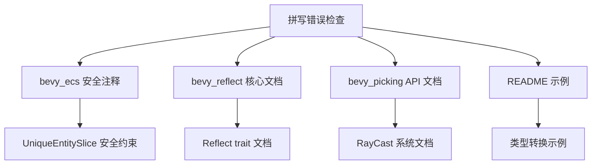

+++
title = "#20669 casted -> cast and downcasted -> downcast spelling."
date = "2025-08-20T00:00:00"
draft = false
template = "pull_request_page.html"
in_search_index = false

[extra]
current_language = "zh-cn"
available_languages = {"en" = { name = "English", url = "/pull_request/bevy/2025-08/pr-20669-en-20250820" }, "zh-cn" = { name = "中文", url = "/pull_request/bevy/2025-08/pr-20669-zh-cn-20250820" }}
+++

# Title

## Basic Information
- **Title**: casted -> cast and downcasted -> downcast spelling.
- **PR Link**: https://github.com/bevyengine/bevy/pull/20669
- **作者**: janis-bhm
- **状态**: 已合并
- **标签**: C-Docs, D-Trivial, S-Ready-For-Final-Review
- **创建时间**: 2025-08-20T12:30:31Z
- **合并时间**: 2025-08-20T16:46:34Z
- **合并人**: alice-i-cecile

## 描述翻译
# 目标

修正 `cast` 和 `downcast`（过去式）的拼写。
错误的拼写 `casted` 和 `downcasted` 在注释和文档中出现了几次，特别是：
https://dev-docs.bevy.org/bevy/prelude/trait.Reflect.html#method.is
https://dev-docs.bevy.org/bevy/picking/backend/struct.HitData.html#structfield.camera
https://dev-docs.bevy.org/bevy/picking/mesh_picking/ray_cast/enum.RayCastVisibility.html#variant.Any

## 解决方案

在项目根目录执行 `rg 'casted'`
执行 `s/casted/cast/g`

## 测试

这仅影响注释和文档注释。

## 这个 Pull Request 的故事

这个 PR 处理的是一个看似简单但很重要的代码质量问题：纠正代码注释和文档中不正确的英语动词过去式拼写。开发者发现项目中多处使用了非标准的过去式形式 "casted" 和 "downcasted"，而正确的过去式应该是 "cast" 和 "downcast"。

问题的重要性在于代码文档的准确性和专业性。虽然这些拼写错误不会影响代码执行，但它们会影响代码的可读性和项目的专业形象。特别是在 API 文档中，正确的术语使用对于开发者理解和使用库的功能至关重要。

开发者采用了直接且高效的解决方案：使用 `ripgrep` (rg) 工具在项目根目录搜索所有出现 "casted" 的地方，然后使用全局替换命令将其修正为正确的形式 "cast"。这种方法确保了所有相关实例都被找到并修正，避免了手动查找可能遗漏的情况。

从技术角度来看，这个修改涉及多个核心模块：
- `bevy_ecs` 中的实体切片操作安全注释
- `bevy_reflect` 反射系统的核心文档和注释  
- `bevy_picking` 拾取系统的 API 文档
- 项目 README 中的示例说明

这些修改虽然表面上是简单的文本替换，但实际上确保了技术文档的准确性和一致性。特别是在安全注释中，正确的术语使用对于开发者理解安全约束条件非常重要。



## 关键文件变更

### `crates/bevy_ecs/src/entity/unique_slice.rs` (+3/-3)
修改了安全注释中的拼写错误，将 "casted" 改为 "cast"。这些注释描述了在进行类型转换时需要满足的安全前提条件。

```rust
// 修改前：
/// All elements in each of the casted slices must be unique.

// 修改后：
/// All elements in each of the cast slices must be unique.
```

### `crates/bevy_reflect/src/reflect.rs` (+2/-2)
修正了反射系统核心文档中的术语使用，确保类型转换相关描述的准确性。

```rust
// 修改前：
/// it can be downcasted to. In the case that this underlying value "represents"
// ...
/// Represented types cannot be downcasted

// 修改后：
/// it can be downcast to. In the case that this underlying value "represents"
// ...
/// Represented types cannot be downcast
```

### `crates/bevy_picking/src/backend.rs` (+1/-1)
修正了拾取系统中射线投射相关的 API 文档。

```rust
// 修改前：
/// casted for this hit when using a raycasting backend.

// 修改后：
/// cast for this hit when using a raycasting backend.
```

### `crates/bevy_picking/src/mesh_picking/ray_cast/mod.rs` (+1/-1)
修正了射线可见性枚举的文档注释。

```rust
// 修改前：
/// Hidden items can still be ray casted against.

// 修改后：
/// Hidden items can still be ray cast against.
```

### `crates/bevy_reflect/README.md` (+1/-1)
修正了 README 中的类型转换示例说明。

```markdown
// 修改前：
// knows that &dyn Reflect should first be downcasted to &MyType, which can then be safely casted to &dyn DoThing

// 修改后：
// knows that &dyn Reflect should first be downcast to &MyType, which can then be safely cast to &dyn DoThing
```

## 进一步阅读

- [Rust 标准库中的类型转换文档](https://doc.rust-lang.org/std/any/index.html)
- [Bevy Reflect 系统指南](https://bevy-cheatbook.github.io/programming/reflection.html)
- [英语动词不规则变化规则](https://www.grammarly.com/blog/irregular-verbs/)