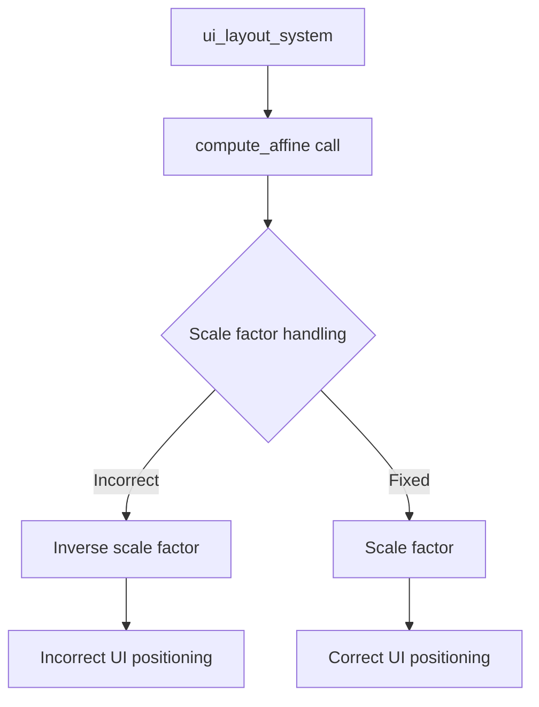

+++
title = "#20672 UI transform scale factor fix"
date = "2025-08-20T00:00:00"
draft = false
template = "pull_request_page.html"
in_search_index = true

[taxonomies]
list_display = ["show"]

[extra]
current_language = "en"
available_languages = {"en" = { name = "English", url = "/pull_request/bevy/2025-08/pr-20672-en-20250820" }, "zh-cn" = { name = "中文", url = "/pull_request/bevy/2025-08/pr-20672-zh-cn-20250820" }}
labels = ["C-Bug", "A-UI", "D-Straightforward"]
+++

# UI Transform Scale Factor Fix

## Basic Information
- **Title**: UI transform scale factor fix
- **PR Link**: https://github.com/bevyengine/bevy/pull/20672
- **Author**: ickshonpe
- **Status**: MERGED
- **Labels**: C-Bug, A-UI, S-Ready-For-Final-Review, D-Straightforward
- **Created**: 2025-08-20T15:51:41Z
- **Merged**: 2025-08-20T22:52:03Z
- **Merged By**: alice-i-cecile

## Description
**Objective**

When computing `UiGlobalTransform`s during layout the translation is multiplied by the inverse scale factor but it's a logical value and needs to be multiplied by scale factor instead.

**Solution**

Multiply by scale factor, not inverse scale factor.

## The Story of This Pull Request

This PR addresses a mathematical error in Bevy's UI layout system that was causing incorrect transform calculations when dealing with scaled UI elements. The issue occurred during the computation of global transforms for UI nodes, specifically in how scale factors were applied to translations.

The core problem was in the `ui_layout_system` function, where the system was incorrectly passing the inverse scale factor to the `compute_affine` method when calculating local transforms. This caused UI element positions to be scaled incorrectly, particularly when working with non-uniform scaling or when UI elements were nested within scaled containers.

The fix is mathematically straightforward but important for correct UI rendering. The system needed to use the actual scale factor rather than its inverse when computing affine transformations. The solution replaces `inverse_target_scale_factor` with its reciprocal (`inverse_target_scale_factor.recip()`), which effectively converts the inverse scale factor back to the original scale factor.

This change ensures that UI element translations are properly scaled according to the target display's scaling characteristics, maintaining correct positioning and layout regardless of the scale factors applied through the UI hierarchy.

The implementation is minimal and focused, affecting only the specific calculation that was incorrect. The change maintains all existing functionality while fixing the scaling behavior, making it a low-risk modification that directly addresses the identified issue.

## Visual Representation



## Key Files Changed

**File: `crates/bevy_ui/src/layout/mod.rs`**

This file contains the core UI layout system logic. The change modifies how scale factors are handled when computing affine transformations for UI elements.

**Key Modification:**
```rust
// Before:
let mut local_transform =
    transform.compute_affine(inverse_target_scale_factor, layout_size, target_size);

// After:
let mut local_transform = transform.compute_affine(
    inverse_target_scale_factor.recip(),
    layout_size,
    target_size,
);
```

The change replaces the direct use of `inverse_target_scale_factor` with its reciprocal, effectively converting the inverse scale factor back to the original scale factor before passing it to the `compute_affine` method. This ensures that translations are scaled correctly according to the target's actual scale factor rather than its inverse.

## Further Reading

- [Affine Transformations in Computer Graphics](https://en.wikipedia.org/wiki/Affine_transformation)
- [Bevy UI System Documentation](https://docs.rs/bevy_ui/latest/bevy_ui/)
- [Coordinate Systems and Transformations in Game Development](https://learnopengl.com/Getting-started/Coordinate-Systems)

## Full Code Diff
```diff
diff --git a/crates/bevy_ui/src/layout/mod.rs b/crates/bevy_ui/src/layout/mod.rs
index beae07cfdf6a2..d16f464745fc8 100644
--- a/crates/bevy_ui/src/layout/mod.rs
+++ b/crates/bevy_ui/src/layout/mod.rs
@@ -257,9 +257,12 @@ pub fn ui_layout_system(
             node.bypass_change_detection().border = taffy_rect_to_border_rect(layout.border);
             node.bypass_change_detection().padding = taffy_rect_to_border_rect(layout.padding);
 
-            // Computer the node's new global transform
-            let mut local_transform =
-                transform.compute_affine(inverse_target_scale_factor, layout_size, target_size);
+            // Compute the node's new global transform
+            let mut local_transform = transform.compute_affine(
+                inverse_target_scale_factor.recip(),
+                layout_size,
+                target_size,
+            );
             local_transform.translation += local_center;
             inherited_transform *= local_transform;
```