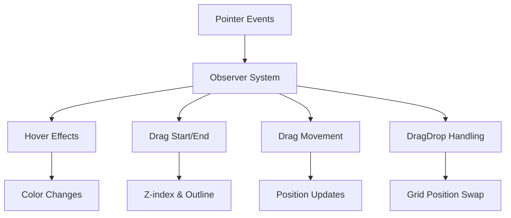

+++
title = "#20673 UI drag and drop example"
date = "2025-08-26T00:00:00"
draft = false
template = "pull_request_page.html"
in_search_index = true

[taxonomies]
list_display = ["show"]

[extra]
current_language = "en"
available_languages = {"en" = { name = "English", url = "/pull_request/bevy/2025-08/pr-20673-en-20250826" }, "zh-cn" = { name = "中文", url = "/pull_request/bevy/2025-08/pr-20673-zh-cn-20250826" }}
labels = ["C-Examples", "A-UI", "D-Straightforward"]
+++

# UI Drag and Drop Example

## Basic Information
- **Title**: UI drag and drop example
- **PR Link**: https://github.com/bevyengine/bevy/pull/20673
- **Author**: ickshonpe
- **Status**: MERGED
- **Labels**: C-Examples, A-UI, S-Ready-For-Final-Review, D-Straightforward
- **Created**: 2025-08-20T16:27:34Z
- **Merged**: 2025-08-26T03:25:46Z
- **Merged By**: alice-i-cecile

## Description Translation
# Objective

Add a basic UI drag and drop example.

## Solution

Lots of observers.

## Testing

The displacement of the dragged UI nodes is wrong if you have scale factor set, #20672 fixes this.

## The Story of This Pull Request

This PR adds a new example to demonstrate UI drag and drop functionality in Bevy. The example creates a grid of interactive tiles that users can drag and drop to swap positions, showcasing Bevy's UI interaction capabilities.

The implementation centers around Bevy's observer system, which handles pointer events through multiple observers attached to each UI node. The example creates a 10x10 grid of colored tiles, each displaying its index number. When users interact with these tiles, several visual feedback mechanisms provide a polished drag-and-drop experience:

1. **Hover Effects**: Tiles lighten when the pointer hovers over them
2. **Drag Initiation**: A white outline appears and the tile moves to a higher z-index when dragging starts
3. **Drag Movement**: The tile follows the pointer movement during drag operations
4. **Drop Handling**: When dropped on another tile, the two tiles swap grid positions

The core technical approach uses Bevy's observer pattern with specific pointer event types:
- `Pointer<Over>` and `Pointer<Out>` for hover effects
- `Pointer<DragStart>` and `Pointer<DragEnd>` for drag state management
- `Pointer<Drag>` for tracking movement
- `Pointer<DragDrop>` for handling drop interactions between elements

The implementation demonstrates proper use of Bevy's UI layout system with grid placement, showing how to manipulate `grid_row` and `grid_column` properties programmatically to achieve the swap effect. The example also handles visual styling through color manipulation and outline effects.

One important note is the known issue with scale factor affecting drag displacement, which is addressed in a separate PR (#20672). This demonstrates good practice in documenting limitations while still delivering functional examples.

## Visual Representation



## Key Files Changed

### `examples/ui/ui_drag_and_drop.rs` (+102/-0)
This new file contains the complete drag and drop example implementation:

```rust
//! Demonstrates dragging and dropping UI nodes

use bevy::{prelude::*, winit::WinitSettings};

fn main() {
    App::new()
        .add_plugins(DefaultPlugins)
        // Only run the app when there is user input. This will significantly reduce CPU/GPU use.
        .insert_resource(WinitSettings::desktop_app())
        .add_systems(Startup, setup)
        .run();
}

// ... (implementation continues with grid setup and observer logic)
```

### `Cargo.toml` (+11/-0)
Added the new example to the project configuration:

```toml
[[example]]
name = "ui_drag_and_drop"
path = "examples/ui/ui_drag_and_drop.rs"
doc-scrape-examples = true

[package.metadata.example.ui_drag_and_drop]
name = "UI Drag and Drop"
description = "Demonstrates dragging and dropping UI nodes"
category = "UI (User Interface)"
wasm = true
```

### `examples/README.md` (+1/-0)
Added documentation reference for the new example:

```markdown
[UI Drag and Drop](../examples/ui/ui_drag_and_drop.rs) | Demonstrates dragging and dropping UI nodes
```

## Further Reading

- [Bevy UI Documentation](https://bevyengine.org/learn/books/ui/)
- [Bevy Input Handling](https://bevyengine.org/learn/books/input/)
- [Observer Pattern in Bevy](https://bevyengine.org/learn/books/ecs/observer/)
- [CSS Grid Layout (conceptual comparison)](https://developer.mozilla.org/en-US/docs/Web/CSS/CSS_grid_layout)