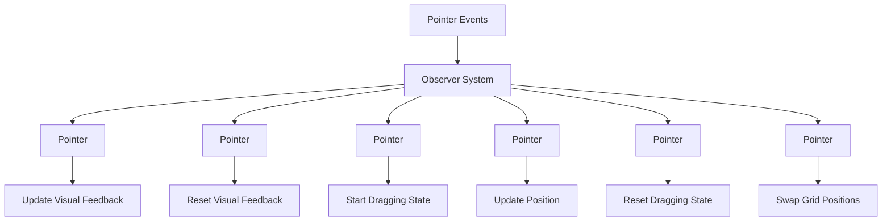

+++
title = "#20673 UI drag and drop example"
date = "2025-08-26T00:00:00"
draft = false
template = "pull_request_page.html"
in_search_index = false

[extra]
current_language = "zh-cn"
available_languages = {"en" = { name = "English", url = "/pull_request/bevy/2025-08/pr-20673-en-20250826" }, "zh-cn" = { name = "中文", url = "/pull_request/bevy/2025-08/pr-20673-zh-cn-20250826" }}
+++

# UI Drag and Drop Example

## 基本信息
- **标题**: UI drag and drop example
- **PR链接**: https://github.com/bevyengine/bevy/pull/20673
- **作者**: ickshonpe
- **状态**: 已合并
- **标签**: C-Examples, A-UI, S-Ready-For-Final-Review, D-Straightforward
- **创建时间**: 2025-08-20T16:27:34Z
- **合并时间**: 2025-08-26T03:25:46Z
- **合并者**: alice-i-cecile

## 描述翻译
# Objective

添加一个基础的UI拖拽(drag and drop)示例。

## Solution

使用大量观察者(observers)。

## Testing

如果设置了缩放因子(scale factor)，被拖拽UI节点的位移会不正确，#20672修复了这个问题。

## 这个PR的故事

这个PR的主要目标是为Bevy引擎添加一个UI拖拽功能的示例。在游戏开发中，UI拖拽是一个常见需求，比如物品栏系统、卡片游戏、或者自定义UI布局等场景都需要这种交互方式。

开发者面临的问题是Bevy缺乏一个官方的拖拽示例来展示如何使用其观察者系统处理指针事件。虽然Bevy有强大的ECS架构和事件系统，但新用户可能需要具体示例来理解如何实现拖拽功能。

解决方案采用了Bevy的观察者模式，通过多个观察者监听不同的指针事件来实现完整的拖拽交互。观察者模式在这里很适合，因为它允许对特定实体的特定事件做出响应，而不需要全局的事件处理系统。

实现的核心是在一个10×10的网格布局中创建可拖拽的方块。每个方块都有独立的观察者来处理不同的交互状态：

```rust
.observe(move |on_over: On<Pointer<Over>>, mut query: Query<(&mut BackgroundColor, &mut BorderColor)>| {
    if let Ok((mut background_color, mut border_color)) = query.get_mut(on_over.entity()) {
        background_color.0 = tile_color.lighter(0.1);
        border_color.set_all(tile_border_color.lighter(0.1));
    }
})
```

这个观察者处理鼠标悬停事件，当指针移动到方块上时，改变背景和边框颜色以提供视觉反馈。

```rust
.observe(|on_drag_start: On<Pointer<DragStart>>, mut query: Query<(&mut Outline, &mut GlobalZIndex)>| {
    if let Ok((mut outline, mut global_zindex, )) = query.get_mut(on_drag_start.entity()) {
        outline.color = Color::WHITE;
        global_zindex.0 = 1;
    }
})
```

拖拽开始时，添加白色轮廓并提高z-index确保拖拽元素显示在其他元素上方。

```rust
.observe(|on_drag: On<Pointer<Drag>>, mut query: Query<&mut UiTransform>| {
    if let Ok(mut transform) = query.get_mut(on_drag.entity()) {
        transform.translation = Val2::px(on_drag.distance.x, on_drag.distance.y);
    }
})
```

拖拽过程中，根据指针移动距离更新UI元素的位置。

```rust
.observe(move |on_drag_end: On<Pointer<DragEnd>>, mut query: Query<(&mut UiTransform, &mut Outline, &mut GlobalZIndex)>| {
    if let Ok((mut transform, mut outline, mut global_zindex)) = query.get_mut(on_drag_end.entity()) {
        transform.translation = Val2::ZERO;
        outline.color = Color::NONE;
        global_zindex.0 = 0;
    }
})
```

拖拽结束时，重置位置、移除轮廓并恢复z-index。

```rust
.observe(|on_drag_drop: On<Pointer<DragDrop>>, mut query: Query<&mut Node>| {
    if let Ok([mut a, mut b]) = query.get_many_mut([on_drag_drop.entity(), on_drag_drop.dropped]) {
        core::mem::swap(&mut a.grid_row, &mut b.grid_row);
        core::mem::swap(&mut a.grid_column, &mut b.grid_column);
    }
})
```

最重要的部分是拖拽放置处理，当将一个元素拖放到另一个元素上时，交换它们在网格中的行列位置。

技术实现上的一个值得注意的点是使用了Bevy的网格布局系统，通过`grid_row`和`grid_column`属性来管理元素位置，这使得交换位置变得简单高效。

这个示例展示了Bevy观察者系统的强大功能，特别是在处理UI交互方面。每个观察者都专注于单一职责，代码结构清晰且易于理解。不过，PR描述中也提到一个已知问题：在设置了缩放因子的情况下，拖拽位移计算可能不准确，这需要另一个PR(#20672)来修复。

从工程角度看，这个实现提供了良好的可扩展性基础。开发者可以基于这个示例添加更复杂的逻辑，如拖拽验证、动画效果或自定义拖拽行为。

## 可视化表示



## 关键文件变更

**1. `examples/ui/ui_drag_and_drop.rs` (+102/-0)**
新增UI拖拽示例文件，实现了完整的拖拽交互功能。

```rust
// 关键代码片段：拖拽放置处理
.observe(|on_drag_drop: On<Pointer<DragDrop>>, mut query: Query<&mut Node>| {
    if let Ok([mut a, mut b]) = query.get_many_mut([on_drag_drop.entity(), on_drag_drop.dropped]) {
        core::mem::swap(&mut a.grid_row, &mut b.grid_column);
        core::mem::swap(&mut a.grid_column, &mut b.grid_column);
    }
})
```

**2. `Cargo.toml` (+11/-0)**
添加示例配置，使其能够通过cargo运行。

```toml
[[example]]
name = "ui_drag_and_drop"
path = "examples/ui/ui_drag_and_drop.rs"
doc-scrape-examples = true

[package.metadata.example.ui_drag_and_drop]
name = "UI Drag and Drop"
description = "Demonstrates dragging and dropping UI nodes"
category = "UI (User Interface)"
wasm = true
```

**3. `examples/README.md` (+1/-0)**
在示例列表中添加UI拖拽示例的文档链接。

```markdown
[UI Drag and Drop](../examples/ui/ui_drag_and_drop.rs) | Demonstrates dragging and dropping UI nodes
```

## 扩展阅读

- [Bevy观察者文档](https://docs.rs/bevy/latest/bevy/ecs/event/trait.Observer.html) - 了解观察者模式的工作原理
- [Bevy UI系统](https://bevyengine.org/learn/books/ui/) - 官方UI指南
- [Bevy输入处理](https://docs.rs/bevy/latest/bevy/input/) - 输入事件处理机制
- [网格布局指南](https://developer.mozilla.org/en-US/docs/Web/CSS/CSS_grid_layout) - CSS网格布局概念（与Bevy实现类似）