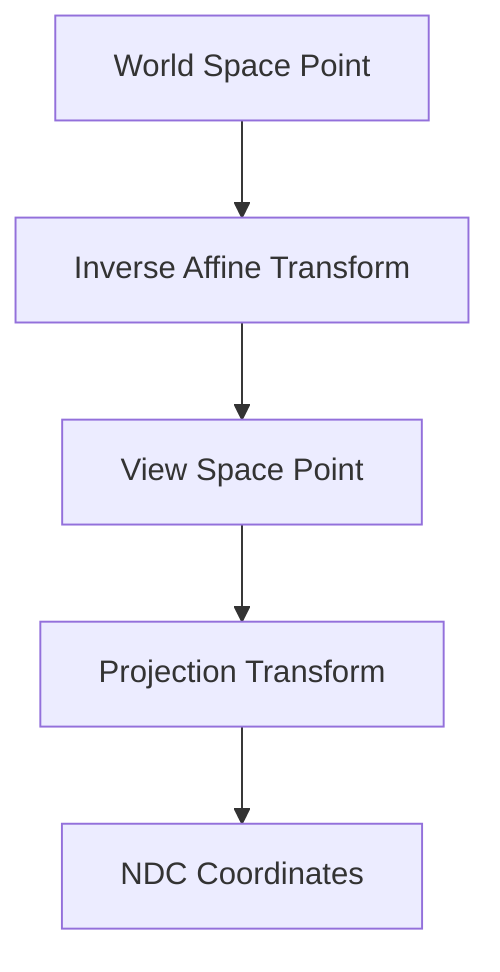

+++
title = "#20674 Fix world_to_ndc"
date = "2025-08-20T00:00:00"
draft = false
template = "pull_request_page.html"
in_search_index = true

[taxonomies]
list_display = ["show"]

[extra]
current_language = "en"
available_languages = {"en" = { name = "English", url = "/pull_request/bevy/2025-08/pr-20674-en-20250820" }, "zh-cn" = { name = "中文", url = "/pull_request/bevy/2025-08/pr-20674-zh-cn-20250820" }}
labels = ["C-Bug", "A-Rendering"]
+++

# Fix world_to_ndc

## Basic Information
- **Title**: Fix world_to_ndc
- **PR Link**: https://github.com/bevyengine/bevy/pull/20674
- **Author**: atlv24
- **Status**: MERGED
- **Labels**: C-Bug, A-Rendering, S-Ready-For-Final-Review
- **Created**: 2025-08-20T16:35:10Z
- **Merged**: 2025-08-20T18:22:31Z
- **Merged By**: alice-i-cecile

## Description Translation
The original description is in English, so it is included as-is:

# Objective

- world_to_ndc inverts a mat4 that is an affine matrix. this doesnt actually work, the translation needs special treatment to be correct. also it unnecessarily does a mat4 x mat4 mul, its cheaper and more precise to mul the point by each in sequence

## Solution

- dont write broken code
- use traits to allow avoiding vec3a -> vec3 -> vec3a casts (if this is controversial i'll undo that commit)

## Testing

- found this bug at my job, fixed it at my job. it works now

## The Story of This Pull Request

The `world_to_ndc` function in Bevy's camera system had a fundamental mathematical flaw in its implementation. The function was designed to convert world-space coordinates to Normalized Device Coordinates (NDC) but was incorrectly handling affine transformations by performing a full matrix inversion and multiplication.

The original implementation attempted to compute the transformation from world space to NDC by creating a combined matrix `clip_from_world` through matrix multiplication (`self.computed.clip_from_view * camera_transform.to_matrix().inverse()`). This approach had two critical issues:

1. **Mathematical Incorrectness**: The function was inverting a 4x4 matrix that represented an affine transformation. While affine matrices can be inverted, the translation component requires special handling that wasn't being properly addressed.

2. **Performance Overhead**: The implementation performed an expensive 4x4 matrix multiplication followed by a matrix inversion, when a more efficient approach was available.

The solution involved rethinking the transformation pipeline. Instead of combining matrices and performing expensive operations, the new implementation breaks the transformation into logical steps:

1. Compute the inverse of just the affine part of the global transform
2. Transform the world point to view space using the inverse affine transformation
3. Project the view space point to NDC using the camera's clip-from-view matrix

This approach is both mathematically correct and more efficient, avoiding unnecessary matrix operations and precision loss.

The implementation was further optimized by introducing generic type parameters to avoid unnecessary vector conversions. The function now accepts any type `V` that implements `Into<Vec3A>` and `From<Vec3A>`, allowing callers to use either `Vec3` or `Vec3A` without paying conversion costs.

```rust
// Before
let clip_from_world: Mat4 = self.computed.clip_from_view * camera_transform.to_matrix().inverse();
let ndc_space_coords: Vec3 = clip_from_world.project_point3(world_position);

// After  
let view_from_world = camera_transform.affine().inverse();
let view_point = view_from_world.transform_point3a(world_point.into());
let ndc_point = self.computed.clip_from_view.project_point3a(view_point);
```

The changes maintain backward compatibility while fixing both the mathematical correctness and performance issues. The function signature was updated to be more generic, and documentation was improved to clarify the expected coordinate ranges in NDC space.

## Visual Representation



## Key Files Changed

### `crates/bevy_camera/src/camera.rs` (+11/-12)

This file contains the core camera functionality in Bevy. The changes focused on fixing the `world_to_ndc` method implementation.

**Key changes:**
1. Added `Vec3A` import to support SIMD operations
2. Updated function signature to use generic types
3. Replaced matrix combination with sequential transformations
4. Improved documentation clarity

**Code changes:**

```rust
// Before:
pub fn world_to_ndc(
    &self,
    camera_transform: &GlobalTransform,
    world_position: Vec3,
) -> Option<Vec3> {
    let clip_from_world: Mat4 =
        self.computed.clip_from_view * camera_transform.to_matrix().inverse();
    let ndc_space_coords: Vec3 = clip_from_world.project_point3(world_position);
    (!ndc_space_coords.is_nan()).then_some(ndc_space_coords)
}

// After:
pub fn world_to_ndc<V: Into<Vec3A> + From<Vec3A>>(
    &self,
    camera_transform: &GlobalTransform,
    world_point: V,
) -> Option<V> {
    let view_from_world = camera_transform.affine().inverse();
    let view_point = view_from_world.transform_point3a(world_point.into());
    let ndc_point = self.computed.clip_from_view.project_point3a(view_point);
    (!ndc_point.is_nan()).then_some(ndc_point.into())
}
```

## Further Reading

- [Affine Transformations](https://en.wikipedia.org/wiki/Affine_transformation)
- [Normalized Device Coordinates](https://www.khronos.org/opengl/wiki/Normalized_Device_Coordinates)
- [Bevy Camera Projection](https://bevy-cheatbook.github.io/features/camera.html)
- [Matrix Inversion for Affine Transforms](https://graphics.stanford.edu/courses/cs248-98-fall/Final/q4.html)