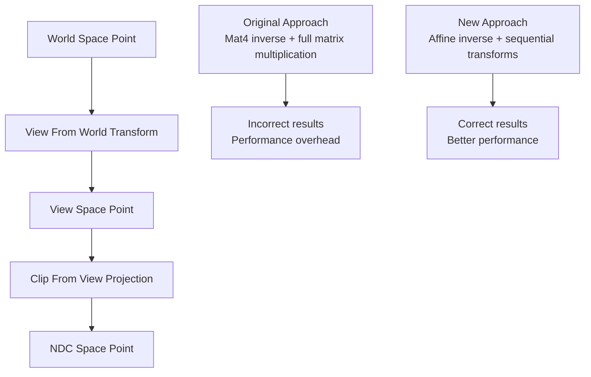

+++
title = "#20674 Fix world_to_ndc"
date = "2025-08-20T00:00:00"
draft = false
template = "pull_request_page.html"
in_search_index = false

[extra]
current_language = "zh-cn"
available_languages = {"en" = { name = "English", url = "/pull_request/bevy/2025-08/pr-20674-en-20250820" }, "zh-cn" = { name = "中文", url = "/pull_request/bevy/2025-08/pr-20674-zh-cn-20250820" }}
labels = ["C-Bug", "A-Rendering"]
+++

# Title

## Basic Information
- **Title**: Fix world_to_ndc
- **PR Link**: https://github.com/bevyengine/bevy/pull/20674
- **Author**: atlv24
- **Status**: MERGED
- **Labels**: C-Bug, A-Rendering, S-Ready-For-Final-Review
- **Created**: 2025-08-20T16:35:10Z
- **Merged**: 2025-08-20T18:22:31Z
- **Merged By**: alice-i-cecile

## Description Translation
# Objective

- world_to_ndc 对一个仿射矩阵 (affine matrix) 进行 mat4 求逆操作。这实际上不起作用，平移 (translation) 需要特殊处理才能正确。此外，它不必要地进行了 mat4 x mat4 乘法运算，按顺序对点进行每个乘法运算更便宜且更精确

## Solution

- 不要写有问题的代码
- 使用 trait 来避免 vec3a -> vec3 -> vec3a 的转换（如果这有争议，我将撤销该提交）

## Testing

- 在工作中发现了这个 bug，在工作中修复了它。现在它可以正常工作了

## The Story of This Pull Request

这个 PR 解决了一个在 Bevy 相机系统中存在的数学计算错误。问题的核心在于 `world_to_ndc` 函数错误地处理了仿射变换矩阵的逆运算，导致世界坐标到标准化设备坐标的转换不正确。

**问题发现与背景**
开发者 atlv24 在实际工作中使用 Bevy 引擎时发现，`Camera::world_to_ndc` 方法返回的结果不正确。这个函数负责将世界空间中的点转换到标准化设备坐标 (NDC) 空间，这是渲染管线中的关键步骤。原实现使用了不恰当的矩阵求逆方法，没有正确处理仿射矩阵的特性。

**技术问题分析**
原代码存在两个主要问题：
1. 对仿射矩阵使用了通用的 `Mat4::inverse()` 方法，而不是专门为仿射变换优化的 `affine().inverse()`
2. 进行了不必要的完整矩阵乘法 `Mat4 × Mat4`，而不是更高效地按顺序变换点坐标

**解决方案实现**
PR 采用了更精确和高效的数学方法：
1. 使用 `camera_transform.affine().inverse()` 来正确计算仿射变换的逆矩阵
2. 将变换过程分解为两个步骤：先进行世界到视图空间的变换，再进行视图到裁剪空间的变换
3. 引入了泛型参数来避免不必要的向量类型转换，提高性能

**性能优化考虑**
通过避免完整的矩阵乘法和减少类型转换，新实现不仅更准确，而且性能更好。使用 `Vec3A` 类型（SIMD 优化的向量）进行计算，然后通过 trait 约束允许灵活的输入输出类型，减少了内存分配和数据类型转换的开销。

**代码质量改进**
PR 还改进了函数文档，更清楚地说明了 NDC 坐标的范围和含义：X 和 Y 轴在 -1.0（左下）到 1.0（右上）之间，Z 轴在 0.0（远）到 1.0（近）之间。

## Visual Representation



## Key Files Changed

### `crates/bevy_camera/src/camera.rs` (+11/-12)

这个文件包含了相机组件的主要实现，修改集中在 `world_to_ndc` 方法上。

**关键修改：**

```rust
// Before:
pub fn world_to_ndc(
    &self,
    camera_transform: &GlobalTransform,
    world_position: Vec3,
) -> Option<Vec3> {
    // Build a transformation matrix to convert from world space to NDC using camera data
    let clip_from_world: Mat4 =
        self.computed.clip_from_view * camera_transform.to_matrix().inverse();
    let ndc_space_coords: Vec3 = clip_from_world.project_point3(world_position);

    (!ndc_space_coords.is_nan()).then_some(ndc_space_coords)
}

// After:
pub fn world_to_ndc<V: Into<Vec3A> + From<Vec3A>>(
    &self,
    camera_transform: &GlobalTransform,
    world_point: V,
) -> Option<V> {
    let view_from_world = camera_transform.affine().inverse();
    let view_point = view_from_world.transform_point3a(world_point.into());
    let ndc_point = self.computed.clip_from_view.project_point3a(view_point);

    (!ndc_point.is_nan()).then_some(ndc_point.into())
}
```

**修改说明：**
1. 方法现在使用泛型参数 `V`，支持 `Vec3` 和 `Vec3A` 类型之间的灵活转换
2. 使用 `affine().inverse()` 而不是 `to_matrix().inverse()` 来正确计算仿射变换的逆
3. 将变换过程分解为两个明确的步骤，而不是合成一个完整的变换矩阵
4. 使用 `transform_point3a` 和 `project_point3a` 方法处理 `Vec3A` 类型，提高性能

## Further Reading

- [Bevy Camera Documentation](https://docs.rs/bevy_camera/latest/bevy_camera/)
- [Affine Transformations Explained](https://en.wikipedia.org/wiki/Affine_transformation)
- [Coordinate Systems in Computer Graphics](https://learnopengl.com/Getting-started/Coordinate-Systems)
- [glam Math Library Documentation](https://docs.rs/glam/latest/glam/) (Bevy 使用的数学库)

# Full Code Diff
diff --git a/crates/bevy_camera/src/camera.rs b/crates/bevy_camera/src/camera.rs
index 8cb04e6e0b0aa..75d4637063d0f 100644
--- a/crates/bevy_camera/src/camera.rs
+++ b/crates/bevy_camera/src/camera.rs
@@ -8,7 +8,7 @@ use bevy_asset::Handle;
 use bevy_derive::Deref;
 use bevy_ecs::{component::Component, entity::Entity, reflect::ReflectComponent};
 use bevy_image::Image;
-use bevy_math::{ops, Dir3, FloatOrd, Mat4, Ray3d, Rect, URect, UVec2, Vec2, Vec3};
+use bevy_math::{ops, Dir3, FloatOrd, Mat4, Ray3d, Rect, URect, UVec2, Vec2, Vec3, Vec3A};
 use bevy_reflect::prelude::*;
 use bevy_transform::components::{GlobalTransform, Transform};
 use bevy_window::{NormalizedWindowRef, WindowRef};
@@ -686,10 +686,10 @@ impl Camera {
         Ok(world_near_plane.truncate())
     }
 
-    /// Given a position in world space, use the camera's viewport to compute the Normalized Device Coordinates.
+    /// Given a point in world space, use the camera's viewport to compute the Normalized Device Coordinates of the point.
     ///
-    /// When the position is within the viewport the values returned will be between -1.0 and 1.0 on the X and Y axes,
-    /// and between 0.0 and 1.0 on the Z axis.
+    /// When the point is within the viewport the values returned will be between -1.0 (bottom left) and 1.0 (top right)
+    /// on the X and Y axes, and between 0.0 (far) and 1.0 (near) on the Z axis.
     /// To get the coordinates in the render target's viewport dimensions, you should use
     /// [`world_to_viewport`](Self::world_to_viewport).
     ///
@@ -699,17 +699,16 @@ impl Camera {
     /// # Panics
     ///
     /// Will panic if the `camera_transform` contains `NAN` and the `glam_assert` feature is enabled.
-    pub fn world_to_ndc(
+    pub fn world_to_ndc<V: Into<Vec3A> + From<Vec3A>>(
         &self,
         camera_transform: &GlobalTransform,
-        world_position: Vec3,
-    ) -> Option<Vec3> {
-        // Build a transformation matrix to convert from world space to NDC using camera data
-        let clip_from_world: Mat4 =
-            self.computed.clip_from_view * camera_transform.to_matrix().inverse();
-        let ndc_space_coords: Vec3 = clip_from_world.project_point3(world_position);
+        world_point: V,
+    ) -> Option<V> {
+        let view_from_world = camera_transform.affine().inverse();
+        let view_point = view_from_world.transform_point3a(world_point.into());
+        let ndc_point = self.computed.clip_from_view.project_point3a(view_point);
 
-        (!ndc_space_coords.is_nan()).then_some(ndc_space_coords)
+        (!ndc_point.is_nan()).then_some(ndc_point.into())
     }
 
     /// Given a position in Normalized Device Coordinates,