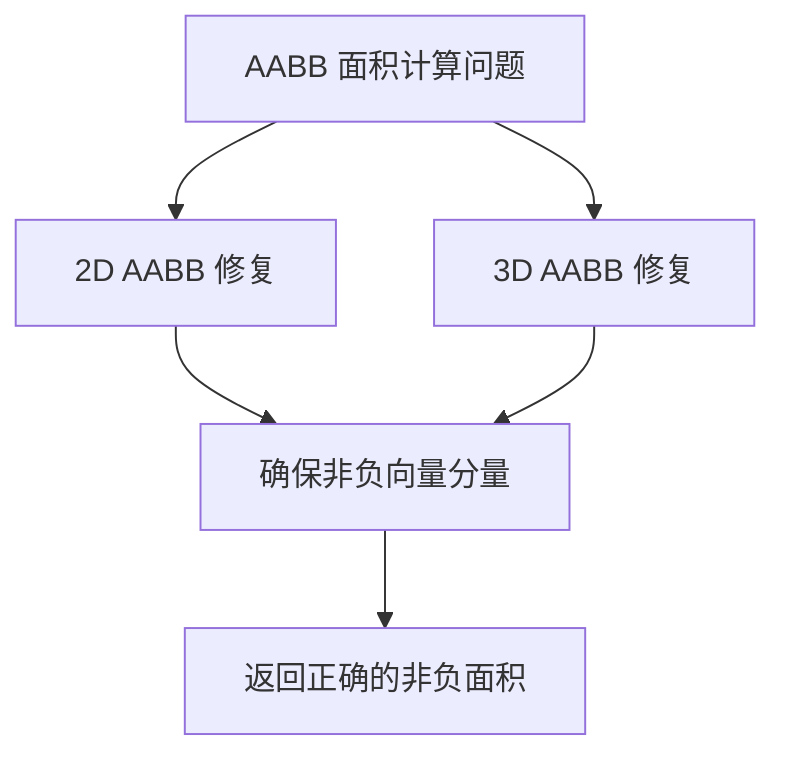

+++
title = "#20675 Fix aabb area calculation"
date = "2025-08-20T00:00:00"
draft = false
template = "pull_request_page.html"
in_search_index = false

[extra]
current_language = "zh-cn"
available_languages = {"en" = { name = "English", url = "/pull_request/bevy/2025-08/pr-20675-en-20250820" }, "zh-cn" = { name = "中文", url = "/pull_request/bevy/2025-08/pr-20675-zh-cn-20250820" }}
+++

# 修复 AABB 面积计算

## 基本信息
- **标题**: Fix aabb area calculation
- **PR 链接**: https://github.com/bevyengine/bevy/pull/20675
- **作者**: atlv24
- **状态**: 已合并
- **标签**: C-Bug, S-Ready-For-Final-Review, A-Math
- **创建时间**: 2025-08-20T17:22:27Z
- **合并时间**: 2025-08-20T18:22:31Z
- **合并者**: alice-i-cecile

## 描述翻译
# Objective (目标)

- 倒置的 Aabb2d 可能会报告正面积，在某些情况下甚至会报告负面积。无效的 Aabb（任何 min > max 的情况）应该具有零面积。

## Solution (解决方案)

- 使用 max 0 处理

## Testing (测试)

- 在工作中发现，在工作中修复，在工作中测试，在工作中运行正常

## 本次 PR 的故事

这个 PR 解决了一个在 Bevy 数学库中关于轴对齐包围盒（AABB）面积计算的边界情况问题。问题的核心在于当 AABB 处于无效状态时（即 min 坐标大于 max 坐标），面积计算会返回不正确的结果。

**问题背景**
在图形学和物理引擎中，AABB 是最基本的边界体积表示方法之一。一个有效的 AABB 应该满足 min ≤ max 的条件。然而，在某些情况下（如初始化错误或计算异常），可能会产生无效的 AABB，其中某些维度的 min 值大于 max 值。

原来的 `visible_area()` 方法实现存在缺陷：

```rust
// 修改前的代码
fn visible_area(&self) -> f32 {
    let b = self.max - self.min;  // 可能产生负值
    b.x * b.y  // 负值相乘可能产生正值
}
```

当 AABB 无效时，`self.max - self.min` 会产生负向量分量，这些负分量相乘后可能产生正值，这与面积应为非负值的数学定义相矛盾。

**解决方案**
开发者采用了最直接有效的修复方法：在计算差值后使用 `max(Vec2::ZERO)` 或 `max(Vec3A::ZERO)` 来确保所有维度分量都为非负值：

```rust
// 修改后的代码
fn visible_area(&self) -> f32 {
    let b = (self.max - self.min).max(Vec2::ZERO);  // 确保非负
    b.x * b.y  // 现在总是返回非负值
}
```

这种处理方式确保了：
1. 有效 AABB 的面积计算保持不变
2. 无效 AABB 的面积返回 0（符合数学定义）
3. 代码改动最小，性能影响可忽略不计

**工程考量**
这个修复体现了良好的工程实践：
- 保持向后兼容性，不影响现有功能
- 使用标准库提供的常量（`Vec2::ZERO`）提高代码可读性
- 添加 `#[inline(always)]` 属性确保性能不受影响
- 同时修复了 2D 和 3D 版本的相同问题

**影响**
这个修复虽然简单，但很重要：
1. 确保了数学计算的正确性
2. 防止了潜在的逻辑错误（如基于面积的正负做出错误决策）
3. 提高了代码的健壮性，能够正确处理边界情况

## 可视化表示



## 关键文件变更

### `crates/bevy_math/src/bounding/bounded2d/mod.rs` (+1/-1)
**变更描述**：修复 2D AABB 面积计算，确保无效 AABB 返回零面积

```rust
// 修改前：
fn visible_area(&self) -> f32 {
    let b = self.max - self.min;
    b.x * b.y
}

// 修改后：
fn visible_area(&self) -> f32 {
    let b = (self.max - self.min).max(Vec2::ZERO);
    b.x * b.y
}
```

### `crates/bevy_math/src/bounding/bounded3d/mod.rs` (+1/-1)
**变更描述**：修复 3D AABB 可见面积计算，使用相同的保护机制

```rust
// 修改前：
fn visible_area(&self) -> f32 {
    let b = self.max - self.min;
    b.x * (b.y + b.z) + b.y * b.z
}

// 修改后：
fn visible_area(&self) -> f32 {
    let b = (self.max - self.min).max(Vec3A::ZERO);
    b.x * (b.y + b.z) + b.y * b.z
}
```

## 延伸阅读

建议阅读以下资源来深入了解相关概念：

1. **AABB 理论基础**：
   - [Axis-Aligned Bounding Boxes (Microsoft DirectX)](https://learn.microsoft.com/en-us/windows/win32/dxtecharts/axis-aligned-bounding-boxes)
   - [Real-Time Collision Detection by Christer Ericson](https://realtimecollisiondetection.net/) - 关于碰撞检测和边界体积的权威参考

2. **Bevy 相关文档**：
   - [Bevy Math Module Documentation](https://docs.rs/bevy_math/latest/bevy_math/)
   - [Bounding Volumes in Bevy](https://bevyengine.org/learn/books/introduction/3d/3d-bounding-volumes/)

3. **Rust 数值计算最佳实践**：
   - [The Rust Performance Book](https://nnethercote.github.io/perf-book/) - 了解如何编写高性能的 Rust 代码
   - [Rust Numerics Working Group](https://github.com/rust-num) - Rust 数值计算的相关工作和库