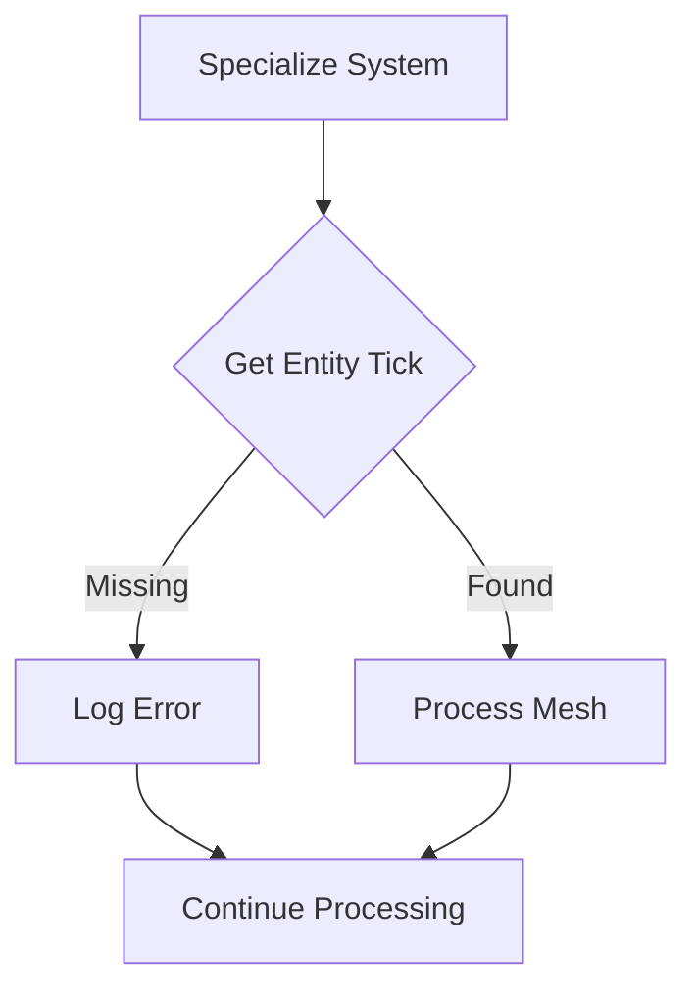

+++
title = "#20677 fix(mesh2d): replace unwrap by error log in specialize system"
date = "2025-08-24T00:00:00"
draft = false
template = "pull_request_page.html"
in_search_index = true

[taxonomies]
list_display = ["show"]

[extra]
current_language = "en"
available_languages = {"en" = { name = "English", url = "/pull_request/bevy/2025-08/pr-20677-en-20250824" }, "zh-cn" = { name = "中文", url = "/pull_request/bevy/2025-08/pr-20677-zh-cn-20250824" }}
labels = ["C-Bug", "A-Rendering", "P-Crash", "X-Contentious", "D-Straightforward"]
+++

# Title

## Basic Information
- **Title**: fix(mesh2d): replace unwrap by error log in specialize system
- **PR Link**: https://github.com/bevyengine/bevy/pull/20677
- **Author**: mirsella
- **Status**: MERGED
- **Labels**: C-Bug, A-Rendering, P-Crash, S-Ready-For-Final-Review, X-Contentious, D-Straightforward
- **Created**: 2025-08-20T19:47:27Z
- **Merged**: 2025-08-24T19:52:05Z
- **Merged By**: alice-i-cecile

## Description Translation
**Objective**

prevent panics talked about in #19064
this a "temporary" fix to get in 0.17, until the above PR is finalized, and the source problem is fixed.

**Solution**

remove the unwrap

**Testing**

- anything is better than panic
- been using this patch in my own games for months without any apparent issue

**Note**

please improve the actual error missing if needed, i doubt its perfect

## The Story of This Pull Request

This PR addresses a critical crash issue in Bevy's 2D mesh specialization system. The problem occurred when entities were missing specialization ticks, which happened when meshes were spawned during `PostUpdate` or later stages. The original implementation used `.unwrap()` to access these ticks, causing a panic when they weren't present.

The solution replaces the unsafe `unwrap()` call with proper error handling. Instead of crashing the entire application, the system now logs an informative error message and continues processing other entities. This approach maintains system stability while providing developers with clear diagnostic information about the unsupported operation.

The implementation follows defensive programming principles by gracefully handling edge cases rather than assuming ideal conditions. The error message specifically mentions that spawning meshes in `PostUpdate` or later isn't fully supported, helping developers identify the root cause of the issue.

This fix serves as a temporary solution until the underlying architectural issue (proper support for late mesh spawning) can be fully addressed. The change demonstrates the importance of avoiding `.unwrap()` in production code, especially in game engines where stability is critical.

## Visual Representation



## Key Files Changed

**File:** `crates/bevy_sprite_render/src/mesh2d/material.rs`

**Changes:** Replaced an unsafe `.unwrap()` call with proper error handling and graceful failure

**Before:**
```rust
let entity_tick = entity_specialization_ticks.get(visible_entity).unwrap();
```

**After:**
```rust
let Some(entity_tick) = entity_specialization_ticks.get(visible_entity) else {
    error!("{visible_entity:?} is missing specialization tick. Spawning Meshes in PostUpdate or later is currently not fully supported.");
    continue;
};
```

This change transforms a potential crash into a logged error, allowing the system to continue processing other entities while providing clear diagnostic information about the unsupported operation.

## Further Reading

- [Rust Error Handling Guide](https://doc.rust-lang.org/book/ch09-00-error-handling.html)
- [Bevy ECS System Documentation](https://bevyengine.org/learn/book/getting-started/ecs/)
- [Defensive Programming Principles](https://en.wikipedia.org/wiki/Defensive_programming)