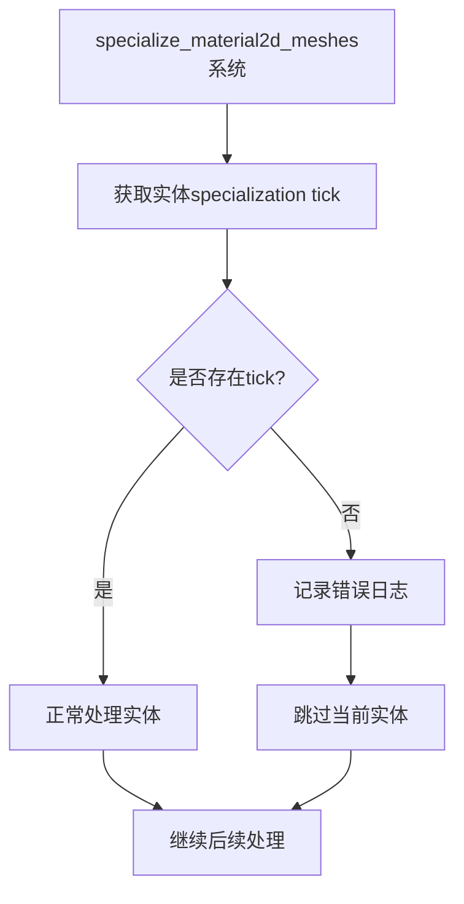

+++
title = "#20677 fix(mesh2d): replace unwrap by error log in specialize system"
date = "2025-08-24T00:00:00"
draft = false
template = "pull_request_page.html"
in_search_index = false

[extra]
current_language = "zh-cn"
available_languages = {"en" = { name = "English", url = "/pull_request/bevy/2025-08/pr-20677-en-20250824" }, "zh-cn" = { name = "中文", url = "/pull_request/bevy/2025-08/pr-20677-zh-cn-20250824" }}
labels = ["C-Bug", "A-Rendering", "P-Crash", "X-Contentious", "D-Straightforward"]
+++

# fix(mesh2d): replace unwrap by error log in specialize system

## Basic Information
- **Title**: fix(mesh2d): replace unwrap by error log in specialize system
- **PR Link**: https://github.com/bevyengine/bevy/pull/20677
- **Author**: mirsella
- **Status**: MERGED
- **Labels**: C-Bug, A-Rendering, P-Crash, S-Ready-For-Final-Review, X-Contentious, D-Straightforward
- **Created**: 2025-08-20T19:47:27Z
- **Merged**: 2025-08-24T19:52:05Z
- **Merged By**: alice-i-cecile

## Description Translation
修复 #19064 中讨论的 panic 问题
这是一个"临时"修复方案，将在 0.17 版本中应用，直到上述 PR 最终完成并且根本问题得到解决。

解决方案：
移除 unwrap 调用

测试：
- 任何处理方式都比 panic 更好
- 此补丁已在作者自己的游戏中使用数月，没有出现明显问题

注意：
如果需要，请改进实际的错误消息，作者对其完善性表示怀疑

## The Story of This Pull Request

这个 PR 解决了一个在 Bevy 渲染系统中可能导致 panic 的关键问题。问题出现在 `specialize_material2d_meshes` 系统中，该系统负责处理 2D 网格材质的特化过程。

**问题背景**：当系统尝试获取实体的 specialization tick 时，如果对应的实体在 `entity_specialization_ticks` 组件中不存在，原有的 `unwrap()` 调用会导致程序 panic。这种情况通常发生在 PostUpdate 或之后阶段生成网格实体时，因为此时系统可能还没有为这些实体准备好必要的 specialization tick 数据。

**解决方案**：开发者采用了防御性编程策略，将可能 panic 的 `unwrap()` 调用替换为错误日志记录和优雅降级处理。当找不到 specialization tick 时，系统现在会记录详细的错误信息并跳过当前实体的处理，而不是让整个应用崩溃。

**技术实现**：修改的核心在于将简单的 `unwrap()` 调用替换为模式匹配的 Option 处理。新的实现：

1. 使用 `if let` 或 `match` 语句安全地解包 Option
2. 在 None 情况下记录包含实体信息的错误日志
3. 使用 `continue` 跳过当前实体的处理，避免中断整个系统

这种处理方式符合 Rust 的最佳实践——避免不必要的 panic，特别是在游戏引擎这种需要稳定运行的系统中。

**影响评估**：这个修复虽然被标记为"临时方案"，但实际上提供了更健壮的错误处理机制。它防止了因实体生成时机问题导致的崩溃，同时通过错误日志为开发者提供了清晰的调试信息。这种模式也为处理类似场景提供了参考模板。

## Visual Representation



## Key Files Changed

### `crates/bevy_sprite_render/src/mesh2d/material.rs` (+4/-1)

**修改说明**：将可能 panic 的 unwrap 调用替换为安全的错误处理和跳过机制

**代码变更**：
```rust
// 修改前：
let entity_tick = entity_specialization_ticks.get(visible_entity).unwrap();

// 修改后：
let Some(entity_tick) = entity_specialization_ticks.get(visible_entity) else {
    error!("{visible_entity:?} is missing specialization tick. Spawning Meshes in PostUpdate or later is currently not fully supported.");
    continue;
};
```

**关联性**：这个修改直接解决了 PR 中描述的问题，防止了因缺失 specialization tick 而导致的程序崩溃，同时提供了有用的调试信息。

## Further Reading

- [Rust Error Handling Best Practices](https://doc.rust-lang.org/book/ch09-00-error-handling.html)
- [Bevy ECS System Writing Guidelines](https://bevyengine.org/learn/quick-start/ecs/)
- [Option Type Documentation](https://doc.rust-lang.org/std/option/enum.Option.html)
- [Defensive Programming Techniques](https://en.wikipedia.org/wiki/Defensive_programming)