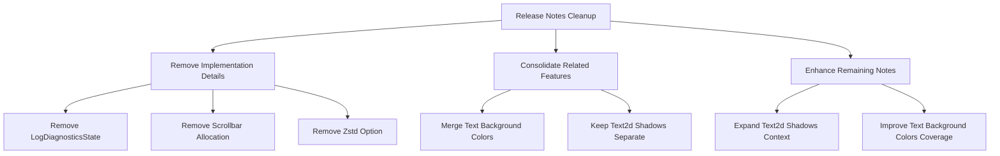

+++
title = "#20681 Cut and merge some 0.17 release notes"
date = "2025-08-27T00:00:00"
draft = false
template = "pull_request_page.html"
in_search_index = true

[taxonomies]
list_display = ["show"]

[extra]
current_language = "en"
available_languages = {"en" = { name = "English", url = "/pull_request/bevy/2025-08/pr-20681-en-20250827" }, "zh-cn" = { name = "中文", url = "/pull_request/bevy/2025-08/pr-20681-zh-cn-20250827" }}
labels = ["C-Docs", "A-Meta", "X-Contentious", "D-Straightforward"]
+++

# Cut and merge some 0.17 release notes

## Basic Information
- **Title**: Cut and merge some 0.17 release notes
- **PR Link**: https://github.com/bevyengine/bevy/pull/20681
- **Author**: alice-i-cecile
- **Status**: MERGED
- **Labels**: C-Docs, A-Meta, S-Ready-For-Final-Review, X-Contentious, D-Straightforward
- **Created**: 2025-08-20T22:28:30Z
- **Merged**: 2025-08-27T00:10:03Z
- **Merged By**: alice-i-cecile

## Description Translation
# Objective

Fixes #20666.

## Solution

Cut and merge release notes as outlined there.

While writing, I changed my mind on merging the Observers Overhaul and Event Trait Split notes. These sections are both very long already, and there's some interesting discussion in there that I don't want to lose.

We can just have two related sections that we put side-by-side, much like Solari and DLSS.

## Note to reviewers

This will conflict with #20665, but should take priority. No point editing release notes that are just getting cut.

## The Story of This Pull Request

This PR addresses the common challenge of maintaining clear, concise release notes for a large open-source project. As Bevy 0.17 approached, the release notes had accumulated numerous individual entries that needed refinement for better organization and readability.

The core problem was that several release notes were either too implementation-focused, covered minor features, or contained overlapping content that could be consolidated. The goal was to streamline the documentation while preserving important information for users upgrading to the new version.

The solution involved a strategic approach to content organization. Rather than simply removing content, the author made thoughtful decisions about what to cut, what to merge, and what to enhance. Several notes were completely removed because they described implementation details rather than user-facing features. For example, the `LogDiagnosticsState` public access change and automatic scrollbar space allocation were considered too low-level for most users.

For text rendering features, the author identified an opportunity to consolidate related functionality. Instead of having separate notes for UI text background colors and Text2d background colors, these were merged into a single comprehensive note that covers both use cases. This makes it easier for users to understand the complete text background color functionality across different text rendering systems.

The Text2d shadows note was enhanced with additional context and explanation, transforming it from a simple feature announcement into a more informative section that explains when and why users might want to use this feature.

Throughout this process, the author demonstrated good judgment about what constitutes valuable user-facing information versus implementation details. The decisions were guided by the principle that release notes should help users understand new capabilities and migration requirements, not document every internal code change.

## Visual Representation



## Key Files Changed

### Files Removed Entirely:

**`release-content/release-notes/faster-zstd-option.md`** (+0/-27)
This note described an internal optimization option for Zstd decompression that was considered too implementation-focused for most users.

**`release-content/release-notes/log-diagnostics-state-public.md`** (+0/-8)
Removed as it documented an internal API change rather than a user-facing feature.

**`release-content/release-notes/automatic_scrollbar_space_allocation.md`** (+0/-7)
Removed as it described an implementation detail of the UI system.

### Files Consolidated:

**`release-content/release-notes/text_background_colors.md`** (new file, +11/-0)
This new file consolidates text background color functionality that was previously split across multiple notes:

```markdown
---
title: "Text Background Colors"
authors: ["@ickshonpe"]
pull_requests: [18892, 20464]
---

TODO: add showcase image(s)

Text in Bevy now supports background colors. Insert the `TextBackgroundColor` component on a UI `Text` or `TextSpan` entity to set a background color for its text section.

This also works with `Text2d`: perfect for worldspace tooltips.
```

**`release-content/release-notes/text2d_textbackgroundcolor.md`** (deleted, +0/-9)
This functionality was merged into the consolidated text background colors note.

**`release-content/release-notes/text-background-colors.md`** (deleted, +0/-7)
This functionality was merged into the consolidated text background colors note.

### Files Enhanced:

**`release-content/release-notes/text2d_shadows.md`** (+8/-3)
Enhanced with additional context and explanation:

```markdown
---
title: "`Text2d` Shadows"
authors: ["@ickshonpe"]
pull_requests: [20463]
---

TODO: add showcase image(s)

`Text2d` is a simple worldspace text API: great for damage numbers and simple labels.
It deserves a few bells and whistles though, so it can keep up with its UI brother, `Text`.

In addition to the new text background color, we've added dropshadows for `Text2d`. Add the `Text2dShadow` component to a `Text2d` entity to draw a shadow effect beneath its text.
```

## Further Reading

- [Bevy Release Notes Documentation](https://github.com/bevyengine/bevy/blob/main/docs/RELEASE_NOTES_PROCESS.md)
- [Keep a Changelog](https://keepachangelog.com/) - Standards for maintaining changelogs
- [Semantic Versioning](https://semver.org/) - Version numbering standards
- [Writing Effective Release Notes](https://www.pagerduty.com/resources/learn/writing-release-notes/) - Best practices for release note content