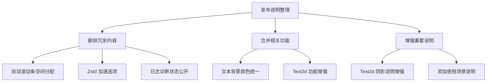

+++
title = "#20681 Cut and merge some 0.17 release notes"
date = "2025-08-27T00:00:00"
draft = false
template = "pull_request_page.html"
in_search_index = false

[extra]
current_language = "zh-cn"
available_languages = {"en" = { name = "English", url = "/pull_request/bevy/2025-08/pr-20681-en-20250827" }, "zh-cn" = { name = "中文", url = "/pull_request/bevy/2025-08/pr-20681-zh-cn-20250827" }}
+++

# Cut and merge some 0.17 release notes

## 基本信息
- **标题**: Cut and merge some 0.17 release notes
- **PR链接**: https://github.com/bevyengine/bevy/pull/20681
- **作者**: alice-i-cecile
- **状态**: 已合并
- **标签**: C-Docs, A-Meta, S-Ready-For-Final-Review, X-Contentious, D-Straightforward
- **创建时间**: 2025-08-20T22:28:30Z
- **合并时间**: 2025-08-27T00:10:03Z
- **合并者**: alice-i-cecile

## 描述翻译
# 目标

修复 #20666。

## 解决方案

按照那里的说明裁剪和合并发布说明。

在编写过程中，我改变了关于合并 Observers Overhaul 和 Event Trait Split 说明的想法。这些部分都已经很长了，而且里面有一些有趣的讨论我不想丢失。

我们可以有两个相关的部分并排放置，就像 Solari 和 DLSS 那样。

## 给审阅者的说明

这会与 #20665 冲突，但应该优先处理。没有必要编辑即将被裁剪的发布说明。

## 此拉取请求的故事

这个拉取请求主要处理 Bevy 0.17 版本发布说明的整理工作。问题源于发布说明中存在一些重复、冗余或过于细碎的内容，需要通过合并和裁剪来优化文档结构。

问题的核心在于多个相关的功能变更被分散在不同的文档中，导致用户难以全面了解某个功能的完整改进。例如，文本背景颜色功能在 UI Text 和 Text2d 中都有实现，但最初被分成了两个独立的发布说明文档。

开发者采取的解决方案是系统性地审查所有发布说明，识别出可以合并或删除的内容。具体策略包括：
1. 删除过于技术性或小众的功能说明（如 zstd 加速选项、滚动条空间分配）
2. 合并相关功能的说明（如 Text2d 的阴影和背景颜色）
3. 增强重要功能的说明内容，添加更多上下文和使用场景

在实现过程中，开发者保持了原有的文档格式和元数据，但重新组织了内容结构。对于 Text2d 的阴影功能，不仅保留了基本说明，还增加了使用场景描述和与 UI Text 的对比，使文档更加实用。

技术上看，这是一个典型的文档整理工作，不涉及代码逻辑变更，但对用户体验有直接影响。通过减少文档碎片化，用户能够更快速地找到相关信息，理解功能的全貌。

此次整理也反映了良好的开源项目管理实践——在版本发布前对文档进行审查和优化，确保最终用户获得清晰、一致的文档体验。

## 可视化表示



## 关键文件变更

### `release-content/release-notes/faster-zstd-option.md` (+0/-27)
此文件被完全删除，因为 zstd 加速选项被认为过于技术性且小众，不适合包含在主发布说明中。

### `release-content/release-notes/text2d_shadows.md` (+8/-3)
增强了 Text2d 阴影功能的说明，添加了更多上下文和使用场景：

```markdown
# 修改前：
title: Text2d Shadows
authors: ["@Ickshonpe"]

`Text2d` now supports shadows. Add the `Text2dShadow` component to a `Text2d` entity to draw a shadow beneath its text.

# 修改后：
title: "`Text2d` Shadows"
authors: ["@ickshonpe"]

TODO: add showcase image(s)

`Text2d` is a simple worldspace text API: great for damage numbers and simple labels.
It deserves a few bells and whistles though, so it can keep up with its UI brother, `Text`.

In addition to the new text background color, we've added dropshadows for `Text2d`. Add the `Text2dShadow` component to a `Text2d` entity to draw a shadow effect beneath its text.
```

### `release-content/release-notes/text_background_colors.md` (+11/-0)
新创建的文件，合并了原来分散在不同文件中的文本背景颜色功能说明：

```markdown
---
title: "Text Background Colors"
authors: ["@ickshonpe"]
pull_requests: [18892, 20464]
---

TODO: add showcase image(s)

Text in Bevy now supports background colors. Insert the `TextBackgroundColor` component on a UI `Text` or `TextSpan` entity to set a background color for its text section.

This also works with `Text2d`: perfect for worldspace tooltips.
```

### `release-content/release-notes/text2d_textbackgroundcolor.md` (+0/-9)
此文件被删除，其内容被合并到新的统一文本背景颜色说明中。

### `release-content/release-notes/log-diagnostics-state-public.md` (+0/-8)
此文件被删除，因为日志诊断状态的公开化被认为是一个较小的内部改进，不适合主发布说明。

## 延伸阅读

- [Bevy 官方文档](https://bevyengine.org/learn/)
- [GitHub 项目管理最佳实践](https://docs.github.com/en/issues/planning-and-tracking-with-projects)
- [技术文档编写指南](https://documentation.divio.com/)