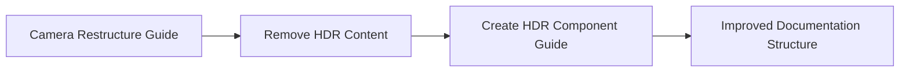

+++
title = "#20683 `Hdr` migration guide wording"
date = "2025-08-21T00:00:00"
draft = false
template = "pull_request_page.html"
in_search_index = true

[taxonomies]
list_display = ["show"]

[extra]
current_language = "en"
available_languages = {"en" = { name = "English", url = "/pull_request/bevy/2025-08/pr-20683-en-20250821" }, "zh-cn" = { name = "中文", url = "/pull_request/bevy/2025-08/pr-20683-zh-cn-20250821" }}
labels = ["C-Docs", "A-Rendering"]
+++

# Hdr Migration Guide Wording

## Basic Information
- **Title**: `Hdr` migration guide wording
- **PR Link**: https://github.com/bevyengine/bevy/pull/20683
- **Author**: ecoskey
- **Status**: MERGED
- **Labels**: C-Docs, A-Rendering, S-Ready-For-Final-Review
- **Created**: 2025-08-20T23:13:27Z
- **Merged**: 2025-08-21T00:04:19Z
- **Merged By**: alice-i-cecile

## Description Translation
# Objective

slight reword of the `Hdr` component split migration guide. Was meant to be the first of a series but then I worked on other stuff :p

## The Story of This Pull Request

This PR addresses documentation improvements for the Bevy game engine's migration guide related to the HDR component restructuring. The core issue was organizational - the migration guide for camera restructuring contained information about the HDR component split that deserved its own dedicated documentation section.

The developer recognized that while the camera restructuring migration guide provided valuable context about broader camera changes, the HDR component split was significant enough to warrant separate documentation. This separation follows good documentation practices where major architectural changes should have clear, focused migration guides rather than being buried within broader topics.

The solution involved extracting the HDR-specific content from the camera restructuring guide and creating a new dedicated migration guide file. The implementation maintains all technical accuracy while improving the organizational structure of the documentation. The content was slightly reworded to stand alone without the camera restructuring context, making it more directly actionable for developers who specifically need to migrate their HDR implementation.

From an engineering perspective, this change demonstrates the importance of maintaining clear, focused documentation for architectural changes. When components are split or significant API changes occur, having dedicated migration guides helps developers understand and implement the changes more efficiently. The use of marker components (`Hdr`) and the `#[require(Hdr)]` attribute pattern shown in this migration guide represents a common Bevy pattern for conditionally enabling features based on component presence.

The impact of this change is improved developer experience when migrating codebases to newer versions of Bevy. By providing a clean, focused migration guide for the HDR component split, developers can more easily understand what changed and how to update their code.

## Visual Representation



## Key Files Changed

### `release-content/migration-guides/camera_restructure.md` (-12 lines)
This file was completely removed as part of the reorganization. It previously contained HDR-specific migration content that was moved to a dedicated file.

```markdown
# Before (deleted content):
---
title: Camera Restructure
pull_requests: [18873]
---

As part of the rendering crate reorganization, we've been working to simplify Bevy `Camera`s:

- `Camera.hdr` has been split out into a new marker component, `Hdr`
  - before: `commands.spawn((Camera3d, Camera { hdr: true, ..default() });`
  - after: `commands.spawn((Camera3d, Hdr));`
  - rendering effects can now `#[require(Hdr)]` if they only function with an HDR camera.
    This is currently implemented for `Bloom`, `AutoExposure`, and `Atmosphere`
```

### `release-content/migration-guides/hdr_component.md` (+11 lines)
New file created to provide focused documentation for the HDR component migration.

```markdown
# After (new content):
---
title: Split `Hdr` from `Camera`
pull_requests: [18873]
---

`Camera.hdr` has been split out into a new marker component, `Hdr`

- before: `commands.spawn((Camera3d, Camera { hdr: true, ..default() });`
- after: `commands.spawn((Camera3d, Hdr));`
- rendering effects can now `#[require(Hdr)]` if they only function with an HDR camera.
  This is currently implemented for `Bloom`, `AutoExposure`, and `Atmosphere`
```

## Further Reading

- [Bevy Engine Documentation](https://bevyengine.org/learn/)
- [ECS Pattern in Bevy](https://bevyengine.org/learn/book/getting-started/ecs/)
- [Component Documentation](https://docs.rs/bevy/latest/bevy/ecs/component/trait.Component.html)
- [Migration Guide Best Practices](https://documentation.divio.com/how-to-guides/)