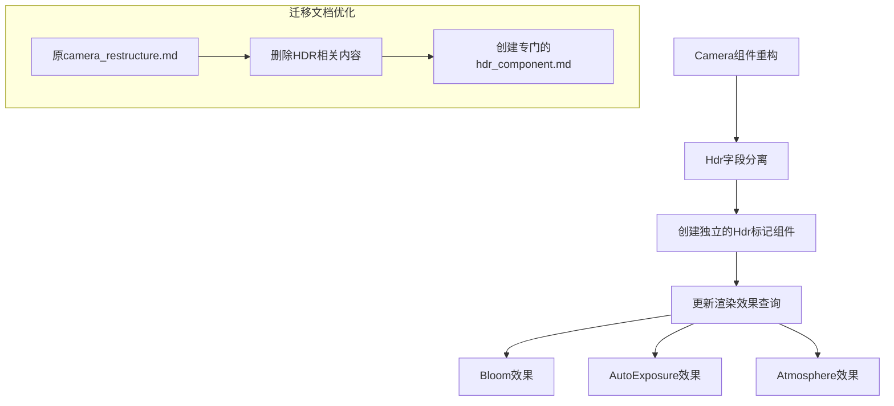

+++
title = "#20683 Hdr` migration guide wording"
date = "2025-08-21T00:00:00"
draft = false
template = "pull_request_page.html"
in_search_index = false

[extra]
current_language = "zh-cn"
available_languages = {"en" = { name = "English", url = "/pull_request/bevy/2025-08/pr-20683-en-20250821" }, "zh-cn" = { name = "中文", url = "/pull_request/bevy/2025-08/pr-20683-zh-cn-20250821" }}
+++

# Hdr 迁移指南措辞优化

## 基本信息
- **标题**: `Hdr` migration guide wording
- **PR 链接**: https://github.com/bevyengine/bevy/pull/20683
- **作者**: ecoskey
- **状态**: 已合并
- **标签**: C-Docs, A-Rendering, S-Ready-For-Final-Review
- **创建时间**: 2025-08-20T23:13:27Z
- **合并时间**: 2025-08-21T00:04:19Z
- **合并者**: alice-i-cecile

## 描述翻译
对 `Hdr` 组件拆分迁移指南进行轻微的重写。原本打算作为系列的第一部分，但后来我处理了其他事情 :p

## 本次 Pull Request 的技术故事

这个 PR 处理的是一个看似简单但很重要的文档维护问题。Bevy 引擎在 PR #18873 中进行了相机系统的重构，其中一个关键变化是将 `Camera` 组件中的 `hdr` 字段分离出来，成为一个独立的标记组件 `Hdr`。

最初，这个迁移指南被放在了 `camera_restructure.md` 文件中，作为相机重构的一部分。然而，作者 ecoskey 意识到这种组织方式存在问题 - 将 HDR 相关的迁移说明嵌入到更广泛的相机重构文档中，使得特定于 HDR 的更改不够突出，不利于开发者快速找到所需信息。

从技术架构的角度看，这个改动反映了 Bevy 引擎向更组件化设计方向的演进。将 `hdr` 从 `Camera` 组件中分离出来有几个重要优势：

1. **关注点分离**：`Camera` 组件专注于视角和投影相关的属性，而 `Hdr` 组件专门处理高动态范围渲染
2. **查询优化**：渲染系统现在可以使用 `#[require(Hdr)]` 属性来明确要求 HDR 支持，使查询更加高效
3. **可扩展性**：这种模式为未来可能添加的其他渲染特性提供了模板

代码迁移的变化也很直接但重要：
```rust
// 之前：
commands.spawn((Camera3d, Camera { hdr: true, ..default() }));

// 之后：
commands.spawn((Camera3d, Hdr));
```

这种变化不仅仅是语法上的改进，它代表了 Bevy ECS 架构的最佳实践 - 使用标记组件而不是布尔字段来实现特性开关。

当前已经有三个渲染效果利用了这种新模式：`Bloom`（辉光）、`AutoExposure`（自动曝光）和 `Atmosphere`（大气效果）。这些效果现在都使用 `#[require(Hdr)]` 属性来确保它们只在具有 HDR 支持的相机上运行。

从文档工程的角度来看，这个 PR 展示了良好的实践：将相关的迁移指南组织到专门的文件中，而不是混杂在更广泛的重构文档里。这使得开发者能够更容易地找到特定功能的迁移说明，特别是在大型代码库中进行版本升级时。

## 可视化表示



## 关键文件更改

### `release-content/migration-guides/camera_restructure.md` (-12 行)
这个文件被完全删除，因为它包含了特定于 HDR 组件分离的内容，而这些内容现在被移动到了专门的文档中。

**删除的内容：**
```markdown
---
title: Camera Restructure
pull_requests: [18873]
---

As part of the rendering crate reorganization, we've been working to simplify Bevy `Camera`s:

- `Camera.hdr` has been split out into a new marker component, `Hdr`
  - before: `commands.spawn((Camera3d, Camera { hdr: true, ..default() });`
  - after: `commands.spawn((Camera3d, Hdr));`
  - rendering effects can now `#[require(Hdr)]` if they only function with an HDR camera.
    This is currently implemented for `Bloom`, `AutoExposure`, and `Atmosphere`
```

### `release-content/migration-guides/hdr_component.md` (+11 行)
新创建的专门文档，专注于 HDR 组件的迁移指南。

**新增的内容：**
```markdown
---
title: Split `Hdr` from `Camera`
pull_requests: [18873]
---

`Camera.hdr` has been split out into a new marker component, `Hdr`

- before: `commands.spawn((Camera3d, Camera { hdr: true, ..default() });`
- after: `commands.spawn((Camera3d, Hdr));`
- rendering effects can now `#[require(Hdr)]` if they only function with an HDR camera.
  This is currently implemented for `Bloom`, `AutoExposure`, and `Atmosphere`
```

这些变化体现了文档组织的最佳实践：为每个重要的架构变化创建专门的迁移指南，而不是将多个不相关的更改混杂在同一个文档中。

## 延伸阅读

对于想要深入了解相关概念的开发者，建议参考以下资源：

1. **Bevy ECS 架构**：了解标记组件（Marker Components）的设计模式和优势
2. **迁移指南编写最佳实践**：如何为开源项目创建清晰、有用的升级文档
3. **高动态范围渲染（HDR）**：计算机图形学中 HDR 渲染的技术原理和应用
4. **关注点分离原则**：软件工程中模块化设计的重要原则

相关的 Bevy 文档和示例可以帮助开发者更好地理解如何使用新的 `Hdr` 组件以及相关的渲染效果。

# 完整代码差异
```diff
diff --git a/release-content/migration-guides/camera_restructure.md b/release-content/migration-guides/camera_restructure.md
deleted file mode 100644
index a7904bcf63f3d..0000000000000
--- a/release-content/migration-guides/camera_restructure.md
+++ /dev/null
@@ -1,12 +0,0 @@
----
-title: Camera Restructure
-pull_requests: [18873]
----
-
-As part of the rendering crate reorganization, we've been working to simplify Bevy `Camera`s:
-
-- `Camera.hdr` has been split out into a new marker component, `Hdr`
-  - before: `commands.spawn((Camera3d, Camera { hdr: true, ..default() });`
-  - after: `commands.spawn((Camera3d, Hdr));`
-  - rendering effects can now `#[require(Hdr)]` if they only function with an HDR camera.
-    This is currently implemented for `Bloom`, `AutoExposure`, and `Atmosphere`
diff --git a/release-content/migration-guides/hdr_component.md b/release-content/migration-guides/hdr_component.md
new file mode 100644
index 0000000000000..8061b664f84b1
--- /dev/null
+++ b/release-content/migration-guides/hdr_component.md
@@ -0,0 +1,11 @@
+---
+title: Split `Hdr` from `Camera`
+pull_requests: [18873]
+---
+
+`Camera.hdr` has been split out into a new marker component, `Hdr`
+
+- before: `commands.spawn((Camera3d, Camera { hdr: true, ..default() });`
+- after: `commands.spawn((Camera3d, Hdr));`
+- rendering effects can now `#[require(Hdr)]` if they only function with an HDR camera.
+  This is currently implemented for `Bloom`, `AutoExposure`, and `Atmosphere`
```