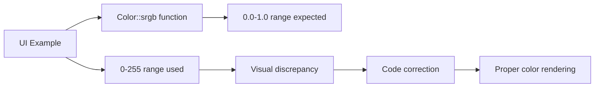

+++
title = "#20685 Color::srgb requires values in range 0..1 and the ui/relative_cursor_position example used misleading 0..255 range"
date = "2025-08-22T00:00:00"
draft = false
template = "pull_request_page.html"
in_search_index = true

[taxonomies]
list_display = ["show"]

[extra]
current_language = "en"
available_languages = {"en" = { name = "English", url = "/pull_request/bevy/2025-08/pr-20685-en-20250822" }, "zh-cn" = { name = "中文", url = "/pull_request/bevy/2025-08/pr-20685-zh-cn-20250822" }}
labels = ["C-Bug", "D-Trivial", "C-Examples", "A-UI"]
+++

# Color::srgb requires values in range 0..1 and the ui/relative_cursor_position example used misleading 0..255 range

## Basic Information
- **Title**: Color::srgb requires values in range 0..1 and the ui/relative_cursor_position example used misleading 0..255 range
- **PR Link**: https://github.com/bevyengine/bevy/pull/20685
- **Author**: Shelim
- **Status**: MERGED
- **Labels**: C-Bug, D-Trivial, C-Examples, A-UI, S-Ready-For-Final-Review
- **Created**: 2025-08-20T23:52:29Z
- **Merged**: 2025-08-22T22:06:22Z
- **Merged By**: james7132

## Description Translation
`Color::srgb` requires values in range `0..1` and the `ui/relative_cursor_position` example uses misleading `0..255` range

# Objective

- To remove misleading range error in UI example (it actually caught me off-guard when I was learning about Bevy UI)

## Solution

- Scaled data to (approx.) `0..1` range of values via dividing by `255` with 2 digits precision. This will change the example look, as previously the example node rendered 100% white.

## Testing

- Run the isolated example, screenshots below

---

## Showcase

- Comparison below:

### Previous version


### New version


## The Story of This Pull Request

This PR addresses a straightforward but important issue in Bevy's UI examples. The problem was discovered when the author was learning about Bevy UI and encountered misleading color values in the `relative_cursor_position` example.

The core issue was that the `Color::srgb` function expects color values in the normalized range of 0.0 to 1.0, but the example was using values in the 0-255 range commonly found in web development and graphic design tools. This discrepancy could confuse developers who might assume the color values follow the 0-255 convention, leading to incorrect color implementations in their own projects.

The solution was mathematically simple but practically important: convert the RGB values from the 0-255 range to the 0.0-1.0 range by dividing each component by 255. The author chose to use two-digit precision for the converted values (235/255 ≈ 0.92, 35/255 ≈ 0.14, 12/255 ≈ 0.05), which maintains reasonable visual accuracy while adhering to Bevy's API requirements.

This change had a visible impact on the example's appearance. The previous implementation using (235, 35, 12) in the 0-255 range was being interpreted as nearly white due to the first component (235) being treated as 235.0 in the 0.0-1.0 range, far exceeding the maximum value of 1.0. The corrected values produce the intended reddish color shown in the "New version" screenshot.

The fix demonstrates proper API usage and serves as better documentation for developers learning Bevy's UI system. While the change is small, it prevents potential confusion and sets a better example for new users understanding color representation in Bevy.

## Visual Representation



## Key Files Changed

### `examples/ui/relative_cursor_position.rs`

This file contained the problematic color values that used the 0-255 range instead of the expected 0.0-1.0 range for the `Color::srgb` function.

**Change:**
```rust
// Before:
BackgroundColor(Color::srgb(235., 35., 12.)),

// After:
BackgroundColor(Color::srgb(0.92, 0.14, 0.05)),
```

The change converts the RGB values from the 0-255 range to the normalized 0.0-1.0 range by dividing each component by 255 and rounding to two decimal places. This ensures the color is rendered correctly according to Bevy's color API specifications.

## Further Reading

- Bevy Color API documentation: https://docs.rs/bevy/latest/bevy/color/struct.Color.html
- SRGB color space explanation: https://en.wikipedia.org/wiki/SRGB
- Bevy UI examples: https://github.com/bevyengine/bevy/tree/main/examples/ui