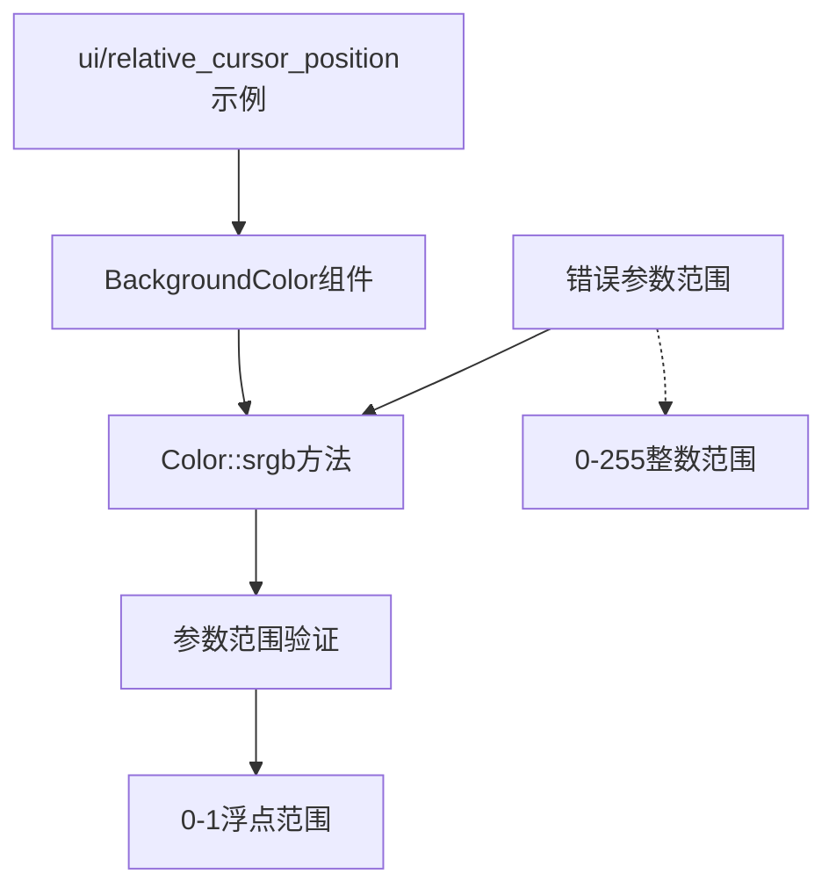

+++
title = "#20685 Color::srgb requires values in range 0..1 and the ui/relative_cursor_position example used misleading 0..255 range"
date = "2025-08-22T00:00:00"
draft = false
template = "pull_request_page.html"
in_search_index = false

[extra]
current_language = "zh-cn"
available_languages = {"en" = { name = "English", url = "/pull_request/bevy/2025-08/pr-20685-en-20250822" }, "zh-cn" = { name = "中文", url = "/pull_request/bevy/2025-08/pr-20685-zh-cn-20250822" }}
+++

# 分析报告：Color::srgb 参数范围修复与UI示例优化

## 基本信息
- **标题**: Color::srgb requires values in range 0..1 and the ui/relative_cursor_position example used misleading 0..255 range
- **PR链接**: https://github.com/bevyengine/bevy/pull/20685
- **作者**: Shelim
- **状态**: 已合并
- **标签**: C-Bug, D-Trivial, C-Examples, A-UI, S-Ready-For-Final-Review
- **创建时间**: 2025-08-20T23:52:29Z
- **合并时间**: 2025-08-22T22:06:22Z
- **合并者**: james7132

## 描述翻译
`Color::srgb` 方法要求参数值在 `0..1` 范围内，但 `ui/relative_cursor_position` 示例使用了误导性的 `0..255` 范围

# 目标
- 修复UI示例中的误导性范围错误（这实际上在我学习Bevy UI时让我措手不及）

## 解决方案
- 通过除以255并保留2位小数精度，将数据缩放到（大约）`0..1` 的值范围。这将改变示例的外观，因为之前示例节点呈现为100%白色。

## 测试
- 运行了独立的示例，截图如下

---

## 展示
- 对比如下：

### 先前版本


### 新版本


## PR的技术叙事

这个PR解决了一个在Bevy UI示例中存在的技术误导问题。问题的核心在于`Color::srgb`方法期望接收0到1范围内的浮点数值，但示例代码中却使用了传统的0-255整数范围，这在学习过程中容易造成混淆。

开发者在学习Bevy UI时遇到了这个不一致性问题，意识到这可能会对其他学习者产生同样的困惑。虽然从技术角度看，原来的代码确实能够运行（因为Bevy会自动处理超出范围的值），但使用错误的参数范围违背了API的设计意图，并且会导致颜色显示不正确 - 原本应该是橙红色的背景变成了纯白色。

解决方案采用了直接且精确的方法：将原有的235、35、12三个RGB值分别除以255，得到0.92、0.14、0.05这三个在0-1范围内的浮点数。这种转换保持了颜色的相对比例，同时符合API的预期输入格式。

这个修改虽然看起来简单，但实际上体现了API设计一致性的重要性。在计算机图形学中，不同的颜色表示系统有着不同的约定：有些使用0-255的整数范围（如Web开发中的RGB），而有些使用0.0-1.0的浮点范围（如大多数图形API）。Bevy选择了后者，这与其作为游戏引擎需要与底层图形API（如OpenGL、Vulkan）保持一致的设计理念相符。

从技术实现角度看，这个修改确保了示例代码的正确性和教育价值。现在，开发者学习这个示例时看到的是符合Bevy API规范的颜色设置方式，避免了后续开发中的潜在困惑。

## 可视化表示



## 关键文件更改

**文件**: `examples/ui/relative_cursor_position.rs`

**修改描述**: 将`BackgroundColor`组件中`Color::srgb`的参数从0-255范围的整数值改为0-1范围的浮点值，以符合API要求并正确显示颜色。

**代码变更**:
```rust
// 修改前:
BackgroundColor(Color::srgb(235., 35., 12.)),

// 修改后:
BackgroundColor(Color::srgb(0.92, 0.14, 0.05)),
```

这个修改直接解决了PR中描述的问题，确保了示例代码的正确性和一致性。颜色值235、35、12分别除以255后得到0.92、0.14、0.05，保持了相同的颜色比例但使用了正确的参数范围。

## 延伸阅读

- [Bevy Color文档](https://docs.rs/bevy/latest/bevy/prelude/struct.Color.html) - 官方Color类型的API文档
- [sRGB颜色空间](https://en.wikipedia.org/wiki/SRGB) - 关于sRGB颜色标准的维基百科文章
- [Bevy UI示例](https://github.com/bevyengine/bevy/tree/main/examples/ui) - 更多Bevy UI示例代码
- [图形编程中的颜色表示](https://learnopengl.com/Advanced-Lighting/Gamma-Correction) - 关于颜色空间和gamma校正的OpenGL教程

# 完整代码差异
```diff
diff --git a/examples/ui/relative_cursor_position.rs b/examples/ui/relative_cursor_position.rs
index 062d2b3139c38..1fe8e4f853f27 100644
--- a/examples/ui/relative_cursor_position.rs
+++ b/examples/ui/relative_cursor_position.rs
@@ -44,7 +44,7 @@ fn setup(mut commands: Commands, asset_server: Res<AssetServer>) {
                         margin: UiRect::bottom(Val::Px(15.)),
                         ..default()
                     },
-                    BackgroundColor(Color::srgb(235., 35., 12.)),
+                    BackgroundColor(Color::srgb(0.92, 0.14, 0.05)),
                 ))
                 .insert(RelativeCursorPosition::default());
```