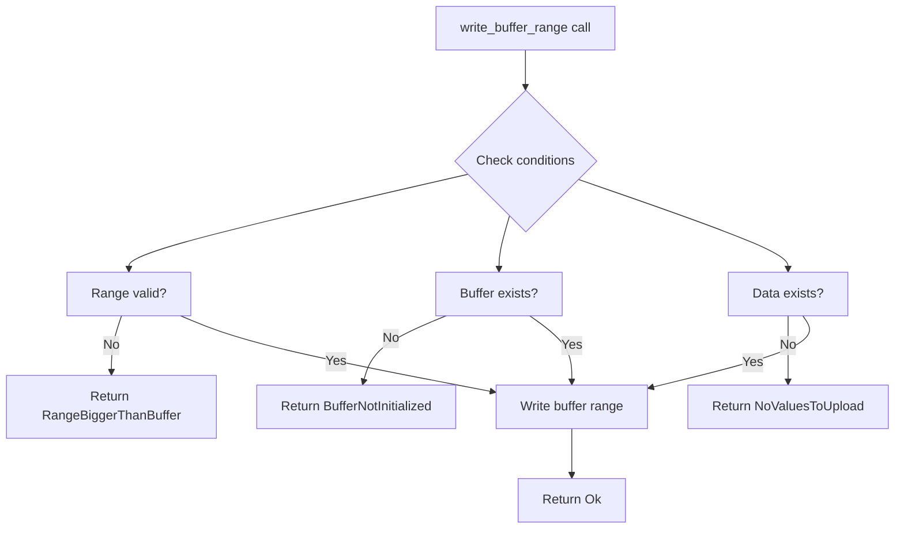

+++
title = "#20687 Don't reserve in write_buffer_range"
date = "2025-08-22T00:00:00"
draft = false
template = "pull_request_page.html"
in_search_index = true

[taxonomies]
list_display = ["show"]

[extra]
current_language = "en"
available_languages = {"en" = { name = "English", url = "/pull_request/bevy/2025-08/pr-20687-en-20250822" }, "zh-cn" = { name = "中文", url = "/pull_request/bevy/2025-08/pr-20687-zh-cn-20250822" }}
labels = ["A-Rendering", "C-Usability", "D-Straightforward"]
+++

# Title: Don't reserve in write_buffer_range

## Basic Information
- **Title**: Don't reserve in write_buffer_range
- **PR Link**: https://github.com/bevyengine/bevy/pull/20687
- **Author**: IceSentry
- **Status**: MERGED
- **Labels**: A-Rendering, C-Usability, S-Ready-For-Final-Review, D-Straightforward
- **Created**: 2025-08-21T03:59:39Z
- **Merged**: 2025-08-22T23:09:03Z
- **Merged By**: james7132

## Description Translation
# Objective

- If you push new data to the cpu side buffer and it becomes bigger than the gpu buffer the call to reserve would wipe the old data. It was an acceptable behaviour for write_buffer but if you are only writing a range it would be surprising if suddenly all the other data was gone without warning

## Solution

- Don't call reserve and return an error letting users decide how to handle it.

## Testing

Not tested, not sure how to easily test this.

Closes https://github.com/bevyengine/bevy/issues/20686

## The Story of This Pull Request

The issue addressed in this PR stems from a subtle but important behavioral difference between full buffer writes and range writes in Bevy's rendering system. When developers use the `write_buffer_range` method to update only a portion of a GPU buffer, they reasonably expect that the existing data outside the specified range will remain intact. However, the original implementation had a problematic side effect: it automatically called `reserve()` before writing, which could unexpectedly wipe the entire GPU buffer if the CPU-side data exceeded the current GPU buffer capacity.

This behavior was acceptable for the full `write_buffer` method since it writes the entire buffer anyway, but for range operations, it violated the principle of least surprise. Developers using range writes specifically want to preserve data outside their target range, making the automatic reallocation behavior counterintuitive and potentially destructive.

The solution implemented here takes a more conservative approach by removing the automatic `reserve()` call and instead returning explicit error conditions when the operation cannot be safely performed. This shifts the responsibility for buffer management decisions to the caller, who can then choose the appropriate strategy based on their specific use case - whether that's resizing the buffer (accepting data loss), creating a new buffer with data copying, or handling the error in another way.

The implementation introduces a new error enum `WriteBufferRangeError` that clearly communicates the possible failure conditions:
- `RangeBiggerThanBuffer`: When the specified range exceeds the current buffer capacity
- `BufferNotInitialized`: When no GPU buffer exists yet
- `NoValuesToUpload`: When there's no data to write

This approach maintains backward compatibility while providing clearer failure modes and preventing unexpected data loss. The changes affect both `RawBufferVec` and `BufferVec` implementations, ensuring consistent behavior across different buffer types in the rendering system.

## Visual Representation



## Key Files Changed

**File: `crates/bevy_render/src/render_resource/buffer_vec.rs`** (+36/-12)

This file contains the core implementation changes for both `RawBufferVec` and `BufferVec` structs. The modifications remove the automatic buffer reservation behavior and replace it with explicit error handling.

**Key changes in `RawBufferVec::write_buffer_range`:**
```rust
// Before:
pub fn write_buffer_range(
    &mut self,
    device: &RenderDevice,
    render_queue: &RenderQueue,
    range: core::ops::Range<usize>,
) {
    if self.values.is_empty() {
        return;
    }
    self.reserve(self.values.len(), device);
    if let Some(buffer) = &self.buffer {
        let bytes: &[u8] = must_cast_slice(&self.values[range.start..range.end]);
        render_queue.write_buffer(buffer, (range.start * self.item_size) as u64, bytes);
    }
}

// After:
pub fn write_buffer_range(
    &mut self,
    render_queue: &RenderQueue,
    range: core::ops::Range<usize>,
) -> Result<(), WriteBufferRangeError> {
    if self.values.is_empty() {
        return Err(WriteBufferRangeError::NoValuesToUpload);
    }
    if range.end > self.item_size * self.capacity {
        return Err(WriteBufferRangeError::RangeBiggerThanBuffer);
    }
    if let Some(buffer) = &self.buffer {
        let bytes: &[u8] = must_cast_slice(&self.values[range.start..range.end]);
        render_queue.write_buffer(buffer, (range.start * self.item_size) as u64, bytes);
        Ok(())
    } else {
        Err(WriteBufferRangeError::BufferNotInitialized)
    }
}
```

**Key changes in `BufferVec::write_buffer_range`:**
```rust
// Similar transformation with error handling added
// and reserve call removed
```

**New error type definition:**
```rust
#[derive(Debug, Eq, PartialEq, Copy, Clone, Error)]
pub enum WriteBufferRangeError {
    #[error("the range is bigger than the capacity of the buffer")]
    RangeBiggerThanBuffer,
    #[error("the gpu buffer is not initialized")]
    BufferNotInitialized,
    #[error("there are no values to upload")]
    NoValuesToUpload,
}
```

## Further Reading

- [WGSL Buffer and Memory Model](https://gpuweb.github.io/gpuweb/wgsl/#memory-model) - Understanding how GPU buffers work
- [Bevy Render Resources Documentation](https://docs.rs/bevy_render/latest/bevy_render/render_resource/index.html) - Bevy's render resource management
- [Error Handling in Rust](https://doc.rust-lang.org/book/ch09-00-error-handling.html) - Rust's error handling patterns
- [WGPU Buffer Operations](https://wgpu.rs/next/wgpu/struct.Queue.html#method.write_buffer) - How buffer writes work in WGPU